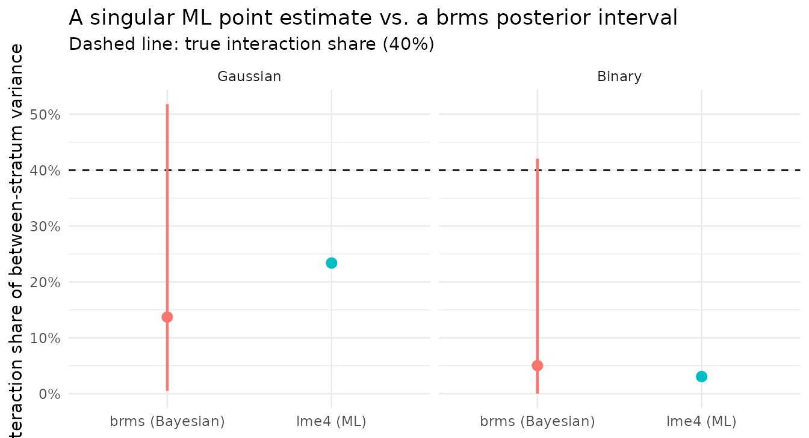

# Bayesian MAIHDA for sparse intersections

## Sparse intersectional cells

Intersectional MAIHDA decomposes the between-stratum variation into an
additive part (the constituent dimensions’ main effects) and an
interaction part (the model-implied departure from additivity). That
conclusion is defensible only when each intersectional stratum is
populated well enough to estimate its effect. In practice it often is
not. Crossing several dimensions multiplies the strata while the sample
size stays fixed, so cell counts fall away quickly. Estimating an
interaction variance from cells like these is hard.

## A dataset with a known interaction

`maihda_sparse_data` is simulated for exactly that: 4 dimensions form 36
intersectional strata, and the interaction is constructed to account for
**40% of the between-stratum variance** – on a Gaussian outcome `y` and
on the latent scale of a binary outcome `event`. Individuals are
allocated to strata unevenly, reproducing the skewed cell sizes of real
survey data.

``` r

data(maihda_sparse_data)
d <- maihda_sparse_data

cells <- table(interaction(d$gender, d$ethnicity, d$education, d$age_group, drop = TRUE))
summary(as.numeric(cells))                    # cell-size distribution
#>    Min. 1st Qu.  Median    Mean 3rd Qu.    Max. 
#>   1.000   4.000   6.000   6.667   9.250  17.000
sum(cells < 5)                                # how many strata have < 5 people
#> [1] 12
attr(d, "truth")$gaussian$interaction_share   # the true interaction share: 0.40
#> [1] 0.4
```

A third of the strata hold fewer than five individuals. This is not an
unusual case, as it is often the situation once more than two or three
dimensions are crossed, and it is precisely where maximum likelihood
becomes unreliable.

## What lme4 reports

We fit the crossed-dimensions decomposition with `engine = "lme4"` on
both outcomes.

``` r

m_g <- maihda(y ~ 1 + (1 | gender:ethnicity:education:age_group),
              data = d, decomposition = "crossed-dimensions", engine = "lme4")
m_b <- maihda(event ~ 1 + (1 | gender:ethnicity:education:age_group),
              data = d, decomposition = "crossed-dimensions",
              engine = "lme4", family = "binomial")

c(gaussian = m_g$decomposition$interaction_share,
  binary   = m_b$decomposition$interaction_share)
#>   gaussian     binary 
#> 0.23380215 0.03061839
c(gaussian_singular = isTRUE(m_g$model$diagnostics$singular),
  binary_singular   = isTRUE(m_b$model$diagnostics$singular))
#> gaussian_singular   binary_singular 
#>              TRUE              TRUE
```

Both fits are singular: maximum likelihood has placed the interaction
variance at the boundary. The Gaussian interaction share is pulled down
to 23%, and the binary share to 3% – against a true 40%, the binary fit
reports a substantial interaction as effectively absent. Crucially,
neither estimate carries an interval. The estimate is not only biased
but reported with unwarranted precision, because the model has no way to
express how little the sparse cells determine.

## What brms adds: posterior uncertainty

Refitting with `engine = "brms"` and a weakly-informative prior on the
random-effect standard deviations changes the output in one important
respect. The prior regularises the between-stratum standard deviations
away from the boundary (so the fit is not singular) and the posterior
yields a credible interval in place of a single number. The call is
shown but not evaluated here (`brms` requires Stan and several minutes;
see the note on precomputation below).

``` r

m_g_brms <- maihda(
  y ~ 1 + (1 | gender:ethnicity:education:age_group),
  data = d, decomposition = "crossed-dimensions", engine = "brms",
  prior = brms::set_prior("normal(0, 0.5)", class = "sd"),
  chains = 4, iter = 2000, warmup = 1000, cores = 4, seed = 1,
  control = list(adapt_delta = 0.97)
)
m_g_brms$decomposition$interaction_share
m_g_brms$decomposition$interaction_share_ci
```

The cached posterior summaries:

``` r

bg <- pc$brms$gaussian; bb <- pc$brms$binary
data.frame(
  outcome      = c("Gaussian", "Binary"),
  true_share   = c(pc$truth$gaussian$interaction_share, pc$truth$binary_latent$interaction_share),
  brms_share   = c(bg$share, bb$share),
  ci_low       = c(bg$ci[1], bb$ci[1]),
  ci_high      = c(bg$ci[2], bb$ci[2]),
  max_rhat     = c(bg$diag$max_rhat, bb$diag$max_rhat),
  divergences  = c(bg$diag$divergences, bb$diag$divergences)
)
#>    outcome true_share brms_share       ci_low   ci_high max_rhat divergences
#> 1 Gaussian        0.4 0.13704351 0.0050517071 0.5180674 1.004302           0
#> 2   Binary        0.4 0.05027529 0.0001234149 0.4206628 1.002563           0
```

The posterior point remains low: the interaction is weakly identified at
this density, so `brms` does not recover the 40% either, and we should
not expect it to. The credible interval, however, runs from near zero to
past the true value, reflecting posterior uncertainty about the
interaction share. This is the substantive difference. Maximum
likelihood reported a singular point as if it were certain; `brms`
reports an interval that includes the true share in this simulation and
makes the uncertainty explicit. The diagnostics (`max_rhat` close to 1,
no divergent transitions) suggest the posterior is well-sampled.

## Comparison

``` r

fig <- data.frame(
  outcome = factor(rep(c("Gaussian", "Binary"), each = 2), levels = c("Gaussian", "Binary")),
  method  = rep(c("lme4 (ML)", "brms (Bayesian)"), 2),
  share   = c(pc$lme4$gaussian$share, pc$brms$gaussian$share,
              pc$lme4$binary$share,   pc$brms$binary$share),
  lo      = c(NA, pc$brms$gaussian$ci[1], NA, pc$brms$binary$ci[1]),
  hi      = c(NA, pc$brms$gaussian$ci[2], NA, pc$brms$binary$ci[2])
)
truth <- pc$truth$gaussian$interaction_share

ggplot(fig, aes(method, share, colour = method)) +
  geom_hline(yintercept = truth, linetype = "dashed") +
  geom_pointrange(aes(ymin = lo, ymax = hi), na.rm = TRUE, linewidth = 0.8) +
  geom_point(size = 2.5) +
  facet_wrap(~ outcome) +
  scale_y_continuous("Interaction share of between-stratum variance",
                     labels = function(x) paste0(round(100 * x), "%")) +
  labs(x = NULL, colour = NULL,
       title = "A singular ML point estimate vs. a brms posterior interval",
       subtitle = "Dashed line: true interaction share (40%)") +
  theme_minimal() + theme(legend.position = "none")
```



Both point estimates fall below the true value; neither engine can
locate an interaction the sparse data do not pin down. They differ in
what is reported alongside the point. The `brms` credible interval spans
the true 40%, whereas `lme4` provides a single value with no
uncertainty. Reading the `lme4` point at face value (an interaction of
roughly 3–23%, or none at all) is the error the singular fit invites.

## Why the interval, not the point, is what changes

The per-stratum effects (the stratum random intercepts) are similar
under the two engines as both apply partial pooling, shrinking
thinly-estimated strata toward the additive prediction. What differs is
the treatment of uncertainty. Maximum likelihood commits to a single
variance decomposition and, at the boundary, reports it without a
standard error. `brms` propagates the full posterior, so the interaction
share is accompanied by an interval whose width reflects how little the
sparse cells constrain it. Summarising the posterior by its point
discards exactly the information that matters: the degree of
uncertainty. When intersectional cells are sparse, a regularised
Bayesian fit with an explicit interval is the more defensible summary.
