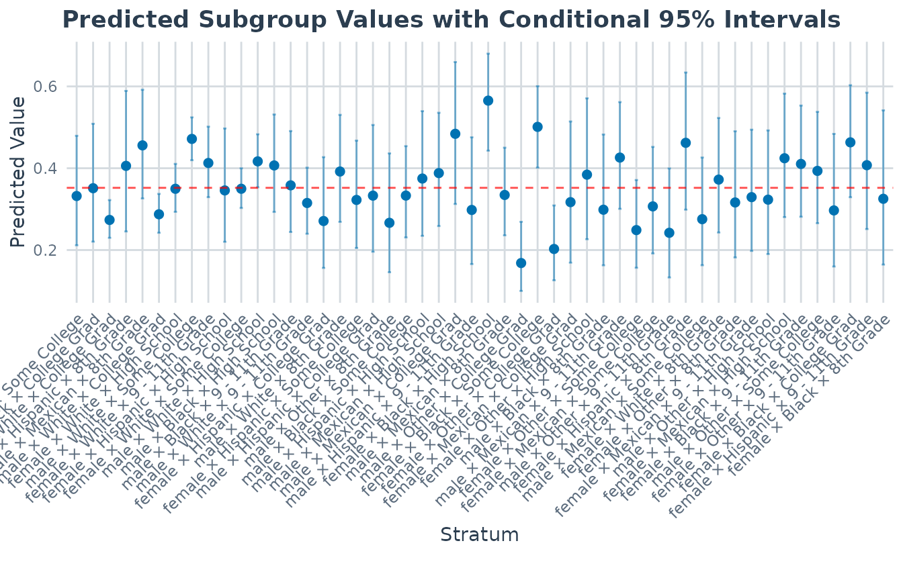
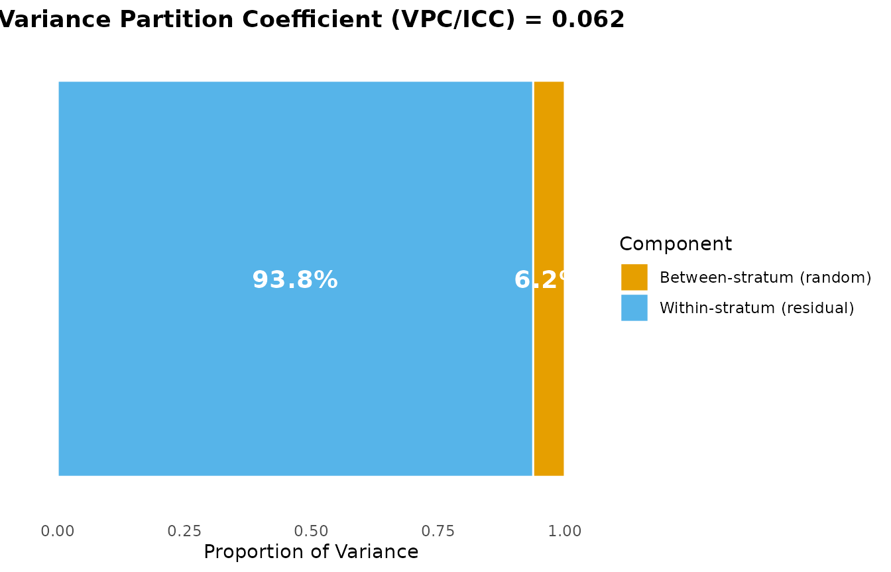
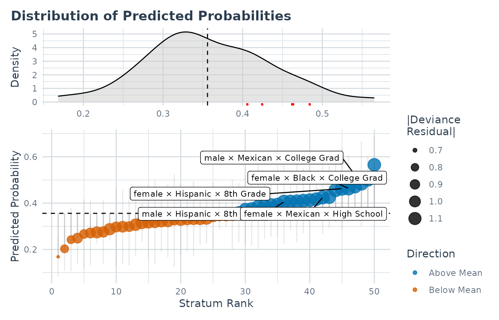

# MAIHDA for Binary Outcomes (Discriminatory Accuracy)

## Why binary outcomes?

Many of the original MAIHDA applications target a **binary** health
outcome – obese vs. not, hypertensive vs. not, screened vs. not. Merlo’s
framing of *discriminatory accuracy* is, at heart, a question about a
binary classifier: how well do the intersectional strata alone separate
people who do and do not have the outcome?

For a binary outcome the model is a multilevel **logistic** regression:

``` math
\text{logit}\,\Pr(y_{ij} = 1) = \beta_0 + u_j, \qquad u_j \sim N(0, \sigma_u^2),
```

where $`j`$ indexes the intersectional stratum. MAIHDA reads off two
complementary quantities from this model:

- the **VPC/ICC**, the share of the (latent) variation that lies
  *between* strata;
- the **discriminatory accuracy** (e.g. the AUC / C-statistic), how well
  stratum membership predicts the individual outcome.

A high between-stratum VPC can still go with only *moderate*
discriminatory accuracy at the individual level – that contrast is the
whole point of the “DA” in MAIHDA, and this vignette shows how to get
both numbers.

``` r

library(MAIHDA)
data("maihda_health_data")

# A two-level outcome: obese (Yes) vs. not (No)
table(maihda_health_data$Obese)
#> 
#>   No  Yes 
#> 1923 1077
```

## Fitting a logistic MAIHDA model

[`fit_maihda()`](https://hdbt.github.io/MAIHDA/reference/fit_maihda.md)
detects a two-level outcome automatically. If you leave `family` at its
default, the function switches to `family = "binomial"`, recodes the
response to 0/1 for `glmer()`, and warns you so the change is never
silent:

``` r

model_null <- fit_maihda(
  Obese ~ 1 + (1 | Gender:Race:Education),
  data = maihda_health_data
)
#> Warning: The outcome variable appears to be binary. Automatically switching to
#> family = 'binomial'. To fit a Linear Probability Model, explicitly specify
#> family = 'gaussian'.
#> Binary outcome 'Obese' recoded to 0/1: 'No' = 0 (reference), 'Yes' = 1 (modeled event). Set the factor levels (or supply a 0/1 outcome) to control which level is the event.
```

The warning is a feature, not a problem. To be explicit (and to silence
the warning), pass `family = "binomial"` yourself – this is the
recommended form for scripts:

``` r

model_null <- fit_maihda(
  Obese ~ 1 + (1 | Gender:Race:Education),
  data   = maihda_health_data,
  family = "binomial"
)
```

> If you actually want a linear probability model on a 0/1 outcome, ask
> for it explicitly with `family = "gaussian"`; the auto-switch only
> fires for the default family.

## The VPC is on the latent scale

[`summary()`](https://rdrr.io/r/base/summary.html) reports the VPC/ICC
for the logistic model. There is no observed-scale residual variance for
a Bernoulli outcome, so MAIHDA uses the standard **latent-scale**
approximation: the level-1 (within-stratum) variance is fixed at
$`\pi^2/3 \approx 3.29`$ for the logit link (and the corresponding
constant for a probit link). The VPC is therefore the between-stratum
share of variation on that underlying latent scale, not on the
probability scale.

``` r

summary_null <- summary(model_null)
print(summary_null)
#> MAIHDA Model Summary
#> ====================
#> 
#> Variance Partition Coefficient (VPC/ICC):
#>   Estimate: 0.0634
#> 
#> Variance Components:
#>                  component variance     sd proportion
#>   Between-stratum (random)   0.2227 0.4719    0.06339
#>  Within-stratum (residual)   3.2899 1.8138    0.93661
#>                      Total   3.5125 1.8742    1.00000
#> 
#> Discriminatory accuracy (binomial MAIHDA)
#>   AUC (C-statistic): 0.626
#>   Median Odds Ratio: 1.568
#>   Cases / controls:  1077 / 1923
#> 
#> Fixed Effects:
#>         term estimate
#>  (Intercept)   -0.616
#> 
#> Stratum Estimates (first 10):
#>  stratum stratum_id                           label random_effect     se
#>        1          1  male × Hispanic × Some College     -0.075834 0.3155
#>        2          2     male × Black × College Grad     -0.001524 0.3325
#>        3          3   female × White × College Grad     -0.360949 0.1186
#>        4          4     male × Hispanic × 8th Grade      0.218443 0.3808
#>        5          5    female × Mexican × 8th Grade      0.437816 0.2809
#>        6          6     male × White × College Grad     -0.293351 0.1187
#>        7          7    female × White × High School     -0.006285 0.1322
#>        8          8     male × White × Some College      0.502977 0.1077
#>        9          9 female × White × 9 - 11th Grade      0.259733 0.1835
#>       10         10 female × Hispanic × High School     -0.006773 0.3208
#>  lower_95 upper_95
#>   -0.6941  0.54246
#>   -0.6533  0.65025
#>   -0.5935 -0.12843
#>   -0.5280  0.96489
#>   -0.1127  0.98833
#>   -0.5259 -0.06076
#>   -0.2654  0.25283
#>    0.2919  0.71405
#>   -0.1000  0.61948
#>   -0.6355  0.62197
#>   ... and 40 more strata
```

Read from this null model, the VPC is the **total** between-stratum
share of latent variation in the odds of obesity. As in the Gaussian
case, the stratum random effects capture the *combined* additive +
interaction differences across strata; they isolate the *pure*
intersectional (interaction) component only once the additive main
effects of the strata variables are in the model.

> For a binomial model
> [`summary()`](https://rdrr.io/r/base/summary.html) now reports the
> discriminatory accuracy (AUC / Median Odds Ratio) automatically, so
> the printed summary above already carries that block – the
> [Discriminatory
> accuracy](#discriminatory-accuracy-auc-and-median-odds-ratio) section
> below explains how to read it and how to obtain the pieces on their
> own.

For an interpretable **probability-scale** complement to the
latent-scale VPC, the package provides
[`maihda_vpc_response()`](https://hdbt.github.io/MAIHDA/reference/maihda_vpc_response.md),
which estimates the response-scale VPC by simulation (Goldstein, Browne
& Rasbash 2002):

``` r

maihda_vpc_response(model_null, seed = 1)
#> Response-scale VPC (simulation method)
#>   VPC: 0.0478
#>   10000 simulated stratum effects; between-stratum variance 0.2227 (latent scale).
```

Report it *alongside* – not instead of – the latent-scale VPC: it
depends on the overall prevalence, and for adjusted models it is
evaluated at the mean covariate profile, so it is best read from the
null model.

## Adjusted model and PCV

A “Model 2” adds individual-level covariates to ask how much of the
between-stratum variation they account for. Here we adjust for age, fit
on the **same analytic sample and strata** as the null model, and
compare with
[`calculate_pvc()`](https://hdbt.github.io/MAIHDA/reference/calculate_pvc.md).
PCV compares variances across models, so both must use the same
complete-case sample:

``` r

health_complete <- maihda_health_data[complete.cases(
  maihda_health_data[, c("Obese", "Age", "Gender", "Race", "Education")]
), ]

model_null2 <- fit_maihda(
  Obese ~ 1 + (1 | Gender:Race:Education),
  data = health_complete, family = "binomial"
)
#> Binary outcome 'Obese' recoded to 0/1: 'No' = 0 (reference), 'Yes' = 1 (modeled event). Set the factor levels (or supply a 0/1 outcome) to control which level is the event.

# Model 2: adjust for an individual-level covariate (age)
model_adj <- fit_maihda(
  Obese ~ Age + (1 | Gender:Race:Education),
  data = health_complete, family = "binomial"
)
#> Binary outcome 'Obese' recoded to 0/1: 'No' = 0 (reference), 'Yes' = 1 (modeled event). Set the factor levels (or supply a 0/1 outcome) to control which level is the event.

pcv <- calculate_pvc(model_null2, model_adj)
print(pcv)
#> Proportional Change in Variance (PCV)
#> =====================================
#> 
#> PCV: 0.0167
#> 
#> Between-stratum variance:
#>   Model 1: 0.222667
#>   Model 2: 0.218941
#>   Change:  0.003726 (1.67%)
#> 
#> Interpretation (PCV is the proportional change in between-stratum
#> variance between the models):
#>   Between-stratum variance is 1.7% lower in Model 2 than in Model 1.
```

The same caveats as in the continuous case apply, with one extra
wrinkle: for non-Gaussian models the latent residual variance is fixed
by the link, so a change in the between-stratum variance is partly a
**rescaling** of the latent scale, not only “variance explained”.
Interpret the PCV as a model-dependent, descriptive change, not a causal
decomposition.

> **A note on adjusting for the strata’s own categories.** If instead
> you add the *categorical* main effects that define the strata (e.g.
> `Obese ~ Gender + Race + Education + ...`) to recover the
> additive-vs-interaction split shown in the
> [introduction](https://hdbt.github.io/MAIHDA/articles/introduction.md),
> be aware that in a logistic model those fixed effects are nearly
> collinear with the stratum random intercept, so `glmer()` often
> reports a convergence or “nearly unidentifiable” note. Scaling
> covariates and using
> `control = lme4::glmerControl(optimizer = "bobyqa")` usually helps.

## Discriminatory accuracy (AUC and Median Odds Ratio)

The VPC summarises *variation*; discriminatory accuracy summarises
*prediction*. For a binomial model this is reported **automatically**:
[`summary()`](https://rdrr.io/r/base/summary.html) of a binomial
`maihda_model` carries a `discriminatory_accuracy` slot, and
`maihda(..., family = "binomial")` surfaces it on its summaries and
headline [`print()`](https://rdrr.io/r/base/print.html). The explicit
[`maihda_discriminatory_accuracy()`](https://hdbt.github.io/MAIHDA/reference/maihda_discriminatory_accuracy.md)
below is the same quantity on its own – it bundles the two
individual-level summaries for a logistic MAIHDA model: the **AUC /
C-statistic** (how well the predicted probabilities separate cases from
non-cases) and the **Median Odds Ratio (MOR)** (the between-stratum
heterogeneity expressed on the odds-ratio scale). The strata-only
model’s AUC is the discriminatory accuracy of the intersectional strata
*themselves* – Merlo’s central quantity. Comparing it with the adjusted
model shows whether individual information beyond stratum membership
sharpens classification:

``` r

da_null <- maihda_discriminatory_accuracy(model_null2)
da_adj  <- maihda_discriminatory_accuracy(model_adj)

da_null
#> Discriminatory accuracy (binomial MAIHDA)
#>   AUC (C-statistic): 0.626
#>   Median Odds Ratio: 1.568
#>   Cases / controls:  1077 / 1923
da_adj
#> Discriminatory accuracy (binomial MAIHDA)
#>   AUC (C-statistic): 0.628
#>   Median Odds Ratio: 1.563
#>   Cases / controls:  1077 / 1923
```

You can also call the pieces directly: `maihda_auc(prob, y)` on any
vector of predicted probabilities and 0/1 outcomes (it equals the
Mann-Whitney U statistic, so it needs no extra package), and
`maihda_mor(model)` for the Median Odds Ratio.

``` r

prob_null <- predict_maihda(model_null2, type = "individual", scale = "response")
y_obs     <- as.numeric(lme4::getME(model_null2$model, "y"))

maihda_auc(prob_null, y_obs)
#> [1] 0.6261898
```

An AUC of 0.5 is chance. Here both models sit around 0.6: even a
non-trivial between-stratum VPC translates into only **modest** accuracy
at the *individual* level – exactly the cautionary message that
motivates discriminatory-accuracy reporting in MAIHDA. Note the adjusted
model barely moves the AUC: the categorical covariates that *define* the
strata are already captured by stratum membership, so only the
continuous covariate (`Age`) adds genuinely new individual-level
information.

> **The MOR needs the logit link.** The Median Odds Ratio is an
> odds-ratio-scale quantity, so it is defined only for
> `binomial(link = "logit")` (the default). For a
> `binomial(link = "probit")` fit,
> [`maihda_mor()`](https://hdbt.github.io/MAIHDA/reference/maihda_mor.md)
> errors and
> [`maihda_discriminatory_accuracy()`](https://hdbt.github.io/MAIHDA/reference/maihda_discriminatory_accuracy.md)
> reports the AUC with `mor = NA` – the AUC, being rank-based, is
> link-agnostic.

## Plots adapt to the binomial family

The standard plots recognise the binomial family and switch to the
probability scale and to deviance-based diagnostics automatically:

``` r

# Predicted probabilities per stratum with intervals
plot(model_adj, type = "predicted")
```



``` r

# Latent-scale variance partition
plot(model_adj, type = "vpc")
```



``` r

# For binomial fits the dashboard highlights the largest absolute
# deviance residuals rather than raw deviations from the mean.
plot(model_adj, type = "prediction_deviation")
```



See the [plot interpretation
vignette](https://hdbt.github.io/MAIHDA/articles/interpreting_plots.md)
for how to read each of these.

## Count outcomes work the same way

A Poisson (count) outcome follows the identical pattern – pass
`family = "poisson"` to
[`fit_maihda()`](https://hdbt.github.io/MAIHDA/reference/fit_maihda.md).
The VPC then uses the log-link latent-scale residual variance, and the
summary, PCV, and plotting helpers all behave as above.

## References

- Merlo, J. (2018). Multilevel analysis of individual heterogeneity and
  discriminatory accuracy (MAIHDA) within an intersectional framework.
  *Social Science & Medicine*, 203, 74-80.

- Evans, C. R., Williams, D. R., Onnela, J. P., & Subramanian, S. V.
  (2018). A multilevel approach to modeling health inequalities at the
  intersection of multiple social identities. *Social Science &
  Medicine*, 203, 64-73.

- Merlo, J., Wagner, P., Ghith, N., & Leckie, G. (2016). An original
  stepwise multilevel logistic regression analysis of discriminatory
  accuracy: the case of neighbourhoods and health. *PLOS ONE*, 11(4),
  e0153778.
