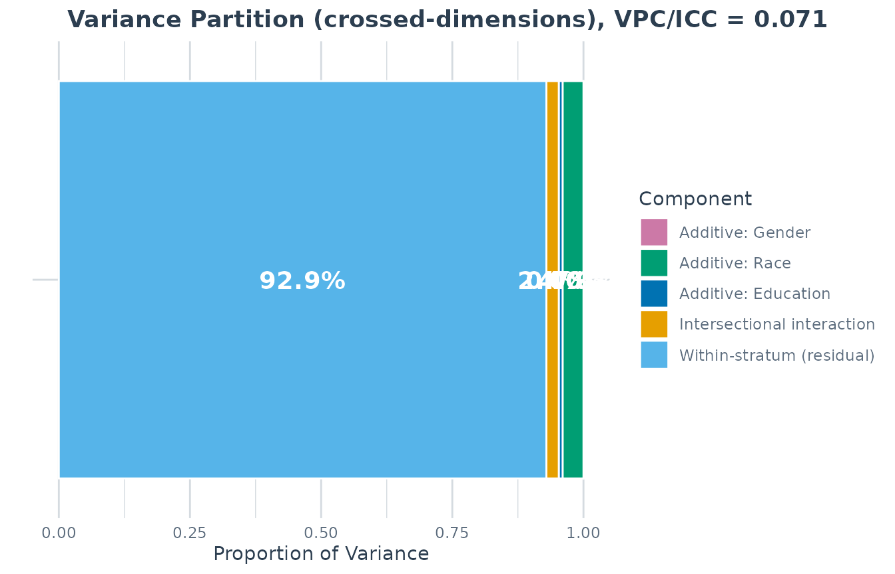
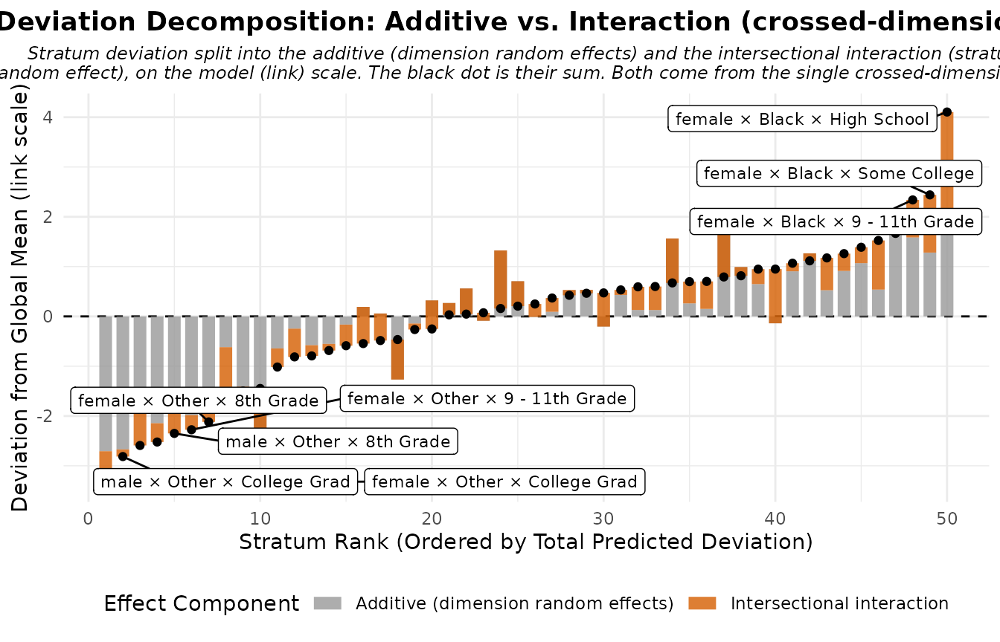
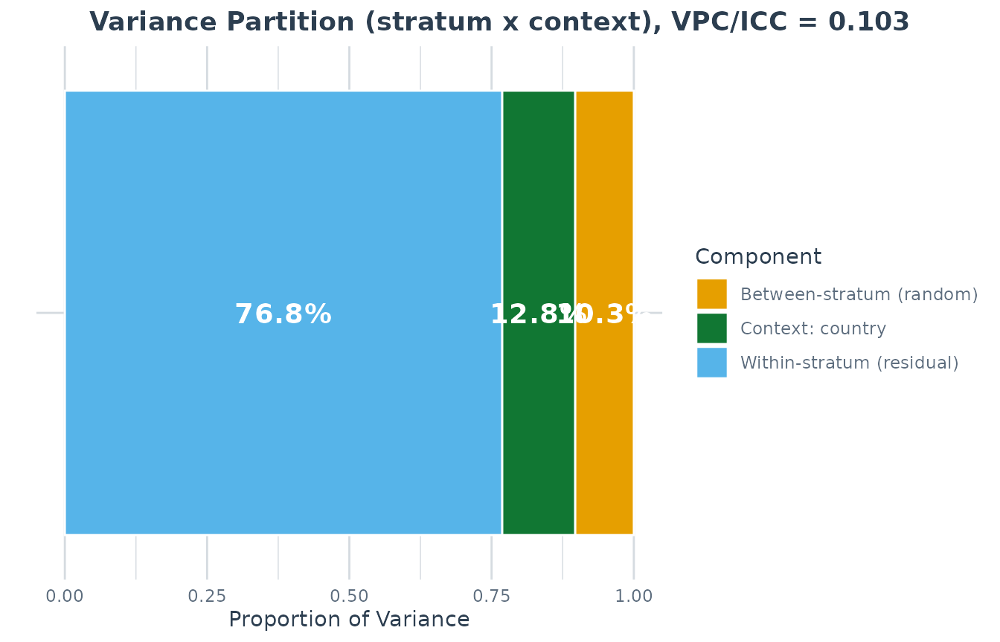
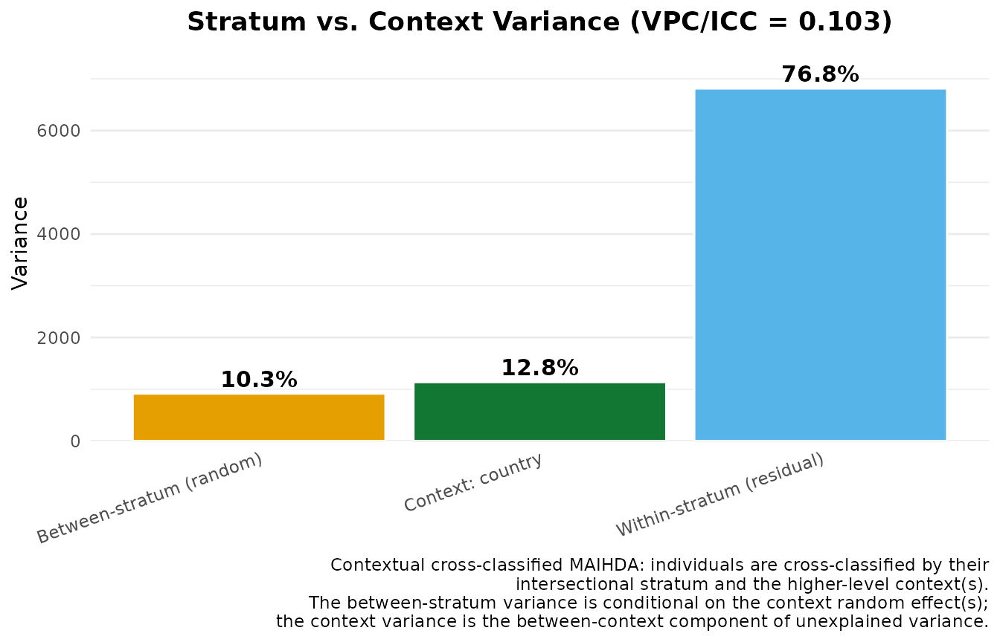

# Crossed random effects in MAIHDA: dimensions and contexts

## Two different things called “cross-classified”

This vignette covers the two MAIHDA designs that cross the
intersectional stratum random effect with other random intercepts, and
disentangles two senses of the term “cross-classified” that are easy to
confuse:

1.  The crossed-dimensions decomposition
    (`maihda(decomposition = "crossed-dimensions")`): the stratum
    dimensions’ *own* main effects enter as random intercepts alongside
    the intersection, in order to estimate a model-based split of the
    between-strata variance into additive and interaction parts within a
    single model.

2.  The contextual cross-classified MAIHDA (`context =`): individuals
    are cross-classified by their intersectional stratum and a
    higher-level place or institution, patients within strata and
    hospitals, students within strata and schools. This is what the
    literature usually means by “cross-classified MAIHDA” (e.g. hospital
    differences in patient survival, or schools crossed with
    sociodemographic strata in student achievement). It partitions the
    unexplained variance into between-stratum vs. between-context
    vs. residual.

The two answer different questions, “how much of the intersectional
inequality is more than additive under this model?” vs. “how much of the
unexplained clustering is between strata rather than between shared
contexts?”, and they compose: you can fit both structures in one model.

## Part 1, The crossed-dimensions decomposition

Intersectional MAIHDA asks how much of the unexplained variation in an
outcome lies between intersectional strata, and how much of that
between-stratum variation can be represented by additive main effects of
the constituent dimensions versus intersectional interaction remaining
over and above those additive parts.

The package offers two estimators for that split, selected with the
`decomposition` argument of
[`maihda()`](https://hdbt.github.io/MAIHDA/reference/maihda.md):

- `"two-model"` (default), the classic approach. Fit a null model and an
  adjusted model that adds the dimensions’ additive main effects as
  fixed effects, and use the PCV (the proportional change in
  between-stratum variance) as the additive-share summary. See
  [`vignette("introduction", package = "MAIHDA")`](https://hdbt.github.io/MAIHDA/articles/introduction.md).

- `"crossed-dimensions"`, a single model that enters each dimension’s
  additive main effect as a random intercept:

  ``` math
  y_i = \beta_0 + \mathbf{x}_i\boldsymbol\beta
    + u^{(1)}_{d_1[i]} + \dots + u^{(K)}_{d_K[i]} + u^{(\text{stratum})}_{s[i]} + e_i.
  ```

  Under this random-effects parameterization, each dimension’s
  random-effect variance is treated as that dimension’s additive
  contribution, and the full intersection (`stratum`) random-effect
  variance is the residual interaction beyond additive. The additive and
  interaction shares are therefore model-implied shares of the
  between-strata variance from this one fit.

It is fit with ordinary multilevel software, `lme4` for a frequentist
fit or `brms` for a Bayesian one, so it does not require any special
toolchain.

### Running a crossed-dimensions analysis

``` r

library(MAIHDA)
data("maihda_health_data")

cc <- maihda(
  BMI ~ Age + (1 | Gender:Race:Education),
  data = maihda_health_data,
  decomposition = "crossed-dimensions"
)
#> boundary (singular) fit: see help('isSingular')
cc
#> MAIHDA Analysis
#> ===============
#> 
#> Decomposition:   crossed-dimensions (single model)
#> Formula:         BMI ~ Age + (1 | Gender) + (1 | Race) + (1 | Education) + (1 |      stratum)
#> Engine: lme4 | Family: gaussian
#> Fit diagnostics:
#>   Singular fit: at least one variance component is estimated at (or near) zero.
#>     The between-stratum variance and any VPC/PCV derived from it may be unreliable.
#>   Convergence warnings reported by lme4:
#>     - boundary (singular) fit: see help('isSingular')
#> 
#> 
#> VPC/ICC: 0.0707
#> 
#> Additive vs. Intersectional Decomposition (crossed-dimensions):
#>   Additive (sum of dimension main effects) variance: 2.1996
#>   Intersectional interaction variance:               1.1024
#>   Total between-strata variance:                     3.3020
#>   Additive share of between-strata variance:    66.6%
#>   Interaction share of between-strata variance: 33.4%
#>   Per-dimension additive variance:
#>     Gender: 0.0000
#>     Race: 1.8589
#>     Education: 0.3407
#>   Note: the additive share is the crossed-dimensions analogue of the PCV but
#>   a different estimator; interpret the interaction share cautiously.
#> 
#> Strata: 50
#> Intersectional interactions: 0 of 50 strata flagged (95% interval, BH-adjusted)
#> 
#> Use summary() for variance components and plot(type = ...) for figures.
#> 
```

[`maihda()`](https://hdbt.github.io/MAIHDA/reference/maihda.md) builds
the crossed-dimensions model for you from the intersectional shorthand:
it reads the dimensions (`Gender`, `Race`, `Education`) from the
grouping term, adds one additive random intercept per dimension plus the
intersection random intercept, and fits the single model:

``` r

cc$formula
#> BMI ~ Age + (1 | Gender) + (1 | Race) + (1 | Education) + (1 | 
#>     stratum)
#> <environment: 0x560dfe97a7e0>
```

The partition is on `cc$decomposition` (and printed above):

``` r

cc$decomposition$additive_var        # sum of the dimension random-effect variances
#> [1] 2.199613
cc$decomposition$interaction_var     # the intersection random-effect variance
#> [1] 1.10236
cc$decomposition$additive_share      # additive share of the between-strata variance
#> [1] 0.666151
cc$decomposition$interaction_share   # the complement: the interaction share
#> [1] 0.333849
cc$decomposition$per_dim             # additive variance per dimension
#>       Gender         Race    Education 
#> 6.632123e-08 1.858914e+00 3.406986e-01
```

[`summary()`](https://rdrr.io/r/base/summary.html) shows the full
variance-components table (one row per dimension, the interaction, and
the residual) alongside the decomposition:

``` r

summary(cc$model)
#> MAIHDA Model Summary
#> ====================
#> 
#> Fit diagnostics:
#>   Singular fit: at least one variance component is estimated at (or near) zero.
#>     The between-stratum variance and any VPC/PCV derived from it may be unreliable.
#>   Convergence warnings reported by lme4:
#>     - boundary (singular) fit: see help('isSingular')
#> 
#> 
#> Variance Partition Coefficient (VPC/ICC):
#>   Estimate: 0.0707
#> 
#> Variance Components:
#>                   component  variance        sd proportion
#>            Additive: Gender 6.632e-08 0.0002575  1.420e-09
#>              Additive: Race 1.859e+00 1.3634201  3.981e-02
#>         Additive: Education 3.407e-01 0.5836939  7.297e-03
#>  Intersectional interaction 1.102e+00 1.0499335  2.361e-02
#>   Within-stratum (residual) 4.339e+01 6.5871467  9.293e-01
#>                       Total 4.669e+01 6.8331892  1.000e+00
#> 
#> Additive vs. Intersectional Decomposition (crossed-dimensions):
#>   Additive (sum of dimension main effects) variance: 2.1996
#>   Intersectional interaction variance:               1.1024
#>   Total between-strata variance:                     3.3020
#>   Additive share of between-strata variance:    66.6%
#>   Interaction share of between-strata variance: 33.4%
#>   Per-dimension additive variance:
#>     Gender: 0.0000
#>     Race: 1.8589
#>     Education: 0.3407
#>   Note: the additive share is the crossed-dimensions analogue of the PCV but
#>   a different estimator; interpret the interaction share cautiously.
#> 
#> Fixed Effects:
#>         term estimate
#>  (Intercept) 28.18811
#>          Age  0.01508
#> 
#> Stratum Estimates (first 10):
#>  stratum stratum_id                           label random_effect     se
#>        1          1  male × Hispanic × Some College      -0.12058 0.8578
#>        2          2     male × Black × College Grad       0.16241 0.8783
#>        3          3   female × White × College Grad      -1.13921 0.5571
#>        4          4     male × Hispanic × 8th Grade       0.46491 0.9478
#>        5          5    female × Mexican × 8th Grade       0.98670 0.8241
#>        6          6     male × White × College Grad      -0.13330 0.5588
#>        7          7    female × White × High School      -0.50071 0.5816
#>        8          8     male × White × Some College       1.08841 0.5517
#>        9          9 female × White × 9 - 11th Grade       0.55145 0.6631
#>       10         10 female × Hispanic × High School      -0.06806 0.8681
#>  lower_95 upper_95
#>  -1.80195  1.56079
#>  -1.55907  1.88389
#>  -2.23108 -0.04735
#>  -1.39286  2.32269
#>  -0.62859  2.60200
#>  -1.22856  0.96195
#>  -1.64070  0.63928
#>   0.00712  2.16969
#>  -0.74820  1.85110
#>  -1.76951  1.63340
#>   ... and 40 more strata
```

### Figures

The variance-partition and decomposition figures are aware of the
crossed-dimensions structure: the VPC plot shows one additive slice per
dimension plus the interaction and residual, and the deviation
decomposition splits each stratum’s deviation into its additive
(dimension random effects) and interaction (intersection random effect)
parts.

``` r

plot(cc, type = "vpc")            # per-dimension additive + interaction + residual
```



``` r

plot(cc, type = "effect_decomp")  # additive vs. interaction, per stratum
```



### Comparing across a higher-level group

Pass a `group` to decompose within each level of a higher-level
variable, here, how the additive-vs-interaction split differs across
countries in the PISA data:

``` r

data("maihda_country_data")
cc_grp <- maihda(
  math ~ 1 + (1 | gender:ses),
  data = maihda_country_data,
  group = "country",
  decomposition = "crossed-dimensions"
)
plot(cc_grp, type = "group_additive_share")  # additive share by country
plot(cc_grp, type = "group_components")       # additive / interaction / residual
```

### A Bayesian fit

Set `engine = "brms"` for a Bayesian crossed-dimensions fit; the
additive and interaction shares then carry posterior credible intervals
(no bootstrap needed). This is the recommended engine when dimensions
have few levels (see the caveats below).

``` r

cc_b <- maihda(
  BMI ~ Age + (1 | Gender:Race:Education),
  data = maihda_health_data,
  engine = "brms",
  decomposition = "crossed-dimensions"
)
cc_b$decomposition$additive_share_ci
```

### Two important caveats

1.  The additive share is not the PCV. The two-model PCV and the
    crossed-dimensions additive share target the same broad question,
    how much of the between-strata variance is additive, but with
    different estimators (fixed main effects across two models vs. a
    single model’s random main-effect variances, which are partially
    pooled). They may be directionally similar, but they need not be
    numerically close; do not treat one as a validation check for the
    other.

2.  Few-level dimensions are poorly identified. A dimension’s additive
    variance is estimated from its handful of levels. A binary dimension
    (e.g. a two-level sex variable) contributes a variance estimated
    from just two groups, so `lme4` may estimate one or more variance
    components at or near zero (a singular fit). This makes the additive
    and interaction shares unstable. Watch for the singular-fit note in
    the output, and consider `engine = "brms"` with explicit prior
    sensitivity checks when dimensions are few-levelled.

## Part 2, Contextual cross-classified MAIHDA (`context =`)

People do not only belong to intersectional strata; they are also
clustered in places and institutions, hospitals, schools,
neighbourhoods, countries. When the context matters for the outcome, a
strata-only MAIHDA can conflate stratum and context variation,
especially when strata are unevenly distributed across contexts. The
contextual cross-classified MAIHDA fits both levels jointly, crossed:

``` math
y_i = \beta_0 + \mathbf{x}_i\boldsymbol\beta
  + u^{(\text{stratum})}_{s[i]} + u^{(\text{context})}_{c[i]} + e_i,
```

and partitions the unexplained variance into

- between-stratum, the intersectional clustering net of the shared
  context (the headline VPC/ICC),
- between-context, the general contextual effect of the
  place/institution, and
- residual, within-stratum, within-context individual heterogeneity.

Pass the context column(s) via `context =`; everything else is
unchanged:

``` r

data("maihda_country_data")

ctx <- fit_maihda(
  math ~ 1 + (1 | gender:ses),
  data = maihda_country_data,
  context = "country"
)
summary(ctx)
#> MAIHDA Model Summary
#> ====================
#> 
#> Variance Partition Coefficient (VPC/ICC):
#>   Estimate: 0.1032
#> 
#> Variance Components:
#>                  component variance    sd proportion
#>   Between-stratum (random)    915.2 30.25     0.1032
#>           Context: country   1137.1 33.72     0.1283
#>  Within-stratum (residual)   6813.0 82.54     0.7685
#>                      Total   8865.3 94.16     1.0000
#> 
#> Contextual Cross-Classified Partition (stratum x context):
#>   Between-stratum (intersectional) variance: 915.2323 (share 10.3%)
#>   Context 'country' variance: 1137.1067 (share 12.8%)
#>   Note: the headline VPC/ICC is the between-stratum share conditional on
#>   the context random effect(s). The context share is the between-context
#>   component of the unexplained variance.
#> 
#> Fixed Effects:
#>         term estimate
#>  (Intercept)    492.3
#> 
#> Stratum Estimates (first 10):
#>  stratum stratum_id           label random_effect    se lower_95 upper_95
#>        1          1   male × Medium         7.404 9.689   -11.59   26.396
#>        2          2 female × Medium        -7.027 9.740   -26.12   12.063
#>        3          3   female × High        30.825 9.729    11.76   49.894
#>        4          4      male × Low       -28.600 9.741   -47.69   -9.508
#>        5          5    female × Low       -37.651 9.724   -56.71  -18.592
#>        6          6     male × High        35.048 9.713    16.01   54.085
```

The headline VPC/ICC is now the between-stratum share conditional on the
country random intercept: in these data it drops noticeably relative to
the strata-only fit, consistent with some country-level clustering or
composition being separated from the stratum component. The country
share is the general contextual effect.

``` r

# Strata-only fit for comparison: its VPC may partly reflect country clustering.
m0 <- fit_maihda(math ~ 1 + (1 | gender:ses), data = maihda_country_data)
summary(m0)$vpc$estimate          # strata-only VPC
#> [1] 0.1493031
s <- summary(ctx)
s$vpc$estimate                    # between-stratum share conditional on country
#> [1] 0.1032371
s$context$vpc_context_total      # the country (general contextual) share
#> [1] 0.1282643
```

### With the full `maihda()` workflow

`maihda(context = )` carries the context random intercept through both
the null and the adjusted model, so the PCV decomposition is computed
with the context partialled out:

``` r

a <- maihda(
  math ~ 1 + (1 | gender:ses),
  data = maihda_country_data,
  context = "country"
)
#> maihda(): added the additive main effect(s) of the stratum dimension(s) gender, ses to the adjusted model; the null model excludes them. List them in the formula to specify the adjusted model explicitly.
a
#> MAIHDA Analysis
#> ===============
#> 
#> Null formula:    math ~ (1 | stratum) + (1 | country)
#> Adjusted formula:math ~ (1 | stratum) + (1 | country) + gender + ses
#> Engine: lme4 | Family: gaussian
#> Context: country (crossed contextual random intercept in the null and adjusted models)
#> VPC/ICC (null): 0.1032
#> Context share (null): 0.1283 (between-country share of unexplained variance)
#> PCV (null -> adjusted): 0.9978
#> Between-stratum variance: 915.2323 (null) -> 1.9877 (adjusted)
#>   ~99.8% of the between-stratum variance is additive (the dimensions' main
#>   effects); the remainder is the between-stratum variance remaining after the
#>   additive main effects -- a model-dependent quantity
#> Strata: 6
#> Intersectional interactions: 0 of 6 strata flagged (95% interval, BH-adjusted)
#> 
#> Use summary() for variance components and plot(type = ...) for figures.
#> 
```

``` r

plot(a, type = "vpc")          # stacked shares, with the context broken out
```



``` r

plot(a, type = "context_vpc")  # stratum vs. context variances side by side
```



`context` also composes with the crossed-dimensions decomposition
(`maihda(..., decomposition = "crossed-dimensions", context = "country")`):
the single fit then carries the dimension, intersection, and context
random intercepts, and the context variance enters the VPC denominator.

### `context =` vs. `group =`

Both bring in a higher-level variable, but they are different designs:

|  | `group = "country"` | `context = "country"` |
|----|----|----|
| Models fitted | One independent model per country | One joint model, strata crossed with country |
| Question | Does intersectional inequality differ across countries? | How much unexplained variance is between strata vs. between countries? |
| Country effect | Handled by stratification; not estimated as a variance component | Estimated as a variance component |
| Strata | Same definitions, separate estimates per country | One set of stratum effects, pooled across countries |

Because they answer different questions,
[`maihda()`](https://hdbt.github.io/MAIHDA/reference/maihda.md) errors
if you supply both.

### Notes

- Few context levels identify the context variance weakly. The
  `maihda_country_data` example has only 6 countries resulting in
  imprecise estimates and `lme4` may fit it singular. Prefer many-level
  contexts, or `engine = "brms"`, whose priors regularise the variance.
- A manually written `+ (1 | school)` in the formula fits the same
  model, but is summarised generically as “Other random effects”. Only
  `context =` activates the labelled stratum-vs-context partition.
