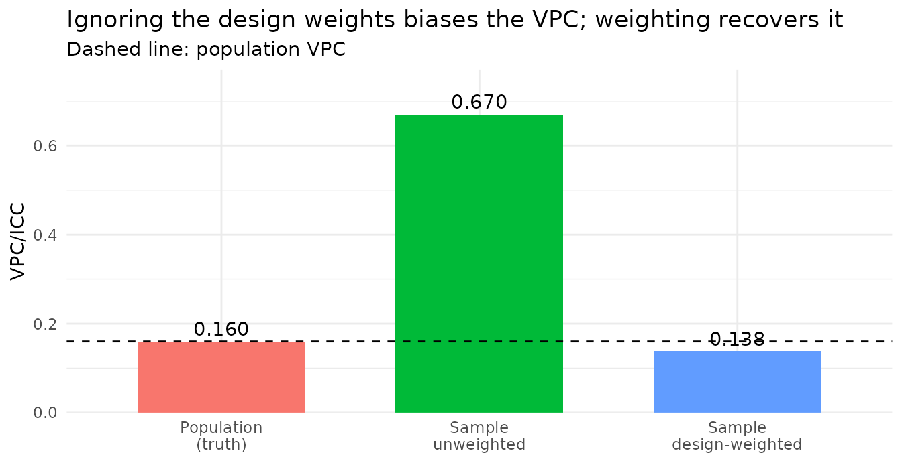

# Design-weighted MAIHDA for survey data

## Why survey weights need their own engine

Most real MAIHDA applications run on **complex survey data** – NHANES,
PISA, BRFSS – where individuals are sampled with unequal probabilities
and each carries a **sampling (design) weight**. Ignoring those weights
gives estimates for the *sample*, not the *population*. But survey
weights are **not** the same thing as `lme4`’s `weights =` argument:
those are *precision* weights that rescale the residual variance, so
feeding survey weights to `lmer()`/`glmer()` maximises the wrong
objective and returns invalid population estimates.

MAIHDA therefore routes design weights through a different estimator.
Supplying `sampling_weights` with `engine = "lme4"` is an **error**
rather than a silent misfit:

``` r

library(MAIHDA)
fit_maihda(y ~ 1 + (1 | gender:edu), data = data.frame(),
           sampling_weights = "w", engine = "lme4")
#> Error:
#> ! Sampling-weight column not found in data: w
```

With the default engine, `sampling_weights` switches (with a message) to
`engine = "wemix"`: weighted pseudo-maximum-likelihood via
[`WeMix::mix()`](https://american-institutes-for-research.github.io/WeMix/reference/mix.html),
the estimator built for NAEP/PISA-style survey analysis (Rabe-Hesketh &
Skrondal 2006). The individual weights enter at level 1; the level-2
(stratum) weights are **1**, because intersectional strata are
exhaustive population cells.

## A population with a known VPC

To see why this matters, we build a finite population whose
intersectional VPC we can measure, then sample from it *informatively* –
in a way that biases the naive analysis – and check which fit recovers
the truth.

``` r

set.seed(2024)
Npop <- 20000

gender <- sample(c("female", "male"), Npop, replace = TRUE)
edu    <- sample(c("low", "mid", "high"), Npop, replace = TRUE)
stratum_id <- paste(gender, edu, sep = ":")

# True stratum effects across the 6 gender x education cells.
u_true <- c("female:low" =  2, "female:mid" =  0, "female:high" = -2,
            "male:low"   =  3, "male:mid"   =  0.5, "male:high"  = -2.5)
y <- 50 + u_true[stratum_id] + rnorm(Npop, sd = 5)

population <- data.frame(y = y, gender = gender, edu = edu)
```

Fitting the **whole population** gives the target VPC – the
between-stratum share of variance we want any sample-based estimate to
reproduce:

``` r

m_pop <- fit_maihda(y ~ 1 + (1 | gender:edu), data = population)
vpc_pop <- glance(m_pop)$vpc
vpc_pop
#> [1] 0.1599225
```

## Informative sampling biases the naive fit

Now draw a sample in which **selection depends on the outcome, with a
sign that flips by the stratum’s effect**: higher-`y` people are
over-sampled in above-average strata and under-sampled in below-average
ones. This stretches the *apparent* between-stratum spread – the kind of
informative sampling that badly distorts a naive variance partition. The
design weight is the inverse of each person’s inclusion probability.

``` r

slope   <- 0.35 * sign(u_true[stratum_id])             # flips by stratum effect
incl_p  <- plogis(-1.8 + slope * (population$y - 50))   # selection on the outcome
sampled <- runif(Npop) < incl_p

survey <- population[sampled, ]
survey$w <- 1 / incl_p[sampled]                        # design weight
nrow(survey)
#> [1] 5971
```

An **unweighted** MAIHDA fit on this sample analyses the sampled people
as if they were the population – and the selection on `y` distorts the
variance partition:

``` r

m_unw <- fit_maihda(y ~ 1 + (1 | gender:edu), data = survey)
glance(m_unw)$vpc
#> [1] 0.6702187
```

## Design-weighted MAIHDA recovers it

Pass the weight column via `sampling_weights` and the fit switches to
the `wemix` engine, weighting each observation by its design weight so
the estimates are **population-representative** again:

``` r

m_w <- fit_maihda(y ~ 1 + (1 | gender:edu), data = survey,
                  sampling_weights = "w")
#> fit_maihda(): 'sampling_weights' supplied; using engine = "wemix" (design-weighted pseudo-maximum-likelihood via WeMix). Set 'engine' explicitly to silence this message or to choose engine = "brms".
glance(m_w)$vpc
#> [1] 0.1382455
```

``` r

library(ggplot2)

comp <- data.frame(
  fit = factor(c("Population\n(truth)", "Sample\nunweighted", "Sample\ndesign-weighted"),
               levels = c("Population\n(truth)", "Sample\nunweighted",
                          "Sample\ndesign-weighted")),
  vpc = c(vpc_pop, glance(m_unw)$vpc, glance(m_w)$vpc)
)

ggplot(comp, aes(fit, vpc, fill = fit)) +
  geom_col(width = 0.65) +
  geom_hline(yintercept = vpc_pop, linetype = "dashed") +
  geom_text(aes(label = sprintf("%.3f", vpc)), vjust = -0.4) +
  scale_y_continuous(expand = expansion(mult = c(0, 0.15))) +
  labs(x = NULL, y = "VPC/ICC",
       title = "Ignoring the design weights biases the VPC; weighting recovers it",
       subtitle = "Dashed line: population VPC") +
  theme_minimal() + theme(legend.position = "none")
```



The unweighted VPC is several times the population value, because the
stratum-dependent selection stretches the apparent between-stratum
spread; the design-weighted fit weights each person by the inverse of
their selection probability and restores the population partition. The
whole toolkit – [`summary()`](https://rdrr.io/r/base/summary.html),
stratum predictions, the plots,
[`calculate_pvc()`](https://hdbt.github.io/MAIHDA/reference/calculate_pvc.md),
and the [`maihda()`](https://hdbt.github.io/MAIHDA/reference/maihda.md)
two-model decomposition – is design-weighted once you pass
`sampling_weights`, with design-consistent (sandwich) standard errors
for the fixed effects, and a design-weighted AUC for a binary outcome.

## Scope and limitations

- **Canonical structure only.** The `wemix` engine supports
  `gaussian(identity)` and `binomial(logit)` with the single
  `(1 | stratum)` intercept. Crossed random effects –
  `decomposition = "crossed-dimensions"` and `context =` – need
  `engine = "lme4"` or `"brms"`.
- **No parametric bootstrap** for `wemix` (a design-based interval needs
  replicate weights). Rows with missing or non-positive weights are
  dropped with a warning.
- **brms alternative.** `engine = "brms"` accepts `sampling_weights` as
  likelihood weights – a *pseudo-posterior*: the point estimates are
  design-consistent, but the credible intervals are not design-based (a
  message says so).

``` r

fit_maihda(y ~ 1 + (1 | gender:edu), data = survey,
           sampling_weights = "w", engine = "brms")
```

> **A note on the bundled data.** `maihda_health_data` (NHANES) and
> `maihda_country_data` (PISA) are teaching subsets that deliberately
> *drop* the surveys’ weights, so they are not survey-representative.
> Use `sampling_weights` with your own weighted data, exactly as shown
> above.

## See also

- [Introduction to
  MAIHDA](https://hdbt.github.io/MAIHDA/articles/introduction.md) – the
  end-to-end workflow.
- [Planning a MAIHDA
  study](https://hdbt.github.io/MAIHDA/articles/planning_a_study.md) –
  choosing strata and when MAIHDA fits.
- [Comparing intersectional inequality across
  groups](https://hdbt.github.io/MAIHDA/articles/group_comparison.md).

## References

- Rabe-Hesketh, S., & Skrondal, A. (2006). Multilevel modelling of
  complex survey data. *Journal of the Royal Statistical Society: Series
  A*, 169(4), 805-827.
