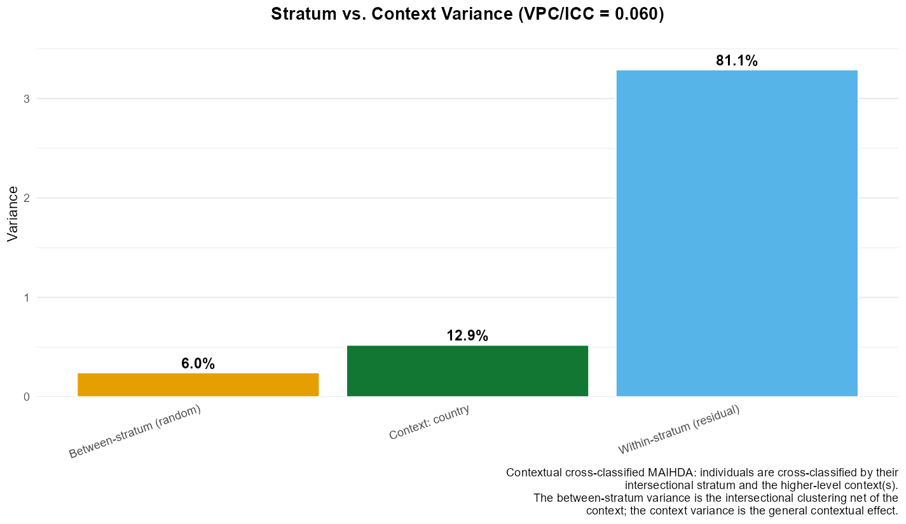
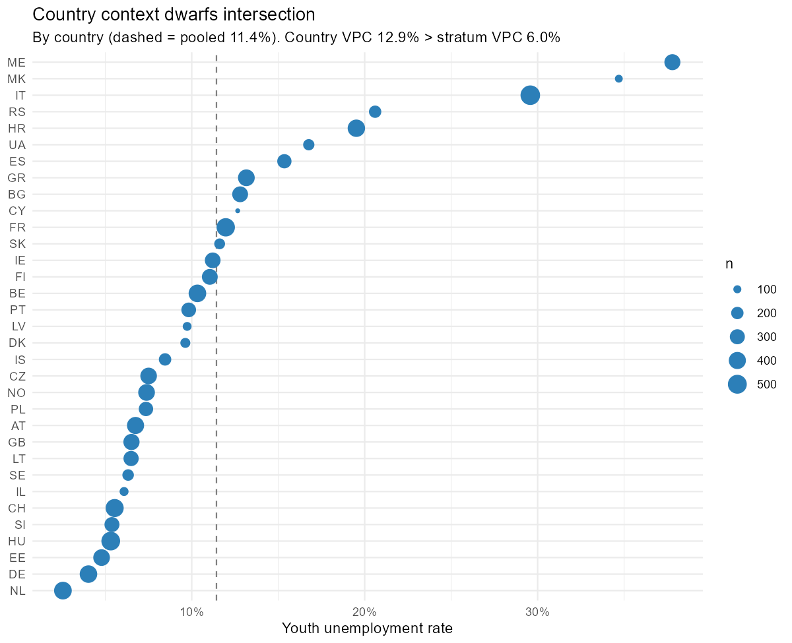
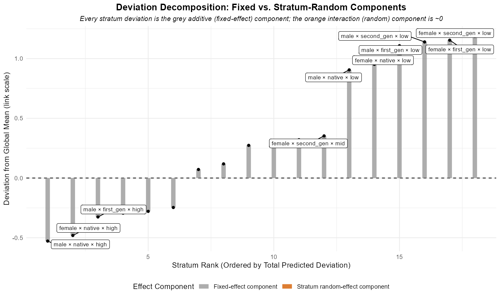
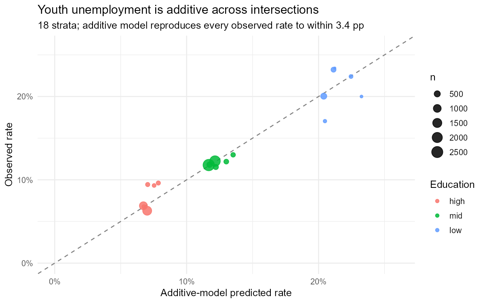
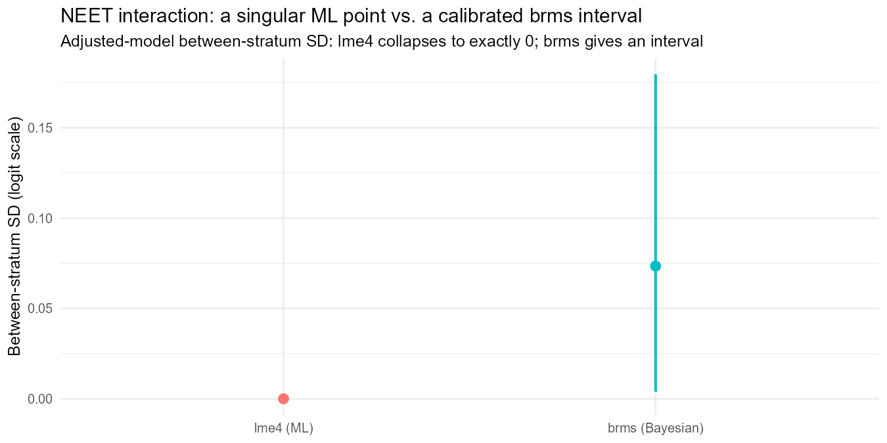

# Case study: youth unemployment across Europe (ESS)

## What this case study does

The other vignettes explain MAIHDA’s machinery on data chosen to teach
it. This one goes the other way: it takes a real, contested empirical
question – *how intersectional is youth unemployment in Europe?* – and
walks the full MAIHDA workflow on real survey data, reporting what it
finds, including where the honest answer is “we cannot tell”. It leans
on, rather than repeats, the method vignettes: see
[`vignette("cross_classified")`](https://hdbt.github.io/MAIHDA/articles/cross_classified.md)
for the contextual design used here,
[`vignette("binary_outcomes")`](https://hdbt.github.io/MAIHDA/articles/binary_outcomes.md)
for discriminatory accuracy, and
[`vignette("bayesian_sparse_maihda")`](https://hdbt.github.io/MAIHDA/articles/bayesian_sparse_maihda.md)
for the singular-fit problem that returns at the end.

The headline is deliberately undramatic and is the point of the
exercise: **MAIHDA reveals a strong intersectional *gradient* in youth
unemployment, finds it essentially *additive* rather than
multiplicative, and – on a harder outcome – shows why a single-number
interaction estimate should not be trusted.** Additivity is not the
absence of intersectionality; it is an empirical result about its
*form*, and it is the form most MAIHDA studies report.

## Data

The data are the **European Social Survey**, integrated files for
**Rounds 9-11 (2018-2022)**, pooled. The analysis sample is **10,114
economically active young people aged 15–29** across **33 countries**.
“Economically active” is the ILO labour-force base – in paid work, or
unemployed and actively looking – which is the youth-unemployment-rate
denominator and which excludes students, so *completed* education is
meaningful. The pooled unemployment rate is **11.4%**.

The intersectional strata cross three dimensions into **18 strata**:

- **gender** (male / female),
- **migration background** (native / second-generation /
  first-generation, from the respondent’s and parents’ country of
  birth),
- **education** (low / medium / high, ES-ISCED collapsed).

Every stratum holds at least 47 people, so the between-stratum variance
is well estimated – this is *not* the sparse regime of
[`vignette("bayesian_sparse_maihda")`](https://hdbt.github.io/MAIHDA/articles/bayesian_sparse_maihda.md).

``` r

# The ESS microdata is licence-restricted; download the integrated .dta files into
# data-raw/ess/ (see data-raw/ess/README.md) and run data-raw/fetch_ess_youth.R,
# which builds the analysis frame `ess_youth` used below.
```

## The design: country as context, not stratum

Youth unemployment ranges from under 3% to nearly 40% *between*
countries, so country cannot be ignored. But country-by-stratum cells
are thin, so folding country *into* the strata would force the analysis
into the sparse regime. The contextual cross-classified MAIHDA solves
this: country enters as a *crossed* random intercept, estimated from 33
well-populated levels, while the intersectional strata stay clean.

``` r

au <- maihda(unemployed ~ gender + migration + education + (1 | gender:migration:education),
             data = ess_youth, context = "country", family = "binomial",
             response_vpc = TRUE)
```

## What MAIHDA reveals: a real intersectional gradient



The variance partition puts **6.0%** of the (latent-scale) variation
*between intersectional strata* and **12.9%** between countries – the
contextual effect is about twice the intersectional one. The strata are
far from inert, though: the discriminatory accuracy is **AUC = 0.735**
with a **median odds ratio of 1.60** (1,156 unemployed vs. 8,958
employed). An AUC of 0.74 is high by MAIHDA standards: knowing only a
young person’s gender, migration background and education separates the
unemployed from the employed fairly well. That separation – a 3–4×
spread in risk across strata – *is* the intersectional inequality, and
MAIHDA has surfaced it.



## Additive or multiplicative?

The substantive intersectionality question is whether the
multiply-disadvantaged are worse off than the *sum* of their
disadvantages – a genuine interaction – or merely the sum of them. The
two-model PCV answers it: the additive main effects of gender, migration
and education explain **100.0%** of the between-stratum variance.



A PCV at the ceiling, with a singular adjusted fit, *could* be the
over-shrinkage artefact of
[`vignette("bayesian_sparse_maihda")`](https://hdbt.github.io/MAIHDA/articles/bayesian_sparse_maihda.md).
Here it is not – it is corroborated two ways that do not depend on the
random-effect machinery:

- a shrinkage-free likelihood-ratio test of the full three-way
  interaction against the additive model is non-significant (χ² = 5.9,
  12 df, *p* = 0.923; AIC prefers the additive model), and
- the additive model reproduces every one of the 18 observed stratum
  rates to within **3.4 percentage points**:



So a low-educated migrant woman is at high risk – but almost exactly the
risk that adding “female”, “migrant” and “low-educated” predicts, with
no extra multiplicative penalty. Education dominates the gradient;
gender and migration add modestly. This *mostly-additive* pattern is the
rule across the MAIHDA literature, not an anomaly.

## A harder probe: NEET and the migrant-women hypothesis

Unemployment-among-the-active excludes the inactive, and
intersectionality theory locates one of its clearest predictions there:
young migrant women drawn into home/care roles. The **NEET** indicator
(not in employment, education or training), measured on **all** 20,602
young people (rate 15.8%), pulls that channel back in. The raw
gender-by-migration NEET rates show exactly the predicted shape:

|        | native | second_gen | first_gen |
|:-------|:-------|:-----------|:----------|
| male   | 12.7%  | 13.4%      | 13.6%     |
| female | 18.2%  | 17.9%      | 22.3%     |

NEET rate by gender and migration background {.table}

Migration barely moves NEET for men or for native/second-generation
women – and then first-generation migrant women jump. A joint
likelihood-ratio test of the two-way interactions is
borderline-significant (χ² = 15.9, 8 df, *p* = 0.045). There is, at
least, a hint of a genuine interaction here.

## The trap, and the honest answer

What does the MAIHDA decomposition make of that hint? With
`engine = "lme4"`, nothing: the adjusted NEET model is **singular**, the
interaction variance pinned to exactly zero, PCV = 100.0% – the hint
vanishes, reported as certain additivity. With only 18 strata, an
interaction *variance* this small is at the edge of what maximum
likelihood can estimate, and it fails silently. This is the same failure
as
[`vignette("bayesian_sparse_maihda")`](https://hdbt.github.io/MAIHDA/articles/bayesian_sparse_maihda.md),
now on real data.

A Bayesian refit with a mildly-informative prior is the fix. It does not
manufacture an effect the data cannot support; it replaces the singular
point with an honest interval.

``` r

# Precomputed in data-raw/precompute_youth_vignette.R (brms needs Stan and is slow).
f_adj <- brm(neet ~ gender + migration + education + (1 | stratum) + (1 | country),
             family = bernoulli(), data = ess_youth_neet,
             prior = c(prior(normal(0, 1), class = "b"),
                       prior(normal(0, 0.5), class = "sd")),
             chains = 4, iter = 4000, warmup = 1500, control = list(adapt_delta = 0.95))
```



Two things change. The adjusted between-stratum interaction SD is no
longer a singular zero but a credible interval, **0.073, 95% CrI
\[0.004, 0.180\]** – small, with a lower bound near the floor. And the
explicit migrant-women interaction carries an odds ratio of **1.19**
with a **89%** posterior probability of being a penalty, but a 95%
credible interval (**0.90–1.57**) that still spans 1. (Sampler: max
R-hat 1.004, 0 divergences.)

| interaction term    | OR (median) | OR 2.5% | OR 97.5% | P(OR \> 1) |
|:--------------------|------------:|--------:|---------:|-----------:|
| female x second_gen |       0.894 |   0.701 |    1.150 |      0.188 |
| female x first_gen  |       1.187 |   0.899 |    1.571 |      0.887 |

Explicit gender x migration interaction, brms posterior {.table}

The honest reading is **suggestive, not confirmed**. There is roughly a
four-in-five posterior chance that first-generation migrant women carry
a NEET penalty beyond additivity, but the interval crosses one, so it
cannot be asserted. Crucially, that is a *defensible* summary; the
singular `lme4` zero was not. The interval is what `brms` contributes,
exactly as in the sparse-data vignette.

## Takeaways

- MAIHDA **revealed** the intersectional structure of European youth
  unemployment: a strong gradient (3–4× across strata) with real
  discriminatory accuracy (AUC 0.74), dominated by education and
  overlaid on a still-larger cross-country contextual effect.
- That inequality is **additive**, not multiplicative – corroborated by
  the PCV, a shrinkage-free interaction test, and the raw rates.
  Additivity *is* an intersectionality finding; it adjudicates the
  additive-vs-multiplicative debate that the theory leaves open, and
  lands where most MAIHDA applications do.
- On NEET, where theory predicts a migrant-women interaction, the data
  give a hint that the variance decomposition can only summarise
  honestly with a **Bayesian interval** – a worked reminder not to read
  a singular `lme4` interaction of zero as evidence of none.

## Caveats and reproducibility

The ESS microdata is licence-restricted and is **not** distributed with
the package; only these derived summaries and figures are. The analysis
is **unweighted** (ESS design/post-stratification weights could be added
via `engine = "wemix"`); pools three rounds without a period term;
covers 33 ESS countries (which include non-EU members, so “Europe (ESS)”
is not the EU-27); and rests on 18 strata, few enough that the
interaction *variance* is hard to estimate – the very point of the final
section. To reproduce: download the ESS Round 9–11 integrated files into
`data-raw/ess/`, then run `data-raw/fetch_ess_youth.R` and
`data-raw/precompute_youth_vignette.R`. \`\`\`
