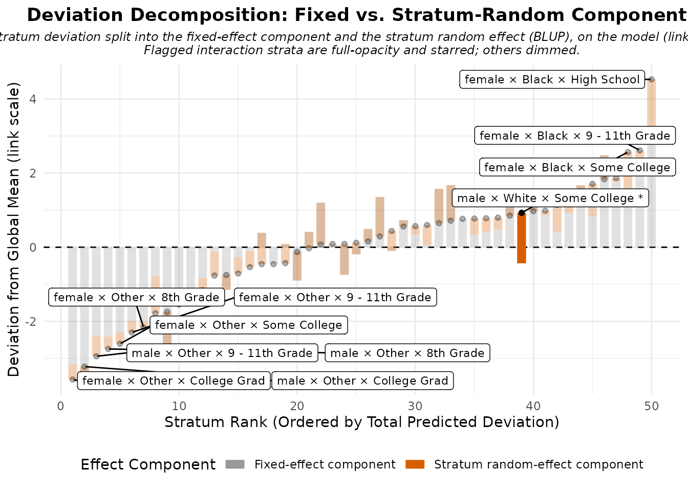
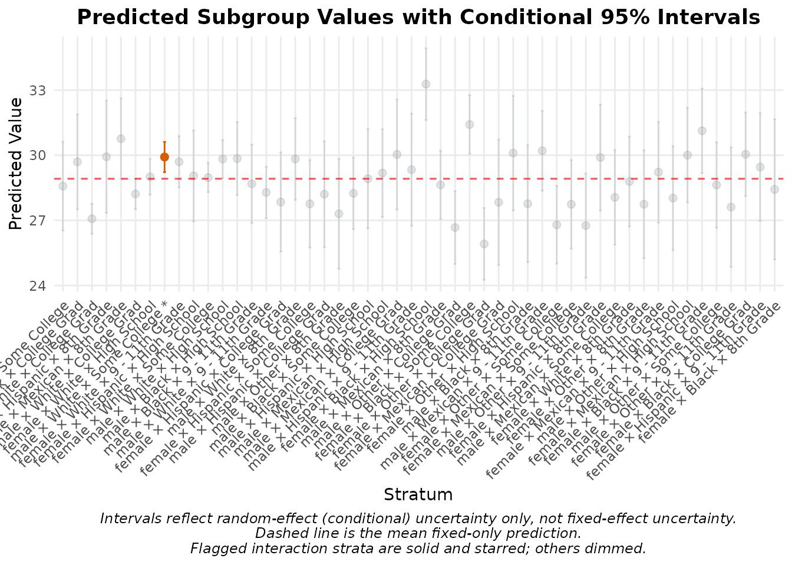

# Finding interaction patterns

## Overview

One question that does come up naturaly is which strata depart most
clearly from the additive expectation?

For these exploratory diagnostics,
[`maihda()`](https://hdbt.github.io/MAIHDA/reference/maihda.md) can
compute the stratum random effects and intervals from the adjusted
model, and apply a multiplicity rule to flag strata that depart from the
additive expectation more than expected by chance. The diagnostic is
stored in the fitted model object and can be used to highlight strata in
the effect-decomposition and predicted-strata plots.

## Run a standard analysis and choose the multiplicity rule

The default is `adjust = "none"`. This reports each stratum-level
interval and flag without a multiple-testing correction.

If the goal is to scan all strata and highlight a smaller set for
follow-up, use an adjustment such as Benjamini-Hochberg:

``` r

library(MAIHDA)
model_bh <- maihda(
  BMI ~ Age + Gender + Race + Education + (1 | Gender:Race:Education),
  data = maihda_health_data,
  interactions = "BH" # Benjamini-Hochberg adjustment
)
```

The printed output reports how many strata were flagged and which
adjustment rule was used. The full table is stored in `a$interactions`.

``` r

model_bh$interactions
#> Strata with credibly non-zero intersectional interaction
#> ========================================================
#> 
#> 1 of 50 strata flagged (95% interval; BH-adjusted p-values).
#> Model: adjusted (two-model); interaction on the link (latent) scale.
#> 
#>  stratum                       label   n interaction     se  lower upper
#>        8 male × White × Some College 328       1.359 0.3448 0.6836 2.035
#>    p_value p_adjusted flagged direction
#>  8.056e-05   0.004028    TRUE     above
#> 
#> Interaction BLUPs are shrunken (partially pooled) estimates; treat flags as
#>   exploratory. See ?maihda_interactions.
```

Each row is one stratum. The main columns are:

- `interaction`: the adjusted-model stratum random effect, on the model
  scale.
- `lower` and `upper`: the interval for that random effect.
- `direction`: whether the stratum is above or below the additive
  expectation.
- `flagged`: whether the stratum passes the selected screening rule.

For frequentist fits, the table also includes the conditional standard
error, p-value, and adjusted p-value when a correction is requested.

## Highlight flagged strata

The plotting methods can reuse the stored diagnostic.

``` r

plot(model_bh, type = "effect_decomp", highlight_interactions = TRUE)
```



To highlight the strata that survive a specific adjustment ( in this
case Benjamini-Hochberg ), pass the adjusted model object that contains
the diagnostic with the desired adjustment:

``` r

plot(model_bh, type = "predicted", highlight_interactions = TRUE)
```



## See also

- [Introduction to
  MAIHDA](https://hdbt.github.io/MAIHDA/articles/introduction.md), the
  main two-model workflow.
- [Interpreting MAIHDA plots and
  diagnostics](https://hdbt.github.io/MAIHDA/articles/interpreting_plots.md),
  how to read the effect-decomposition and predicted-strata plots.
- [Bayesian MAIHDA for sparse
  intersections](https://hdbt.github.io/MAIHDA/articles/bayesian_sparse_maihda.md),
  sparse cells and uncertainty in variance components.

## References

- Evans, C. R., Williams, D. R., Onnela, J. P., & Subramanian, S. V.
  (2018). A multilevel approach to modeling health inequalities at the
  intersection of multiple social identities. *Social Science &
  Medicine*, 203, 64-73.

- Merlo, J. (2018). Multilevel analysis of individual heterogeneity and
  discriminatory accuracy (MAIHDA) within an intersectional framework.
  *Social Science & Medicine*, 203, 74-80.
