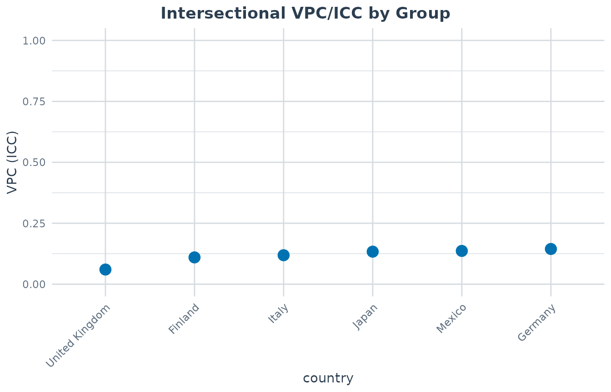
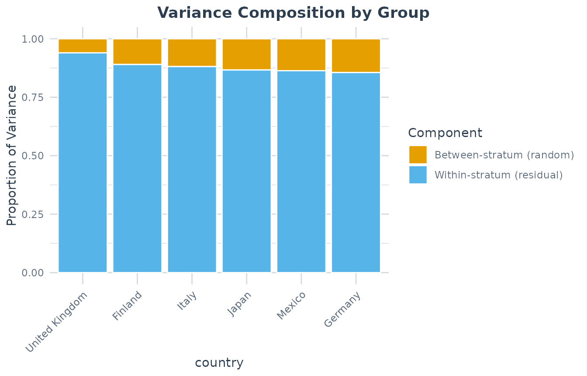
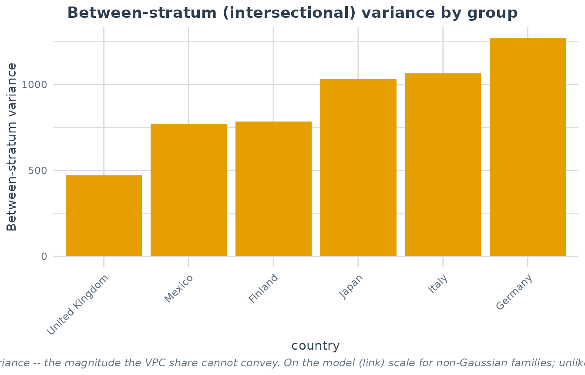
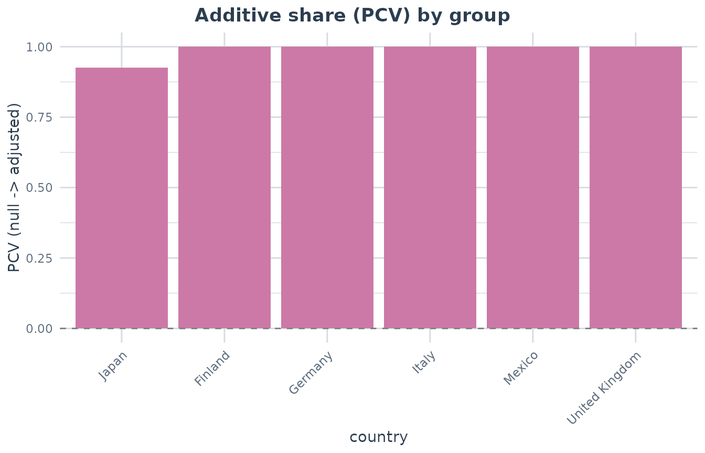

# Comparing Intersectional Inequality Across Groups

## Introduction

MAIHDA is often used to estimate how much outcome variation lies between
intersectional strata in a single population. The group comparison
workflow asks a related contextual question: is intersectional
inequality larger in some higher-level groups than in others?

Examples include comparing gender-by-class inequality across countries,
race-by-gender inequality across regions, or intersectional inequality
across survey waves. In the MAIHDA package, this is handled by
[`maihda()`](https://hdbt.github.io/MAIHDA/reference/maihda.md) with a
`group` argument or, when you want only the group comparison table, by
[`compare_maihda_groups()`](https://hdbt.github.io/MAIHDA/reference/compare_maihda_groups.md).

## Example data: countries, gender, and socioeconomic status

The package includes `maihda_country_data`, a teaching dataset based on
a balanced subset of OECD PISA 2018 data. Each row is a student, the
outcome is a mathematics score, and the intersectional strata are formed
by `gender` and `ses`.

The higher-level grouping variable is `country`, which lets us ask
whether the VPC/ICC for gender-by-SES inequality differs across
countries.

``` r

library(MAIHDA)
data("maihda_country_data")

country_counts <- as.data.frame(table(maihda_country_data$country))
names(country_counts) <- c("country", "n")
country_counts
#>          country   n
#> 1        Finland 600
#> 2        Germany 600
#> 3 United Kingdom 600
#> 4          Italy 600
#> 5          Japan 600
#> 6         Mexico 600

table(maihda_country_data$gender, maihda_country_data$ses)
#>         
#>          Low Medium High
#>   female 619    571  588
#>   male   581    629  612
```

## One-call workflow

Use [`maihda()`](https://hdbt.github.io/MAIHDA/reference/maihda.md) when
you want the full decomposition and the group comparison in one object.
The formula below defines six intersectional strata (`gender:ses`) and
asks for a separate decomposition within each country. Because
[`maihda()`](https://hdbt.github.io/MAIHDA/reference/maihda.md) is a
two-model workflow, it fits both the null and the adjusted model overall
*and* within each country, so the group table also carries a per-country
**PCV** (the additive share of that country’s intersectional
inequality).

``` r

# gender + ses are written as additive fixed effects (the adjusted model); maihda()
# derives the null by dropping them, both overall and within each country.
analysis <- maihda(
  math ~ gender + ses + (1 | gender:ses),
  data = maihda_country_data,
  group = "country"
)
#> boundary (singular) fit: see help('isSingular')
#> boundary (singular) fit: see help('isSingular')
#> boundary (singular) fit: see help('isSingular')
#> boundary (singular) fit: see help('isSingular')
#> boundary (singular) fit: see help('isSingular')
#> boundary (singular) fit: see help('isSingular')
#> Warning: compare_maihda_groups(): the adjusted model was singular for group(s)
#> Finland, Germany, Italy, Mexico, United Kingdom, so the adjusted
#> between-stratum variance sits at the boundary (~0) and the PCV saturates near
#> 100% (pcv_status = "singular"). Read those groups' PCV with caution -- a
#> near-complete attenuation can reflect a boundary fit as well as genuinely
#> additive strata.

analysis
#> MAIHDA Analysis
#> ===============
#> 
#> Null formula:    math ~ (1 | stratum)
#> Adjusted formula:math ~ gender + ses + (1 | stratum)
#> Engine: lme4 | Family: gaussian
#> VPC/ICC (null): 0.1493
#> PCV (null -> adjusted): 1.0000
#> Between-stratum variance: 1352.2436 (null) -> 0.0000 (adjusted)
#>   ~100.0% of the between-stratum variance is additive (the dimensions' main
#>   effects); the remainder is the between-stratum variance remaining after the
#>   additive main effects -- a model-dependent quantity
#> Strata: 6
#> Intersectional interactions: 0 of 6 strata flagged (95% interval, BH-adjusted)
#> 
#> Group comparison by 'country':
#> MAIHDA Group Comparison
#> =======================
#> 
#> Group variable: country 
#> Engine: lme4  | Family: gaussian  | Strata: shared/global 
#> Variance basis: as fitted (REML for Gaussian lmer) 
#> 
#>           group   n n_strata     vpc var_between var_other var_residual    pcv
#>         Finland 600        6 0.10994       785.8         0         6361 1.0000
#>         Germany 600        6 0.14448      1271.6         0         7529 1.0000
#>           Italy 600        6 0.11890      1065.3         0         7895 1.0000
#>           Japan 600        6 0.13344      1032.3         0         6704 0.9266
#>          Mexico 600        6 0.13649       771.5         0         4881 1.0000
#>  United Kingdom 600        6 0.06011       470.5         0         7357 1.0000
#>  var_between_adjusted var_between_adjusted_ml pcv_status status
#>                  0.00                    0.00   singular     ok
#>                  0.00                    0.00   singular     ok
#>                  0.00                    0.00   singular     ok
#>                 75.78                   75.78         ok     ok
#>                  0.00                    0.00   singular     ok
#>                  0.00                    0.00   singular     ok
#> 
#> Use summary() for variance components and plot(type = ...) for figures.
#> 
```

The printed report includes the overall VPC/ICC and PCV first, then the
country-level comparison. The group comparison is also stored in
`analysis$groups`, so it can be inspected or saved as a regular data
frame.

``` r

group_results <- as.data.frame(analysis$groups)
group_results[order(group_results$vpc, decreasing = TRUE),
              c("group", "n", "n_strata", "vpc", "var_between",
                "var_residual", "pcv", "status")]
#>            group   n n_strata        vpc var_between var_residual      pcv
#> 2        Germany 600        6 0.14448319   1271.5810     7529.311 1.000000
#> 5         Mexico 600        6 0.13649162    771.5419     4881.127 1.000000
#> 4          Japan 600        6 0.13344144   1032.3346     6703.902 0.926596
#> 3          Italy 600        6 0.11889899   1065.3186     7894.544 1.000000
#> 1        Finland 600        6 0.10994297    785.7610     6361.226 1.000000
#> 6 United Kingdom 600        6 0.06011138    470.5471     7357.372 1.000000
#>   status
#> 2     ok
#> 5     ok
#> 4     ok
#> 3     ok
#> 1     ok
#> 6     ok
```

In this example all countries have 600 students and all six
gender-by-SES strata are populated. Higher VPC/ICC values indicate that
a larger share of mathematics score variation lies between the
intersectional strata within that country; the `pcv` column shows how
much of each country’s between-stratum variance is the additive sum of
the gender and SES main effects (so a lower PCV flags inequality that is
more intersection-specific). Here the `pcv` is essentially 1 in every
country – a real feature of this data, not an artefact; the PCV section
below explains why that flat result is itself the finding.

## Visualizing the comparison

The group VPC plot orders countries by the estimated intersectional
VPC/ICC. If the comparison was run with `bootstrap = TRUE`, the same
plot will include per-country confidence intervals.

``` r

plot(analysis, type = "group_vpc")
```



The variance-components view shows the same comparison as shares of the
total model variance. The orange segment is the between-stratum
component, which is the numerator of the VPC/ICC.

``` r

plot(analysis, type = "group_components")
```



## Share versus magnitude

The VPC/ICC is a *ratio*: the share of the unexplained variation that
lies between strata. A larger VPC therefore does not necessarily mean a
larger *amount* of between-stratum (intersectional) variation – it can
also reflect a smaller residual variance. Two countries with the same
absolute between-stratum variance can have very different VPCs, and vice
versa.

The `"group_between_variance"` view plots the absolute between-stratum
variance (`var_between`) directly, so it can be read alongside the VPC
to separate the *share* of inequality from its *magnitude*.

``` r

plot(analysis, type = "group_between_variance")
```



For non-Gaussian models this variance is on the model (link) scale, and
unlike the VPC it is not normalised by the residual variance.

## Additive share (PCV) by group

The `"group_pcv"` view bars each country’s PCV – the proportional drop
in between-stratum variance once the gender and SES main effects are
added. A high bar means that country’s intersectional inequality is
largely the additive sum of its parts; a low (or negative) bar flags
inequality that is more intersection-specific. (With strata defined by a
single dimension there is no intersection to decompose, so this view and
the `pcv` column are unavailable.)

In this real-data example the view is deliberately anticlimactic: every
bar sits at (essentially) 100%. The PISA gender-by-SES achievement gaps
are almost purely additive, so once the two main effects enter the model
no between-stratum variance remains in any country – each per-country
adjusted fit lands on the singular boundary, which is what the
`boundary (singular) fit` messages emitted while the models were fitted
mean here. The flat row of full-height bars is itself the substantive
result: none of these six countries shows intersection-specific
gender-by-SES inequality in mathematics. The view earns its keep when
the bars *differ* – a country with a visibly lower (or negative) bar
would be the one whose inequality is more than the sum of its parts.

``` r

plot(analysis, type = "group_pcv")
```



## Direct group comparison

If you only need the group comparison table and plots, call
[`compare_maihda_groups()`](https://hdbt.github.io/MAIHDA/reference/compare_maihda_groups.md)
directly. This fits the same per-country null and adjusted models used
by `maihda(group = "country")` (the `pcv` column appears when the strata
have at least two dimensions).

``` r
group_cmp <- compare_maihda_groups(
  math ~ 1 + (1 | gender:ses),
  data = maihda_country_data,
  pvc_
  group = "country"
)

group_cmp
plot(group_cmp, type = "vpc")
plot(group_cmp, type = "components")
plot(group_cmp, type = "pcv")
```

By default, `shared_strata = TRUE`. That means the `gender:ses` strata
are defined once on the pooled data, then reused in every country. A
“female:Low” stratum therefore refers to the same type of stratum in
each country, which makes the stratum *definitions* comparable across
countries.

Shared definitions are necessary but not by themselves sufficient for
the VPCs to be *directly* comparable. A given country may not contain
every stratum, so two countries’ VPCs can be estimated over different
sets of *populated* strata. When that happens,
[`compare_maihda_groups()`](https://hdbt.github.io/MAIHDA/reference/compare_maihda_groups.md)
issues a warning, and the VPCs should be read with that caveat in mind
(alongside the `n_strata` column) rather than as strictly like-for-like.

Set `shared_strata = FALSE` only when you intentionally want each group
to rebuild its own strata. In that case, stratum identities are no
longer shared across groups, so interpretation should focus on
within-group structure rather than direct stratum-to-stratum comparison.

## Adding bootstrap intervals

For publication-oriented summaries, you can request per-group parametric
bootstrap confidence intervals with the `lme4` engine. This can take
noticeably longer because each group requires repeated model refits, so
the example is not run when the vignette is built.

``` r

group_cmp_boot <- compare_maihda_groups(
  math ~ 1 + (1 | gender:ses),
  data = maihda_country_data,
  group = "country",
  bootstrap = TRUE,
  n_boot = 500
)

plot(group_cmp_boot, type = "vpc")
```
