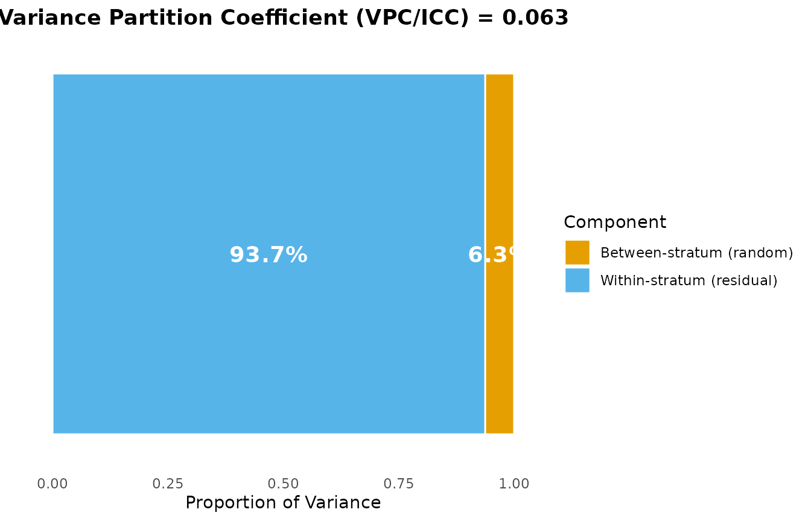
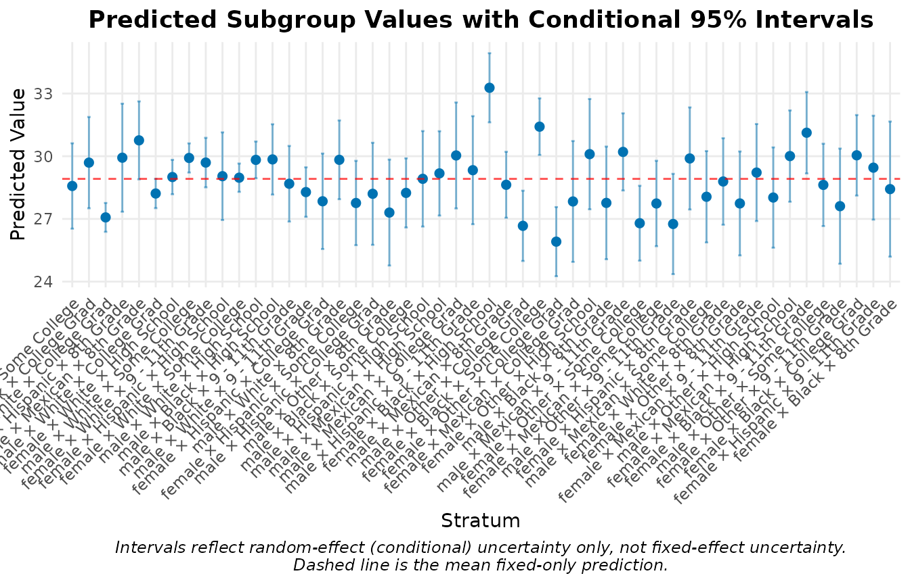
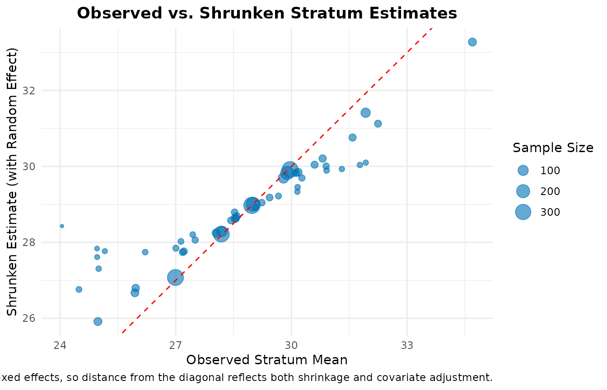
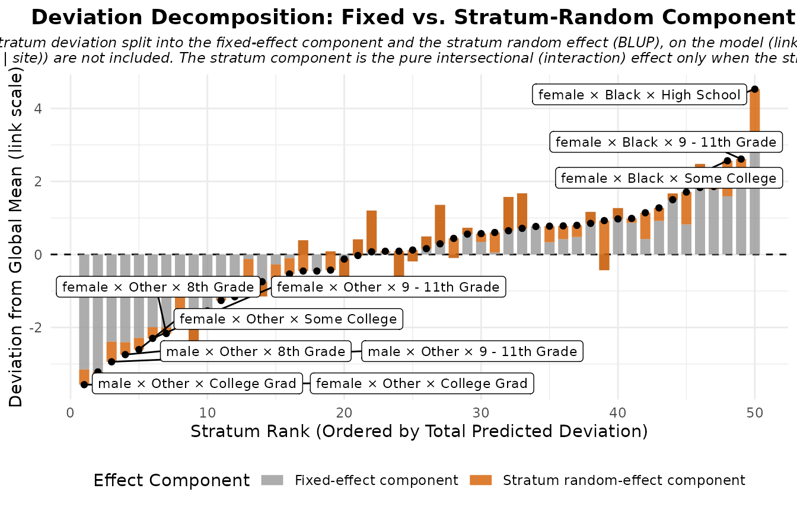
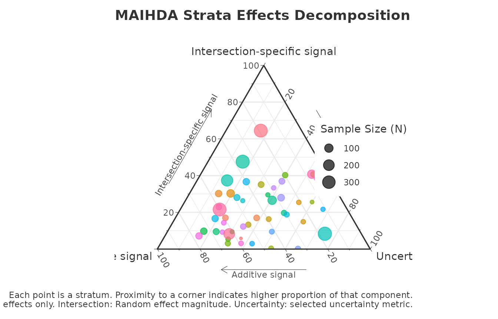
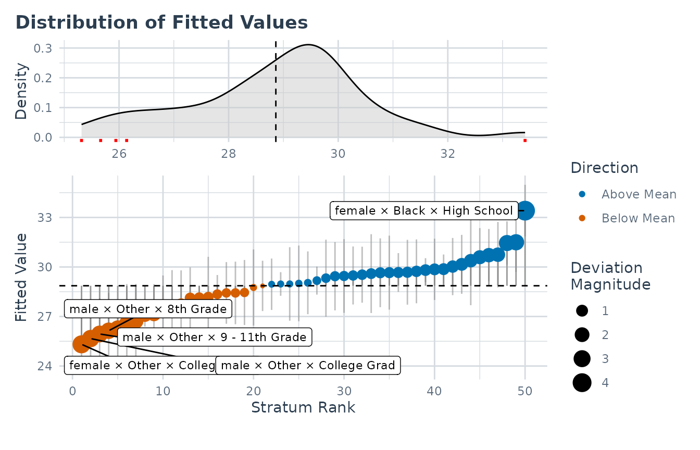
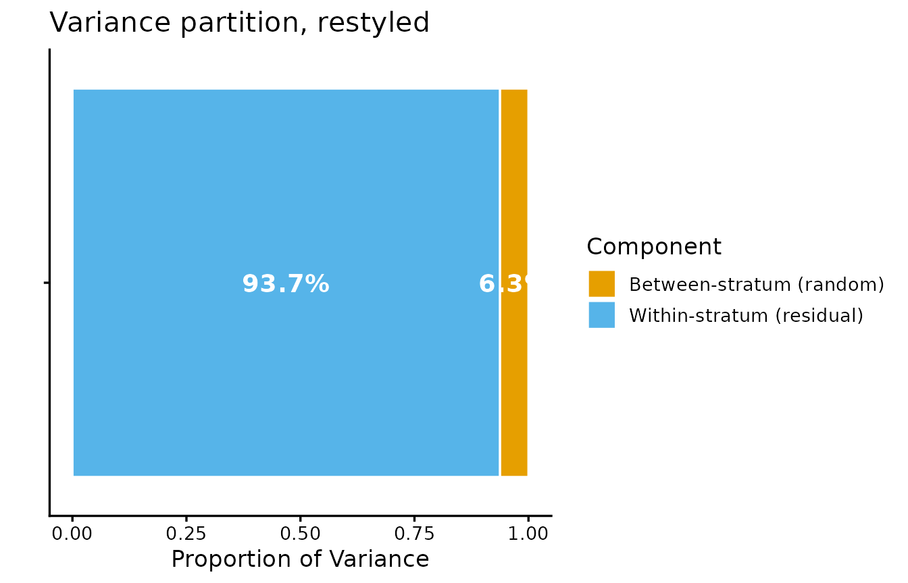
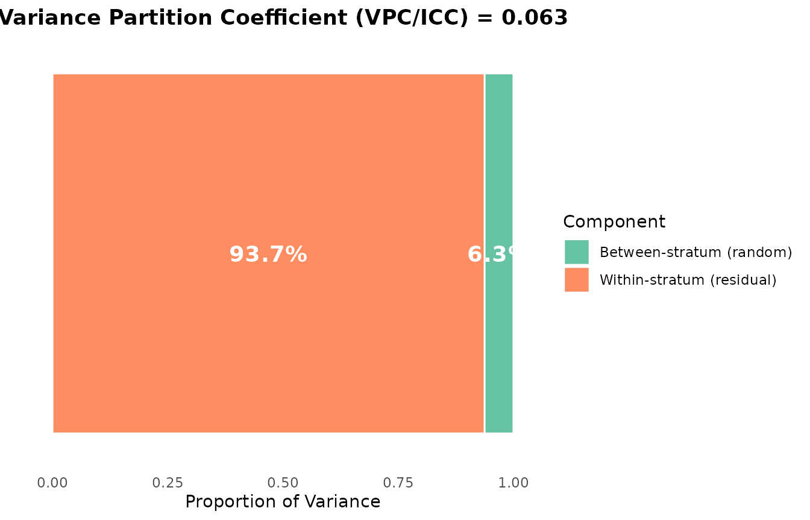
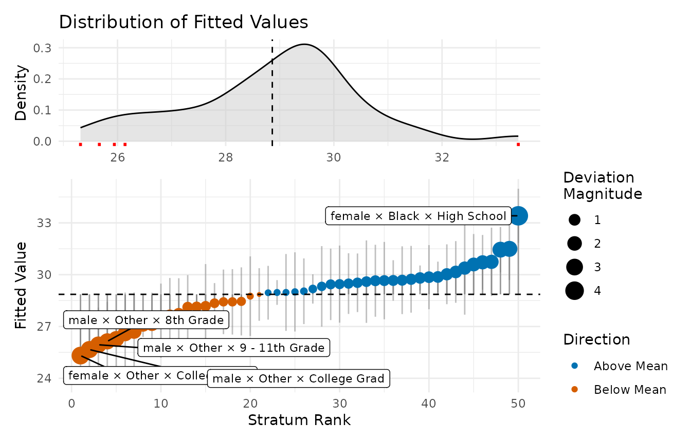

# Interpreting MAIHDA Plots and Diagnostics

## Overview

[`plot()`](https://rdrr.io/r/graphics/plot.default.html) on a fitted
MAIHDA model gives you several views of the same model, each answering a
different question. This vignette explains, for every plot type, what it
shows, how to read it, and what not to conclude from it. Calling
[`plot()`](https://rdrr.io/r/graphics/plot.default.html) with no
specified `type` draws them all.

Lets start with fitting the model.

``` r

library(MAIHDA)
data("maihda_health_data")

health_complete <- maihda_health_data[complete.cases(
  maihda_health_data[, c("BMI", "Age", "Gender", "Race", "Education")]
), ]

model <- maihda(
  BMI ~ Age + Gender + Race + Education + (1 | Gender:Race:Education),
  data = health_complete
)
# or equivalently with the helper:
# model <- fit_maihda(
#   BMI ~ Age + Gender + Race + Education + (1 | Gender:Race:Education),
#   data = health_complete
# )
```

## `vpc` – variance partition

The VPC plot shows how the total unexplained variance splits into a
between-stratum component (the numerator of the VPC/ICC), any other
random-effect components, and the within-stratum residual.

``` r

plot(model, type = "vpc")
```



**How to read it.** The between-stratum slice is the share of
unexplained variation that lies between intersectional groups. For
non-Gaussian models this split is on the latent scale.

## `predicted` – stratum predictions with intervals

``` r

plot(model, type = "predicted")
```



**How to read it.** Each point is a stratum’s model-based prediction
with a 95% interval, ordered so you can see which intersections sit
above or below the average. The estimates are shrunken toward the
overall mean. For a binomial model the axis is the predicted probability
instead of the outcome mean.

## `obs_vs_shrunken` – shrinkage made visible

``` r

plot(model, type = "obs_vs_shrunken")
```



**How to read it.** This contrasts the raw observed stratum means with
the model’s shrunken estimates. Points far from the diagonal are strata
whose raw mean was pulled substantially toward the centre, typically the
smallest, noisiest cells. It is a sanity check on how much the
multilevel model is regularising.

## `effect_decomp` – additive vs. intersection-specific

``` r

plot(model, type = "effect_decomp")
```



**How to read it.** This separates, for each stratum, the part of its
deviation from the grand mean that is explained by the additive main
effects from the intersection-specific part (the stratum random effect,
what is left over after the additive effects). Large
intersection-specific bars are the candidate “more/less than the sum of
the parts” intersections, but treat them as hypotheses to probe, not as
confirmed interactions, since they also absorb sample composition and
estimation noise.

## `ternary` – relative signal diagnostic

The ternary plot needs the optional `ggtern` package, so it is only
drawn here when that package is installed.

``` r

plot(model, type = "ternary")
```



**How to read it.** For each stratum the plot normalises three
magnitudes to sum to 1: the additive signal (how far the
fixed-effect-only prediction sits from the grand mean), the
intersection-specific signal (the size of the stratum random effect),
and the uncertainty in that estimate. A stratum near the “uncertainty”
corner is dominated by noise; one near the “intersection” corner carries
signal beyond the additive main effects.

## `prediction_deviation` – the deviation dashboard

``` r

plot(model, type = "prediction_deviation")
```



**How to read it.** This two-panel dashboard highlights the most notable
cases or strata. What counts as “notable” depends on the model: the
largest deviation from the mean prediction (Gaussian/Poisson), the
largest absolute deviance residual (binomial), or the most surprising
observation (ordinal).

## Group-comparison plots

When you fit across a higher-level grouping variable with
[`compare_maihda_groups()`](https://hdbt.github.io/MAIHDA/reference/compare_maihda_groups.md)
(or `maihda(group = ...)`), extra plot types become available –
`group_vpc`, `group_components`, `group_between_variance`, and
`group_pcv` (also reachable as `type = "vpc"`, `"components"`,
`"between_variance"`, and `"pcv"` on the comparison object). Those are
covered in the [group comparison
vignette](https://hdbt.github.io/MAIHDA/articles/group_comparison.md).

## Customizing the appearance

Every [`plot()`](https://rdrr.io/r/graphics/plot.default.html) call with
a single `type` returns a plain **ggplot** object, so you are never
locked into the package’s styling – restyle it with the usual ggplot2
grammar by adding a theme, overriding the labels, or dropping in another
layer. Themes,
[`labs()`](https://ggplot2.tidyverse.org/reference/labs.html), and added
layers compose cleanly:

``` r

library(ggplot2)
#> 
#> Attaching package: 'ggplot2'
#> The following objects are masked from 'package:ggtern':
#> 
#>     aes, annotate, ggplot, ggplot_build, ggplot_gtable, ggplotGrob,
#>     ggsave, layer_data, theme_bw, theme_classic, theme_dark,
#>     theme_gray, theme_light, theme_linedraw, theme_minimal, theme_void

plot(model, type = "vpc") +
  theme_classic(base_size = 13) +
  labs(title = "Variance partition, restyled")
```



The views that map a fill or colour (`vpc`, `context_vpc`,
`effect_decomp`) also accept a replacement palette. ggplot2 prints a
harmless “Scale for fill is already present … which will replace the
existing scale” message as it swaps the built-in palette out (suppressed
here):

``` r

plot(model, type = "vpc") +
  scale_fill_brewer(palette = "Set2")
```



A few plot types return something other than a single ggplot, so they
restyle slightly differently:

- **`prediction_deviation`** is a two-panel
  [patchwork](https://patchwork.data-imaginist.com/). `+ theme_*()`
  styles only the active panel; use `&` to apply a theme to *both*
  panels at once:

  ``` r

  plot(model, type = "prediction_deviation") & theme_minimal()
  ```

  

- **`type = "all"`** returns a named list of ggplot objects (it prints
  them as a side effect), so pick one out to restyle it:

  ``` r

  plots <- plot(model)          # list: vpc, predicted, effect_decomp, ...
  plots$predicted + theme_bw()
  ```

- **`ternary`** is a `ggtern` object with its own coordinate system –
  reach for the `ggtern::theme_*()` family rather than the standard
  ggplot2 themes.

## See also

- [Introduction to
  MAIHDA](https://hdbt.github.io/MAIHDA/articles/introduction.md) – the
  end-to-end workflow.
- [MAIHDA for binary
  outcomes](https://hdbt.github.io/MAIHDA/articles/binary_outcomes.md) –
  how these plots adapt to logistic models.
