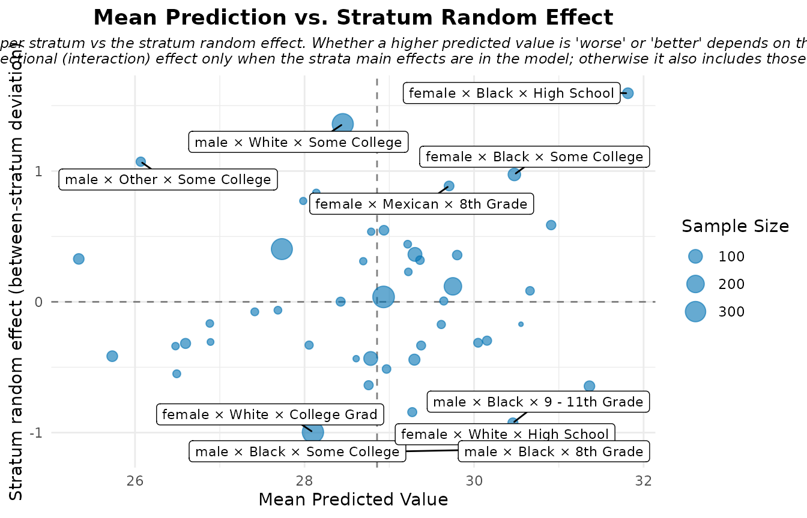

# Interpreting MAIHDA Plots and Diagnostics

## Overview

[`plot()`](https://rdrr.io/r/graphics/plot.default.html) on a fitted
MAIHDA model gives you several views of the same model, each answering a
different question. This vignette explains, for every plot type, **what
it shows, how to read it, and what *not* to conclude from it.** Calling
[`plot()`](https://rdrr.io/r/graphics/plot.default.html) with no `type`
draws them all; pass a `type` to get one.

We use one shared Gaussian model throughout so the views are directly
comparable.

``` r

library(MAIHDA)
data("maihda_health_data")

health_complete <- maihda_health_data[complete.cases(
  maihda_health_data[, c("BMI", "Age", "Gender", "Race", "Education")]
), ]

model <- fit_maihda(
  BMI ~ Age + Gender + Race + Education + (1 | Gender:Race:Education),
  data = health_complete
)
```

## `vpc` – variance partition

The VPC plot shows how the total *unexplained* variance splits into a
between-stratum component (the numerator of the VPC/ICC), any other
random-effect components, and the within-stratum residual.

``` r

plot(model, type = "vpc")
```


**How to read it.** The between-stratum slice is the share of
unexplained variation that lies between intersectional groups. Because
this model includes covariates, it is a *conditional* VPC (net of the
fixed effects); the headline, total between-stratum share is the one
read from a null model `outcome ~ 1 + (1 | stratum)`. For non-Gaussian
models this split is on the latent scale.

## `predicted` – stratum predictions with intervals

``` r

plot(model, type = "predicted")
```


**How to read it.** Each point is a stratum’s model-based prediction
with a 95% interval, ordered so you can see which intersections sit
above or below the average. The estimates are **shrunken** toward the
overall mean – small strata are pulled in more – which is the protective
feature of multilevel modelling against over-interpreting noisy small
groups. For a binomial model the axis is the predicted probability
instead of the outcome mean.

## `obs_vs_shrunken` – shrinkage made visible

``` r

plot(model, type = "obs_vs_shrunken")
```


**How to read it.** This contrasts the raw observed stratum means with
the model’s shrunken estimates. Points far from the diagonal are strata
whose raw mean was pulled substantially toward the centre – typically
the smallest, noisiest cells. It is a sanity check on how much the
multilevel model is regularising, not a statement about which strata are
“really” high or low.

## `risk_vs_effect` – mean prediction vs. random effect

``` r

plot(model, type = "risk_vs_effect")
```



**How to read it.** Each stratum is placed by its mean predicted outcome
(x) and its stratum random effect (y), splitting the plane into
quadrants. Despite the type name, this is deliberately **not** framed as
“risk”: whether a higher value is worse or better depends entirely on
the outcome (high BMI vs. high test score), so read the axes in the
context of your own outcome rather than as a fixed good/bad map.

## `effect_decomp` – additive vs. intersection-specific

``` r

plot(model, type = "effect_decomp")
```


**How to read it.** This separates, for each stratum, the part of its
deviation from the grand mean that is explained by the **additive** main
effects from the **intersection-specific** part (the stratum random
effect, what is left over after the additive effects). Large
intersection-specific bars are the candidate “more/less than the sum of
the parts” intersections – but treat them as hypotheses to probe, not as
confirmed interactions, since they also absorb sample composition and
estimation noise.

## `ternary` – relative signal diagnostic

The ternary plot needs the optional `ggtern` package, so it is only
drawn here when that package is installed.

``` r

plot(model, type = "ternary")
```


**How to read it.** For each stratum the plot normalises three
magnitudes to sum to 1: the **additive** signal (how far the
fixed-effect-only prediction sits from the grand mean), the
**intersection-specific** signal (the size of the stratum random
effect), and the **uncertainty** in that estimate. A stratum near the
“uncertainty” corner is dominated by noise; one near the “intersection”
corner carries signal beyond the additive main effects.

**What it is not.** This is a *relative-magnitude* diagnostic, not a
formal variance decomposition – the three shares are rescaled per
stratum, so they compare the *balance* of signal across strata, not
absolute variance contributions.

## `prediction_deviation` – the deviation dashboard

``` r

plot(model, type = "prediction_deviation")
```


**How to read it.** This two-panel, publication-oriented dashboard
highlights the most notable cases or strata. What counts as “notable”
depends on the model: the largest deviation from the mean prediction
(Gaussian/Poisson), the largest absolute deviance residual (binomial),
or the most surprising observation (ordinal). The labelled points are
*notable*, **not** regression-diagnostic outliers – do not read them as
points to delete.

## Group-comparison plots

When you fit across a higher-level grouping variable with
[`compare_maihda_groups()`](https://hdbt.github.io/MAIHDA/reference/compare_maihda_groups.md)
(or `maihda(group = ...)`), two extra plot types become available –
`group_vpc` and `group_components` (also reachable as `type = "vpc"` and
`type = "components"` on the comparison object). Those are covered in
the [group comparison
vignette](https://hdbt.github.io/MAIHDA/articles/group_comparison.md).

## See also

- [Introduction to
  MAIHDA](https://hdbt.github.io/MAIHDA/articles/introduction.md) – the
  end-to-end workflow.
- [MAIHDA for binary
  outcomes](https://hdbt.github.io/MAIHDA/articles/binary_outcomes.md) –
  how these plots adapt to logistic models.
