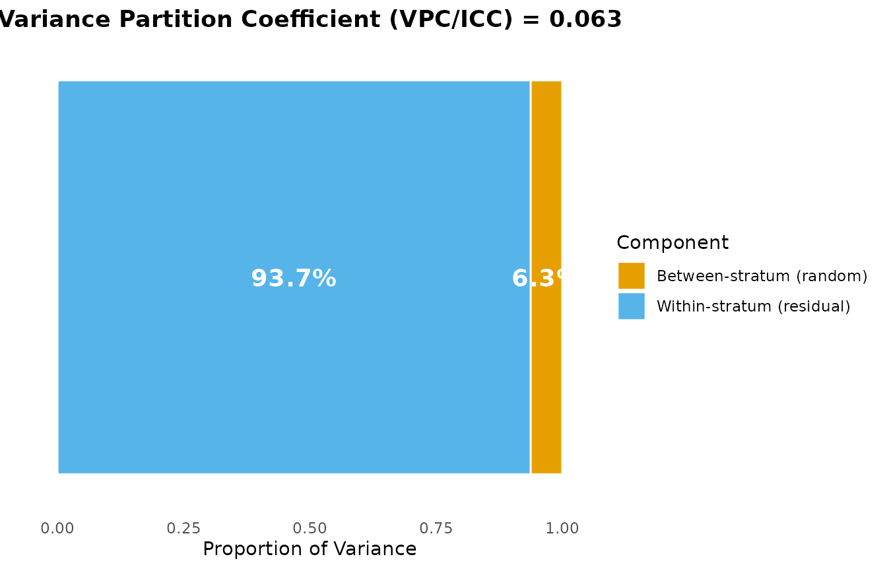
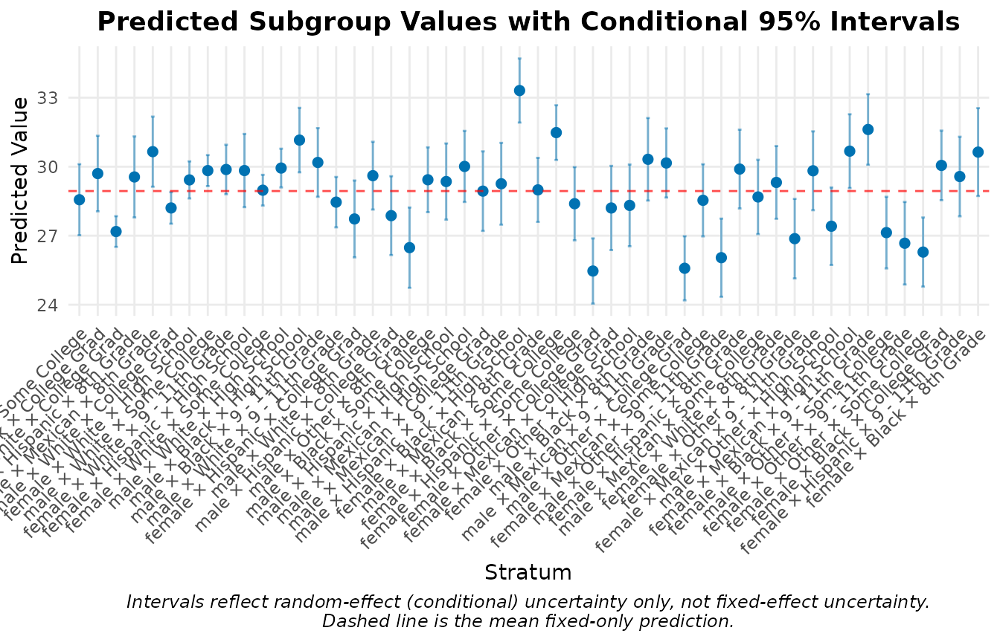
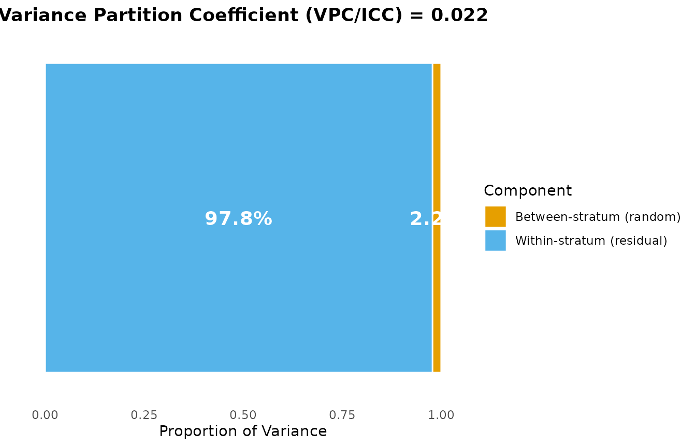
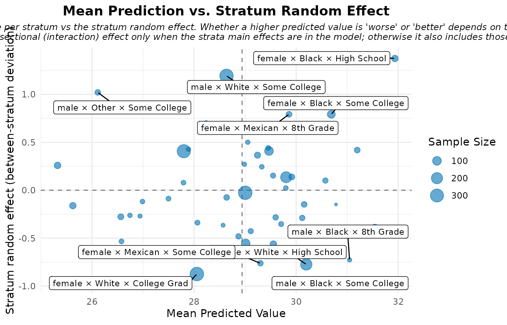
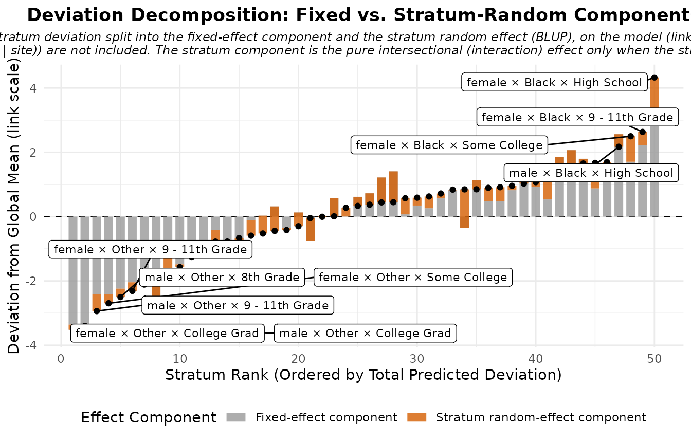
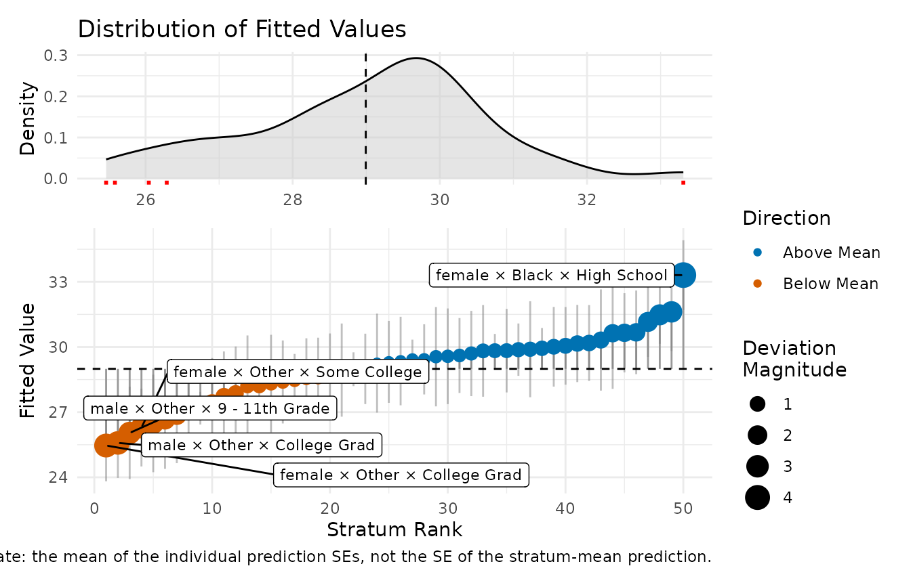
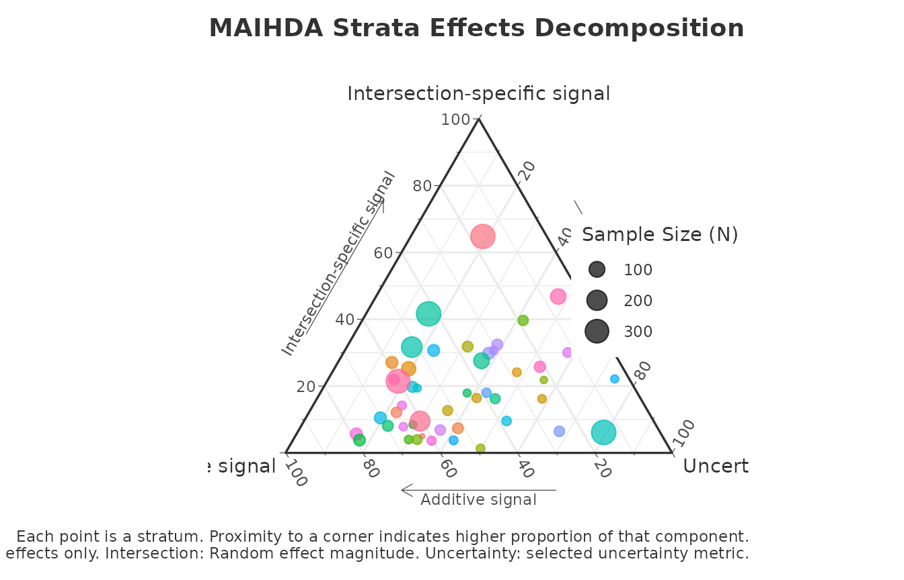
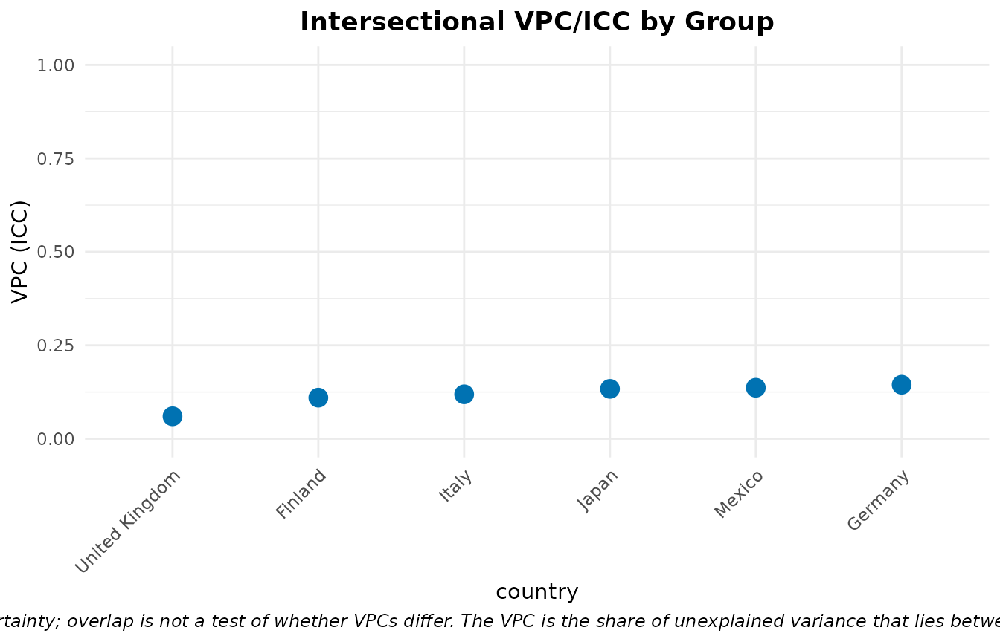
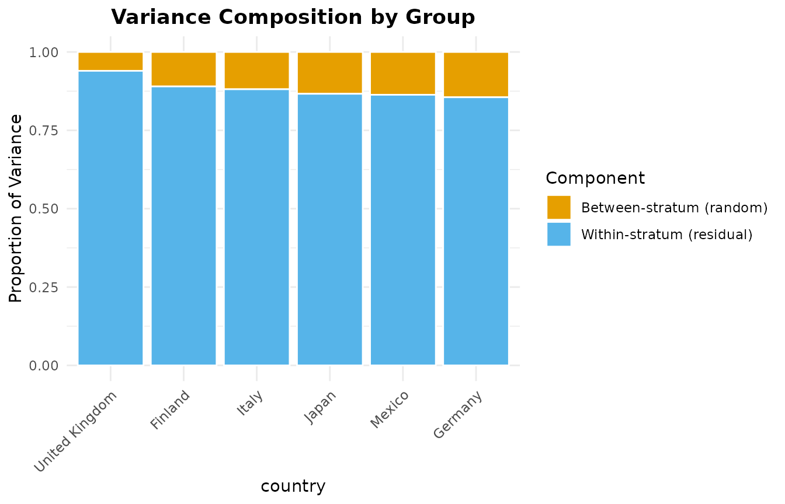

# Introduction to MAIHDA

## Introduction

The **MAIHDA** package provides specialized tools for conducting
Multilevel Analysis of Individual Heterogeneity and Discriminatory
Accuracy. This modern epidemiological approach is highly effective for
investigating intersectional health inequalities and understanding how
joint social categories (e.g., Race x Gender x Education) influence
individual outcomes.

By utilizing multilevel mixed-effects models (via `lme4` or `brms`),
MAIHDA allows researchers to: 1. Automatically construct intersectional
strata. 2. Estimate between-stratum variance and Variance Partition
Coefficients (VPC). 3. Evaluate the Proportional Change in Variance
(PCV): a descriptive, model-dependent measure of how much the
between-stratum variance changes when additive main effects are added
(it is not a causal decomposition, and a negative PCV does not by itself
establish hidden structural inequality). 4. Launch an interactive Shiny
Dashboard for code-free analysis.

## Installation

``` r

# Released version (CRAN):
install.packages("MAIHDA")

# Development version (GitHub):
# install.packages("remotes")
# remotes::install_github("hdbt/MAIHDA")
```

## Quick Start: the `maihda()` one-call workflow

If you just want the standard analysis,
[`maihda()`](https://hdbt.github.io/MAIHDA/reference/maihda.md) runs the
whole pipeline in a single call. It is intrinsically a **two-model**
decomposition: it fits the **null** model (the formula you supply) *and*
the **adjusted** model (the same model plus the additive main effects of
the stratum dimensions), summarises the null model’s VPC/ICC, and
reports the **PCV** – the proportional change in between-stratum
variance from null to adjusted, i.e. the additive share of the
intersectional inequality. It can also compare this decomposition across
a higher-level grouping variable. It returns one object with
[`print()`](https://rdrr.io/r/base/print.html),
[`summary()`](https://rdrr.io/r/base/summary.html), and
[`plot()`](https://rdrr.io/r/graphics/plot.default.html) methods. (For a
single model – e.g. just the null-model VPC – call
[`fit_maihda()`](https://hdbt.github.io/MAIHDA/reference/fit_maihda.md)
directly; the sections below also walk through the pipeline step by
step.)

``` r

library(MAIHDA)
data("maihda_health_data")

# Null + adjusted fit, VPC summary, and PCV decomposition in one call. Write the
# strata variables (Gender, Race, Education) as additive fixed effects -- the
# fully-specified adjusted model; maihda() derives the null by dropping them. (Omit
# them and maihda() adds them for you, with a message.)
analysis <- maihda(BMI ~ Age + Gender + Race + Education + (1 | Gender:Race:Education),
                   data = maihda_health_data)
analysis                      # VPC/ICC (null) and PCV (null -> adjusted)
#> MAIHDA Analysis
#> ===============
#> 
#> Null formula:    BMI ~ Age + (1 | stratum)
#> Adjusted formula:BMI ~ Age + Gender + Race + Education + (1 | stratum)
#> Engine: lme4 | Family: gaussian
#> VPC/ICC (null): 0.0627
#> PCV (null -> adjusted): 0.5957
#> Between-stratum variance: 2.9001 (null) -> 1.1724 (adjusted)
#>   ~59.6% of the between-stratum variance is additive (the dimensions' main
#>   effects); the remainder is the between-stratum variance remaining after the
#>   additive main effects -- a model-dependent quantity, often interpreted as
#>   intersectional interaction, but interpret it cautiously.
#> Strata: 50
#> 
#> Use summary() for variance components and plot(type = ...) for figures.
summary(analysis)             # full variance components
#> MAIHDA Model Summary
#> ====================
#> 
#> Variance Partition Coefficient (VPC/ICC):
#>   Estimate: 0.0627
#> 
#> Variance Components:
#>                  component variance    sd proportion
#>   Between-stratum (random)     2.90 1.703    0.06268
#>  Within-stratum (residual)    43.37 6.586    0.93732
#>                      Total    46.27 6.802    1.00000
#> 
#> Fixed Effects:
#>         term estimate
#>  (Intercept) 28.20790
#>          Age  0.01503
#> 
#> Stratum Estimates (first 10):
#>  stratum stratum_id                           label random_effect     se
#>        1          1  male × Hispanic × Some College     -0.245110 1.0419
#>        2          2     male × Black × College Grad      0.771975 1.1139
#>        3          3   female × White × College Grad     -1.819926 0.3520
#>        4          4     male × Hispanic × 8th Grade      0.921381 1.3183
#>        5          5    female × Mexican × 8th Grade      1.823058 0.9510
#>        6          6     male × White × College Grad     -0.743146 0.3572
#>        7          7    female × White × High School      0.004942 0.4191
#>        8          8     male × White × Some College      1.023286 0.3556
#>        9          9 female × White × 9 - 11th Grade      0.685130 0.6038
#>       10         10 female × Hispanic × High School      0.287026 1.0690
#>  lower_95 upper_95
#>  -2.28715  1.79693
#>  -1.41123  2.95518
#>  -2.50991 -1.12994
#>  -1.66250  3.50526
#>  -0.04088  3.68700
#>  -1.44320 -0.04309
#>  -0.81642  0.82631
#>   0.32630  1.72028
#>  -0.49833  1.86859
#>  -1.80812  2.38217
#>   ... and 40 more strata
analysis$pcv                  # proportional change in between-stratum variance
#> Proportional Change in Variance (PCV)
#> =====================================
#> 
#> PCV: 0.5957
#> 
#> Between-stratum variance:
#>   Model 1: 2.900100
#>   Model 2: 1.172430
#>   Change:  1.727670 (59.57%)
#> 
#> Interpretation (PCV is the proportional change in between-stratum
#> variance between the models; it is variance 'explained' only when Model 2
#> nests Model 1 by adding predictors on the same outcome, sample and strata):
#>   Between-stratum variance is 59.6% lower in Model 2 than in Model 1.

# The VPC/shrinkage views use the null model; the additive-vs-intersectional views
# (effect_decomp, risk_vs_effect, ternary) use the adjusted model -- plot() routes
# each type to the right model automatically.
plot(analysis, type = "vpc")
```



``` r

plot(analysis, type = "effect_decomp")
```


You can add a higher-level grouping variable to also compare across its
levels. `maihda_country_data` (PISA 2018) has a real country grouping;
this workflow has its own [group comparison
vignette](https://hdbt.github.io/MAIHDA/articles/group_comparison.md),
so here we just point to it:

``` r

data("maihda_country_data")
by_country <- maihda(math ~ gender + ses + (1 | gender:ses), data = maihda_country_data,
                     group = "country")
by_country
plot(by_country, type = "group_vpc")
```

The sections below walk through the same steps individually with
[`fit_maihda()`](https://hdbt.github.io/MAIHDA/reference/fit_maihda.md)
and friends, which you can use directly when you need finer control.

## Real-World Example Analysis

The package includes a pedagogical subset of the National Health and
Nutrition Examination Survey (`maihda_health_data`). We will use this to
examine how Body Mass Index (BMI) varies across intersectional
demographic groups.

> **Note.** The bundled `maihda_health_data` and `maihda_country_data`
> are for teaching only. They are non-random subsamples, and the package
> ignores the surveys’ weights and complex sampling design (and uses a
> single PISA plausible value), so the results below are **not**
> survey-representative and should not be read as substantive population
> findings.

### Step 1 & 2: Create Intersectional Strata and Fit a Null MAIHDA Model

Use
[`fit_maihda()`](https://hdbt.github.io/MAIHDA/reference/fit_maihda.md)
to combine multiple social categories directly in the random effect
formula. Providing the variables in the random effect combined with `:`
allows the function to automatically build the intersectional strata on
the fly and fit the multilevel model.

``` r

# PVC compares variance across models, so both models must use the same
# analytic sample. Keep complete cases for all variables used below.
health_complete <- maihda_health_data[complete.cases(
  maihda_health_data[, c("BMI", "Age", "Gender", "Race", "Education", "Poverty")]
), ]

# Fit the initial Null model with auto-generated strata
model_null <- fit_maihda(
  BMI ~ 1 + (1 | Gender:Race:Education),
  data = health_complete,
  engine = "lme4"
)

# Summarize the variance components (VPC)
summary_null <- summary(model_null)
print(summary_null)
#> MAIHDA Model Summary
#> ====================
#> 
#> Variance Partition Coefficient (VPC/ICC):
#>   Estimate: 0.0636
#> 
#> Variance Components:
#>                  component variance    sd proportion
#>   Between-stratum (random)    2.932 1.712    0.06357
#>  Within-stratum (residual)   43.187 6.572    0.93643
#>                      Total   46.118 6.791    1.00000
#> 
#> Fixed Effects:
#>         term estimate
#>  (Intercept)    29.01
#> 
#> Stratum Estimates (first 10):
#>  stratum stratum_id                           label random_effect     se
#>        1          1  male × Hispanic × Some College       -0.3652 1.0426
#>        2          2     male × Black × College Grad        0.5847 1.1667
#>        3          3   female × White × College Grad       -1.8639 0.3550
#>        4          4     male × Hispanic × 8th Grade        1.1454 1.3490
#>        5          5    female × Mexican × 8th Grade        1.9078 1.0173
#>        6          6     male × White × College Grad       -0.7119 0.3652
#>        7          7    female × White × High School        0.2352 0.4374
#>        8          8     male × White × Some College        0.9413 0.3587
#>        9          9 female × White × 9 - 11th Grade        0.9152 0.6162
#>       10         10 female × Hispanic × High School        0.1229 1.0994
#>  lower_95  upper_95
#>  -2.40868  1.678302
#>  -1.70198  2.871286
#>  -2.55965 -1.168149
#>  -1.49872  3.789553
#>  -0.08613  3.901702
#>  -1.42775  0.004003
#>  -0.62207  1.092543
#>   0.23837  1.644306
#>  -0.29260  2.122989
#>  -2.03195  2.277736
#>   ... and 40 more strata
```

**Interpretation:** The resulting Variance Partition Coefficient (VPC or
ICC) tells us what percentage of the total variance in BMI in the
population lies *between* the intersectional social groups, rather than
just *within* them.

### Step 3: Evaluate Proportional Change in Variance (PCV)

To understand whether these intersectional inequalities are largely the
sum of their parts (additive), we evaluate how much the between-stratum
variance changes when the additive main effects are added to the model.

If the variance drops substantially (high PCV), the between-stratum
differences are much smaller once the additive main effects are
included. If it remains or even *increases* (negative PCV), the additive
main effects account for little of it. Interpret this cautiously: the
PCV is a model-dependent variance change, not a causal decomposition,
and a low or negative value does not by itself prove a “true”
intersectional interaction – it can also reflect suppression, rescaling
(on the latent scale for non-Gaussian models), sample composition, or
estimation uncertainty.

``` r

# Fit an adjusted model on the SAME analytic sample
model_adj <- fit_maihda(
  BMI ~ Age + Gender + Race + Education + Poverty + (1 | Gender:Race:Education),
  data = health_complete
)

# Point estimate of the proportional change in between-stratum variance
pcv_result <- calculate_pvc(model_null, model_adj)
print(pcv_result)
#> Proportional Change in Variance (PCV)
#> =====================================
#> 
#> PCV: 0.6693
#> 
#> Between-stratum variance:
#>   Model 1: 2.931928
#>   Model 2: 0.969511
#>   Change:  1.962417 (66.93%)
#> 
#> Interpretation (PCV is the proportional change in between-stratum
#> variance between the models; it is variance 'explained' only when Model 2
#> nests Model 1 by adding predictors on the same outcome, sample and strata):
#>   Between-stratum variance is 66.9% lower in Model 2 than in Model 1.
```

For publication-ready uncertainty, add parametric bootstrap confidence
intervals. This refits the model many times, so it is not run when the
vignette is built:

``` r

pcv_boot <- calculate_pvc(model_null, model_adj, bootstrap = TRUE, n_boot = 500)
print(pcv_boot)
```

### Step 4: Stepwise PCV Decomposition

Often, researchers want to know exactly *which* variable explained the
variance. Use the
[`stepwise_pcv()`](https://hdbt.github.io/MAIHDA/reference/stepwise_pcv.md)
function to add covariates one-by-one and track the variance
dynamically.

``` r

# Run a stepwise variance decomposition using the prepared data with strata
stepwise_results <- stepwise_pcv(
  data = model_null$original_data,
  outcome = "BMI",
  vars = c("Age", "Gender", "Race", "Education", "Poverty")
)

print(stepwise_results)
#>   Step      Model        Added_Variable  Variance     Step_PCV   Total_PCV
#> 1    0 Null Model None (Intercept only) 2.9319281  0.000000000 0.000000000
#> 2    1    Model 1                   Age 2.8627658  0.023589378 0.023589378
#> 3    2    Model 2                Gender 2.9232893 -0.021141634 0.002946462
#> 4    3    Model 3                  Race 1.3016798  0.554720831 0.556032830
#> 5    4    Model 4             Education 0.9756602  0.250460705 0.667229160
#> 6    5    Model 5               Poverty 0.9695115  0.006302093 0.669326313
```

Negative step PCVs in this table indicate an “unmasking”/suppression
pattern: adding a variable increased the between-stratum variance. This
is a model-dependent change in variance, not proof that a hidden
structural inequality was causally revealed – a negative PCV can also
reflect suppression, rescaling, sample composition, or estimation
uncertainty, so interpret it cautiously alongside the fitted effects.

### Step 5: Visualizations

The package provides multiple pre-configured, advanced visualization
options for checking your model estimates natively mirroring the Shiny
application logic. The dedicated [plot interpretation
vignette](https://hdbt.github.io/MAIHDA/articles/interpreting_plots.md)
explains how to read each one.

``` r

# Predicted stratum values with 95% CIs
plot(model_adj, type = "predicted")
```



``` r

# Variance partition (VPC) visualization
plot(model_adj, type = "vpc")
```



``` r

# Mean predicted outcome against the stratum random effect
plot(model_adj, type = "risk_vs_effect")
```



``` r

# Additive versus Intersectional Effect decomposition
plot(model_adj, type = "effect_decomp")
```



``` r

# Individual Prediction Deviance Dashboard
plot(model_adj, type = "prediction_deviation")
```



The ternary diagnostic needs the optional `ggtern` package, so it is
only drawn when that package is installed:

``` r

# Ternary diagnostic: additive vs intersection-specific signal vs uncertainty
plot(model_adj, type = "ternary")
```



### Step 6: Compare Intersectional Inequality Across Groups

When the data spans several higher-level contexts – countries, regions,
survey waves – you often want to know whether the *degree* of
intersectional inequality differs across them.
[`compare_maihda_groups()`](https://hdbt.github.io/MAIHDA/reference/compare_maihda_groups.md)
fits a separate intercept-only MAIHDA model within each level of a
grouping variable and reports the VPC/ICC and variance components side
by side.

By default the intersectional strata are defined once on the full data
(`shared_strata = TRUE`), so a stratum denotes the same combination in
every group. Shared definitions make the stratum *labels* comparable
across groups, but they are necessary rather than sufficient for the
VPCs themselves to be directly comparable: a group need not contain
every stratum, so two groups’ VPCs can be estimated over different sets
of *populated* strata, and differences in residual variance and
`var_between` still matter
([`compare_maihda_groups()`](https://hdbt.github.io/MAIHDA/reference/compare_maihda_groups.md)
warns when groups end up with different populated strata; see the [group
comparison
vignette](https://hdbt.github.io/MAIHDA/articles/group_comparison.md)).
This is a *stratified* analysis (one model per group), not a
cross-classified model.

The bundled `maihda_country_data` (OECD PISA 2018) is designed for
exactly this: it asks how much the joint **gender x
socioeconomic-status** inequality in mathematics achievement differs
across six countries.

``` r

data("maihda_country_data")

group_cmp <- compare_maihda_groups(
  math ~ 1 + (1 | gender:ses),
  data  = maihda_country_data,
  group = "country"
)
#> boundary (singular) fit: see help('isSingular')
#> boundary (singular) fit: see help('isSingular')
#> boundary (singular) fit: see help('isSingular')
#> boundary (singular) fit: see help('isSingular')
#> boundary (singular) fit: see help('isSingular')
group_cmp
#> MAIHDA Group Comparison
#> =======================
#> 
#> Group variable: country 
#> Engine: lme4  | Family: gaussian  | Strata: shared/global 
#> 
#>           group   n n_strata     vpc var_between var_other var_residual    pcv
#>         Finland 600        6 0.10994       785.8         0         6361 1.0000
#>         Germany 600        6 0.14448      1271.6         0         7529 1.0000
#>           Italy 600        6 0.11890      1065.3         0         7895 1.0000
#>           Japan 600        6 0.13344      1032.3         0         6704 0.9266
#>          Mexico 600        6 0.13649       771.5         0         4881 1.0000
#>  United Kingdom 600        6 0.06011       470.5         0         7357 1.0000
#>  var_between_adjusted status
#>                  0.00     ok
#>                  0.00     ok
#>                  0.00     ok
#>                 75.78     ok
#>                  0.00     ok
#>                  0.00     ok

# VPC by country (add bootstrap = TRUE for per-group confidence intervals)
plot(group_cmp, type = "vpc")
```



``` r


# Between- vs within-stratum variance share by country
plot(group_cmp, type = "components")
```



Groups smaller than `min_group_n`, or with fewer than two populated
strata, are skipped with a warning rather than producing an unstable
VPC; a group with no between-stratum variation reports a VPC of 0
instead of erroring.

## Where to next

This vignette is the hub for the rest of the documentation:

- **[MAIHDA for binary
  outcomes](https://hdbt.github.io/MAIHDA/articles/binary_outcomes.md)**
  – logistic MAIHDA, the latent-scale VPC, and a discriminatory-accuracy
  (AUC) recipe.
- **[Interpreting MAIHDA plots and
  diagnostics](https://hdbt.github.io/MAIHDA/articles/interpreting_plots.md)**
  – how to read every plot type shown above, and what *not* to conclude
  from each.
- **[Comparing intersectional inequality across
  groups](https://hdbt.github.io/MAIHDA/articles/group_comparison.md)**
  – the full
  [`compare_maihda_groups()`](https://hdbt.github.io/MAIHDA/reference/compare_maihda_groups.md)
  / `maihda(group = ...)` workflow.
- **[Interactive data
  analysis](https://hdbt.github.io/MAIHDA/articles/interactive_app.md)**
  – the no-code Shiny dashboard.

## Interactive Shiny App

The MAIHDA package ships with a fully-featured, interactive Shiny
Dashboard.

You can upload your own data (CSV, SPSS `.sav`, Stata `.dta`),
dynamically select variables, and compute Stepwise PCV tables and
prediction plots.

``` r

# Launch the interactive interface
run_maihda_app()
```

## References

- Evans, C. R., Williams, D. R., Onnela, J. P., & Subramanian, S. V.
  (2018). A multilevel approach to modeling health inequalities at the
  intersection of multiple social identities. *Social Science &
  Medicine*, 203, 64-73.

- Merlo, J. (2018). Multilevel analysis of individual heterogeneity and
  discriminatory accuracy (MAIHDA) within an intersectional framework.
  *Social Science & Medicine*, 203, 74-80.
