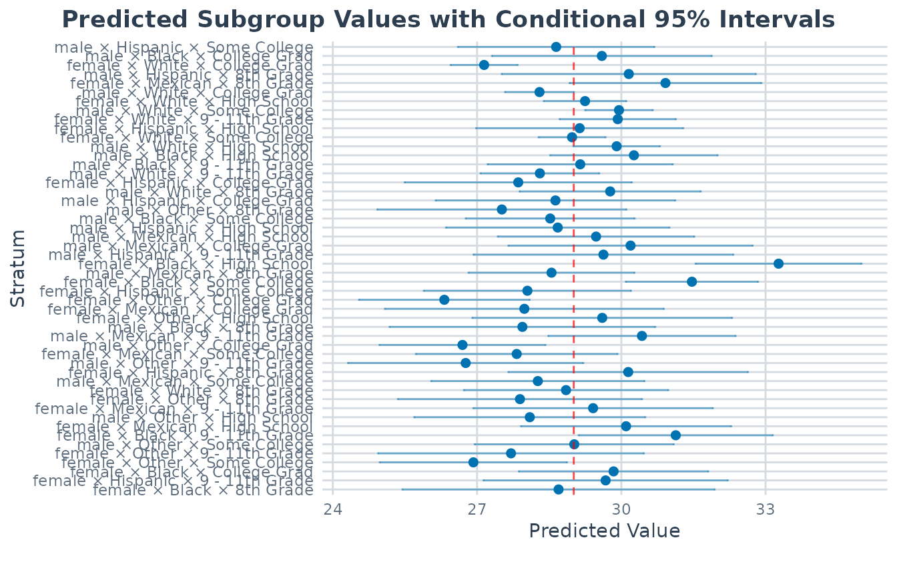
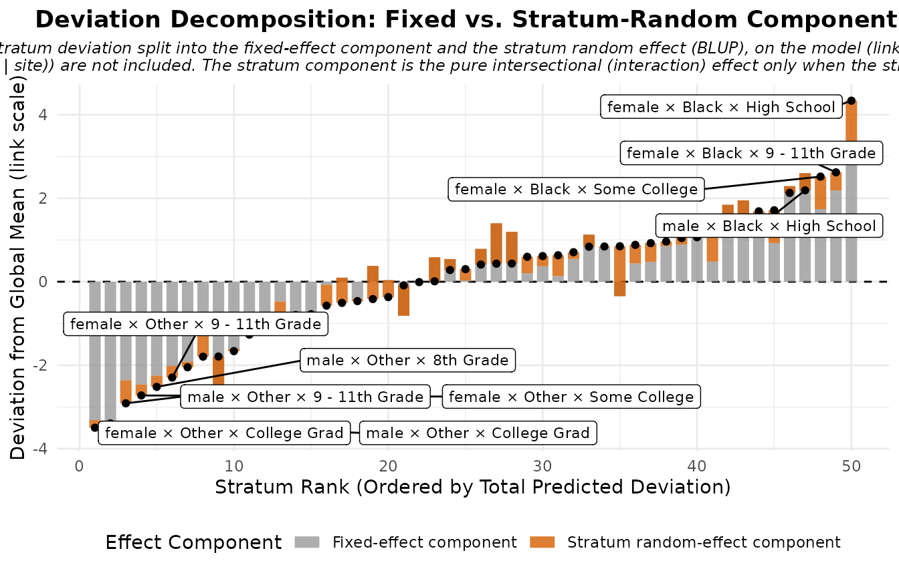
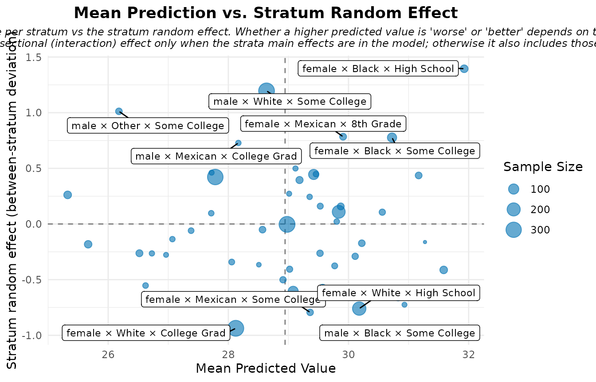
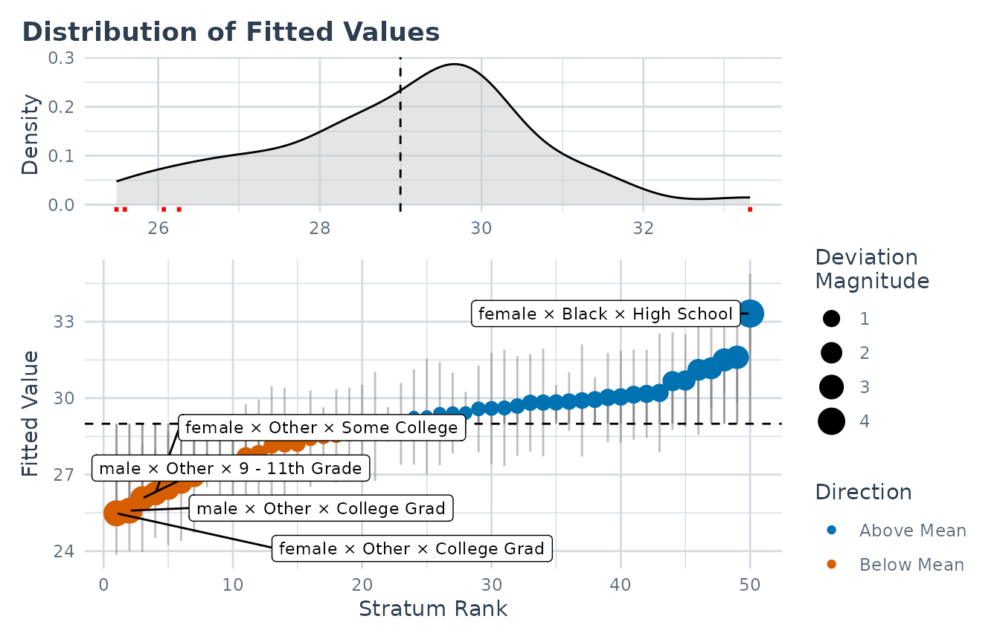
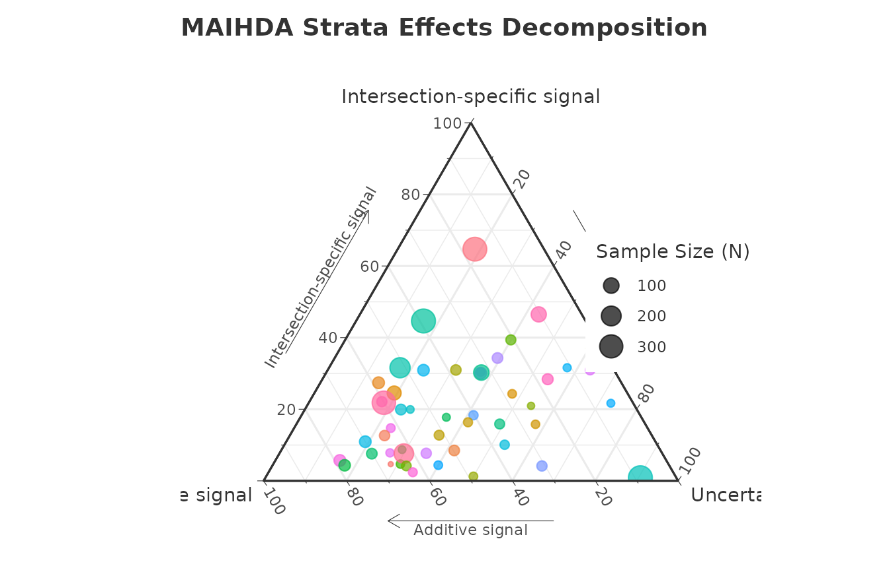

# Introduction to MAIHDA

## Introduction

The **MAIHDA** package provides specialized tools for conducting
Multilevel Analysis of Individual Heterogeneity and Discriminatory
Accuracy. This modern epidemiological approach is highly effective for
investigating intersectional health inequalities and understanding how
joint social categories (e.g., Race x Gender x Education) influence
individual outcomes.

By utilizing multilevel mixed-effects models (via `lme4` or `brms`),
MAIHDA allows researchers to: 1. Automatically construct intersectional
strata. 2. Estimate between-stratum variance and Variance Partition
Coefficients (VPC). 3. Evaluate the Proportional Change in Variance
(PCV): a descriptive, model-dependent measure of how much the
between-stratum variance changes when additive main effects are added
(it is not a causal decomposition, and a negative PCV does not by itself
establish hidden structural inequality). 4. Launch an interactive Shiny
Dashboard for code-free analysis.

The fastest way in is the
[`maihda()`](https://hdbt.github.io/MAIHDA/reference/maihda.md)
function: a single call runs the whole standard analysis and returns one
object you can [`print()`](https://rdrr.io/r/base/print.html),
[`summary()`](https://rdrr.io/r/base/summary.html), and
[`plot()`](https://rdrr.io/r/graphics/plot.default.html). This vignette
leads with that workflow, then opens it up to show the lower-level
building blocks
([`fit_maihda()`](https://hdbt.github.io/MAIHDA/reference/fit_maihda.md)
and friends) for when you need finer control.

## Installation

``` r

# Released version (CRAN):
install.packages("MAIHDA")

# Development version (GitHub):
# install.packages("remotes")
# remotes::install_github("hdbt/MAIHDA")
```

## The data

The package includes a pedagogical subset of the National Health and
Nutrition Examination Survey (`maihda_health_data`). We use it to
examine how Body Mass Index (BMI) varies across intersectional
demographic groups.

> **Note.** The bundled `maihda_health_data` and `maihda_country_data`
> are for teaching only. They are non-random subsamples, and the package
> ignores the surveys’ weights and complex sampling design (and uses a
> single PISA plausible value), so the results below are **not**
> survey-representative and should not be read as substantive population
> findings.

``` r

library(MAIHDA)
data("maihda_health_data")

# A few sections below add individual-level covariates (Age, Poverty) or compare
# variances across models, which all require the same analytic sample. We define
# one complete-case dataset up front so every analysis in this vignette agrees.
health_complete <- maihda_health_data[complete.cases(
  maihda_health_data[, c("BMI", "Age", "Gender", "Race", "Education", "Poverty")]
), ]
```

## The `maihda()` workflow

[`maihda()`](https://hdbt.github.io/MAIHDA/reference/maihda.md) runs the
standard MAIHDA pipeline in a single call. It is intrinsically a
**two-model** decomposition: it fits the **null** model (the
intersectional random intercept, *excluding* the stratum dimensions’
main effects) *and* the **adjusted** model (the null *plus* the additive
main effects of the stratum dimensions), summarises the null model’s
VPC/ICC, and reports the **PCV** – the proportional change in
between-stratum variance from null to adjusted, i.e. the additive share
of the intersectional inequality.

Write the stratum dimensions’ main effects in the formula and
[`maihda()`](https://hdbt.github.io/MAIHDA/reference/maihda.md) treats
it as the fully-specified adjusted model, deriving the null by dropping
them. (Omit them – `BMI ~ 1 + (1 | Gender:Race:Education)` – and
[`maihda()`](https://hdbt.github.io/MAIHDA/reference/maihda.md) adds
them to the adjusted model for you, with a
[`message()`](https://rdrr.io/r/base/message.html), so the decomposition
stays explicit.) Either way
[`maihda()`](https://hdbt.github.io/MAIHDA/reference/maihda.md) fits
both models on the **same analytic sample**, so the PCV is always a
like-for-like comparison.

``` r

analysis <- maihda(
  BMI ~ Gender + Race + Education + (1 | Gender:Race:Education),
  data = health_complete
)

analysis                # VPC/ICC (null) and PCV (null -> adjusted)
#> MAIHDA Analysis
#> ===============
#> 
#> Null formula:    BMI ~ (1 | stratum)
#> Adjusted formula:BMI ~ Gender + Race + Education + (1 | stratum)
#> Engine: lme4 | Family: gaussian
#> VPC/ICC (null): 0.0636
#> PCV (null -> adjusted): 0.8263
#> Between-stratum variance: 2.8308 (null) -> 0.4918 (adjusted)
#>   ~82.6% of the between-stratum variance is additive (the dimensions' main
#>   effects); the remainder is the between-stratum variance remaining after the
#>   additive main effects -- a model-dependent quantity
#> Strata: 50
#> 
#> Use summary() for variance components and plot(type = ...) for figures.
analysis$formula        # null:     BMI ~ (1 | stratum)
#> BMI ~ (1 | stratum)
#> <environment: 0x555a59c1f5d0>
analysis$adjusted_formula  # adjusted: BMI ~ Gender + Race + Education + (1 | stratum)
#> BMI ~ Gender + Race + Education + (1 | stratum)
#> <environment: 0x555a65270fb8>
```

The returned object carries everything: the full variance components,
the PCV decomposition, and both fitted models.

``` r

summary(analysis)       # variance components, VPC/ICC, stratum estimates
#> MAIHDA Model Summary
#> ====================
#> 
#> Variance Partition Coefficient (VPC/ICC):
#>   Estimate: 0.0636
#> 
#> Variance Components:
#>                  component variance    sd proportion
#>   Between-stratum (random)    2.932 1.712    0.06357
#>  Within-stratum (residual)   43.187 6.572    0.93643
#>                      Total   46.118 6.791    1.00000
#> 
#> Fixed Effects:
#>         term estimate
#>  (Intercept)    29.01
#> 
#> Stratum Estimates (first 10):
#>  stratum stratum_id                           label random_effect     se
#>        1          1  male × Hispanic × Some College       -0.3652 1.0426
#>        2          2     male × Black × College Grad        0.5847 1.1667
#>        3          3   female × White × College Grad       -1.8639 0.3550
#>        4          4     male × Hispanic × 8th Grade        1.1454 1.3490
#>        5          5    female × Mexican × 8th Grade        1.9078 1.0173
#>        6          6     male × White × College Grad       -0.7119 0.3652
#>        7          7    female × White × High School        0.2352 0.4374
#>        8          8     male × White × Some College        0.9413 0.3587
#>        9          9 female × White × 9 - 11th Grade        0.9152 0.6162
#>       10         10 female × Hispanic × High School        0.1229 1.0994
#>  lower_95  upper_95
#>  -2.40868  1.678302
#>  -1.70198  2.871286
#>  -2.55965 -1.168149
#>  -1.49872  3.789553
#>  -0.08613  3.901702
#>  -1.42775  0.004003
#>  -0.62207  1.092543
#>   0.23837  1.644306
#>  -0.29260  2.122989
#>  -2.03195  2.277736
#>   ... and 40 more strata
analysis$pcv            # proportional change in between-stratum variance
#> Proportional Change in Variance (PCV)
#> =====================================
#> 
#> PCV: 0.8263
#> 
#> Between-stratum variance:
#>   Model 1: 2.830755
#>   Model 2: 0.491811
#>   Change:  2.338944 (82.63%)
#> 
#> Interpretation (PCV is the proportional change in between-stratum
#> variance between the models; it is variance 'explained' only when Model 2
#> nests Model 1 by adding predictors on the same outcome, sample and strata):
#>   Between-stratum variance is 82.6% lower in Model 2 than in Model 1.
```

**Interpretation.** The VPC/ICC tells us what share of the total
variance in BMI lies *between* the intersectional social groups rather
than *within* them. The PCV tells us how much of that between-stratum
variance is the additive sum of the dimensions’ main effects: if the
variance drops substantially (high PCV), the between-stratum differences
are largely additive; what remains is often read as the *intersectional
interaction*. Interpret this cautiously – the PCV is a model-dependent
variance change, not a causal decomposition, and a low or negative value
does not by itself prove a “true” interaction (it can also reflect
suppression, rescaling on the latent scale for non-Gaussian models,
sample composition, or estimation uncertainty).

For publication-ready uncertainty, add `bootstrap = TRUE` (with
`n_boot`) to attach parametric-bootstrap confidence intervals to the VPC
and PCV. It refits the models many times, so it is omitted here.

### Visual diagnostics

[`plot()`](https://rdrr.io/r/graphics/plot.default.html) routes each
`type` to the model it belongs on automatically – the VPC and shrinkage
views to the **null** model, the additive-vs-intersectional views to the
**adjusted** model – so you never have to track which fit carries which
quantity. The dedicated [plot interpretation
vignette](https://hdbt.github.io/MAIHDA/articles/interpreting_plots.md)
explains how to read each one.

``` r

# Variance partition (VPC) -- null model
plot(analysis, type = "vpc")
```


``` r

# Predicted stratum values with 95% CIs -- null model
plot(analysis, type = "predicted")
```



``` r

# Additive versus intersectional effect decomposition -- adjusted model
plot(analysis, type = "effect_decomp")
```



``` r

# Mean predicted outcome against the stratum random effect -- adjusted model
plot(analysis, type = "risk_vs_effect")
```



``` r

# Individual prediction-deviance dashboard -- adjusted model
plot(analysis, type = "prediction_deviation")
```



The ternary diagnostic needs the optional `ggtern` package, so it is
only drawn when that package is installed:

``` r

# Ternary diagnostic: additive vs intersection-specific signal vs uncertainty
plot(analysis, type = "ternary")
```



### A crossed-dimensions alternative

Alongside the two-model PCV,
[`maihda()`](https://hdbt.github.io/MAIHDA/reference/maihda.md) offers a
**crossed-dimensions** decomposition
(`decomposition = "crossed-dimensions"`; formerly called
`"cross-classified"`, which still works as a deprecated alias) that
estimates the additive and interaction parts from a *single* model –
entering each dimension’s main effect as a random intercept rather than
a fixed effect. The two modes target the same question with different
estimators. See
[`vignette("cross_classified", package = "MAIHDA")`](https://hdbt.github.io/MAIHDA/articles/cross_classified.md).

### A contextual cross-classified model

To model the strata *crossed with* a higher-level place or institution –
the literature’s **cross-classified MAIHDA** (patients within strata and
hospitals, students within strata and schools) – pass
`context = "school"` to
[`maihda()`](https://hdbt.github.io/MAIHDA/reference/maihda.md) or
[`fit_maihda()`](https://hdbt.github.io/MAIHDA/reference/fit_maihda.md).
The summary then partitions the unexplained variance into
between-stratum vs. between-context vs. residual, and the headline
VPC/ICC becomes the between-stratum share net of the context. Also
covered in
[`vignette("cross_classified", package = "MAIHDA")`](https://hdbt.github.io/MAIHDA/articles/cross_classified.md).

### Design-weighted MAIHDA (survey data)

For complex-survey data (NHANES, PISA, …), pass the sampling-weight
column via `sampling_weights`. Survey weights are **not** lme4’s
`weights=` (those are precision weights, which rescale the residual
variance), so the fit routes through
[`WeMix::mix()`](https://american-institutes-for-research.github.io/WeMix/reference/mix.html)
– weighted pseudo-maximum-likelihood – and `engine = "lme4"` with
sampling weights is an error rather than a silent misfit. The whole
workflow (VPC/ICC, PCV, stratum summaries, prediction, plots, and the
AUC for binary outcomes) is then design-weighted, with design-consistent
standard errors for the fixed effects:

``` r

weighted <- maihda(outcome ~ age + (1 | gender:race:education),
                   data = survey_data, sampling_weights = "person_weight")
weighted
```

The wemix engine covers the canonical `gaussian(identity)` /
`binomial(logit)` MAIHDA with the single `(1 | stratum)` intercept;
crossed random effects (`context =`,
`decomposition = "crossed-dimensions"`) and bootstrap intervals require
lme4/brms. `engine = "brms"` also accepts `sampling_weights`, as
likelihood weights (a *pseudo-posterior*: design-consistent point
estimates, but credible intervals that are not design-based).

### Comparing across groups

Add a higher-level grouping variable and
[`maihda()`](https://hdbt.github.io/MAIHDA/reference/maihda.md) also
compares the decomposition across its levels. `maihda_country_data`
(OECD PISA 2018) has a real country grouping – it asks how much the
joint **gender x socioeconomic-status** inequality in mathematics
achievement differs across six countries. This workflow has its own
[group comparison
vignette](https://hdbt.github.io/MAIHDA/articles/group_comparison.md),
so here we just point to it:

``` r

data("maihda_country_data")
by_country <- maihda(math ~ gender + ses + (1 | gender:ses),
                     data = maihda_country_data, group = "country")
by_country
plot(by_country, type = "group_vpc")
```

## Under the hood: the building blocks

[`maihda()`](https://hdbt.github.io/MAIHDA/reference/maihda.md) is a
convenience wrapper around a set of lower-level functions:
[`fit_maihda()`](https://hdbt.github.io/MAIHDA/reference/fit_maihda.md)
fits one model,
[`calculate_pvc()`](https://hdbt.github.io/MAIHDA/reference/calculate_pvc.md)
compares two, [`summary()`](https://rdrr.io/r/base/summary.html) reads
the variance components, and
[`compare_maihda_groups()`](https://hdbt.github.io/MAIHDA/reference/compare_maihda_groups.md)
runs the group comparison. Reach for them directly when you need finer
control than the one-call workflow gives – in particular, a **custom
adjusted model**, a **stepwise** decomposition, or the
discriminatory-accuracy extensions for binary outcomes.

### Fit a single model

[`fit_maihda()`](https://hdbt.github.io/MAIHDA/reference/fit_maihda.md)
builds the intersectional strata on the fly (from the `:` interaction in
the random effect) and fits one multilevel model. Use it when you only
want a single fit – for example the null-model VPC on its own.

``` r

model_null <- fit_maihda(BMI ~ 1 + (1 | Gender:Race:Education), data = health_complete)
summary(model_null)
#> MAIHDA Model Summary
#> ====================
#> 
#> Variance Partition Coefficient (VPC/ICC):
#>   Estimate: 0.0636
#> 
#> Variance Components:
#>                  component variance    sd proportion
#>   Between-stratum (random)    2.932 1.712    0.06357
#>  Within-stratum (residual)   43.187 6.572    0.93643
#>                      Total   46.118 6.791    1.00000
#> 
#> Fixed Effects:
#>         term estimate
#>  (Intercept)    29.01
#> 
#> Stratum Estimates (first 10):
#>  stratum stratum_id                           label random_effect     se
#>        1          1  male × Hispanic × Some College       -0.3652 1.0426
#>        2          2     male × Black × College Grad        0.5847 1.1667
#>        3          3   female × White × College Grad       -1.8639 0.3550
#>        4          4     male × Hispanic × 8th Grade        1.1454 1.3490
#>        5          5    female × Mexican × 8th Grade        1.9078 1.0173
#>        6          6     male × White × College Grad       -0.7119 0.3652
#>        7          7    female × White × High School        0.2352 0.4374
#>        8          8     male × White × Some College        0.9413 0.3587
#>        9          9 female × White × 9 - 11th Grade        0.9152 0.6162
#>       10         10 female × Hispanic × High School        0.1229 1.0994
#>  lower_95  upper_95
#>  -2.40868  1.678302
#>  -1.70198  2.871286
#>  -2.55965 -1.168149
#>  -1.49872  3.789553
#>  -0.08613  3.901702
#>  -1.42775  0.004003
#>  -0.62207  1.092543
#>   0.23837  1.644306
#>  -0.29260  2.122989
#>  -2.03195  2.277736
#>   ... and 40 more strata
```

### A custom adjusted model and the PCV

[`maihda()`](https://hdbt.github.io/MAIHDA/reference/maihda.md) only
ever adds the **stratum dimensions’ own** main effects to the adjusted
model. To ask a *different* question – how much of the between-stratum
variance is explained by individual-level **covariates** that are not
strata dimensions (here Age and Poverty) – build the two models yourself
and compare them with
[`calculate_pvc()`](https://hdbt.github.io/MAIHDA/reference/calculate_pvc.md).
PCV compares variances across models, so both must use the same sample
(the `health_complete` data we prepared above):

``` r

model_cov <- fit_maihda(BMI ~ Age + Poverty + (1 | Gender:Race:Education),
                        data = health_complete)

calculate_pvc(model_null, model_cov)
#> Proportional Change in Variance (PCV)
#> =====================================
#> 
#> PCV: 0.0887
#> 
#> Between-stratum variance:
#>   Model 1: 2.830755
#>   Model 2: 2.579769
#>   Change:  0.250986 (8.87%)
#> 
#> Interpretation (PCV is the proportional change in between-stratum
#> variance between the models; it is variance 'explained' only when Model 2
#> nests Model 1 by adding predictors on the same outcome, sample and strata):
#>   Between-stratum variance is 8.9% lower in Model 2 than in Model 1.
```

This PCV answers “how much between-stratum variance do Age and Poverty
account for?”, which is distinct from the additive-share PCV that
[`maihda()`](https://hdbt.github.io/MAIHDA/reference/maihda.md) reports.
Add `bootstrap = TRUE` for parametric-bootstrap confidence intervals
(omitted here because it refits the model many times):

``` r

calculate_pvc(model_null, model_cov, bootstrap = TRUE, n_boot = 500)
```

### Stepwise PCV

Often researchers want to know exactly *which* variable explained the
variance.
[`stepwise_pcv()`](https://hdbt.github.io/MAIHDA/reference/stepwise_pcv.md)
adds covariates one-by-one and tracks the between-stratum variance
dynamically. It works on a data frame that already carries the `stratum`
column – the
[`maihda()`](https://hdbt.github.io/MAIHDA/reference/maihda.md) object
exposes one ready to use as `analysis$model$original_data`:

``` r

stepwise_results <- stepwise_pcv(
  data    = analysis$model$original_data,  # carries the strata column
  outcome = "BMI",
  vars    = c("Age", "Gender", "Race", "Education", "Poverty")
)

print(stepwise_results)
#>  Step      Model        Added_Variable Variance Step_PCV Total_PCV
#>     0 Null Model None (Intercept only)   2.8308  0.00000   0.00000
#>     1    Model 1                   Age   2.7605  0.02481   0.02481
#>     2    Model 2                Gender   2.7194  0.01489   0.03933
#>     3    Model 3                  Race   0.9892  0.63625   0.65056
#>     4    Model 4             Education   0.4769  0.51789   0.83153
#>     5    Model 5               Poverty   0.4698  0.01480   0.83402
```

Negative step PCVs in this table indicate an “unmasking”/suppression
pattern: adding a variable increased the between-stratum variance. This
is a model-dependent change in variance, not proof that a hidden
structural inequality was causally revealed – a negative PCV can also
reflect suppression, rescaling, sample composition, or estimation
uncertainty, so interpret it cautiously alongside the fitted effects.

### Discriminatory accuracy and the response-scale VPC

For a **binary** outcome the discriminatory accuracy (AUC / C-statistic
and Median Odds Ratio) is reported **automatically** – it rides along on
the [`maihda()`](https://hdbt.github.io/MAIHDA/reference/maihda.md)
summaries and headline [`print()`](https://rdrr.io/r/base/print.html)
(and on `summary(fit_maihda(...))`), so the strata’s AUC sits next to
the VPC with no extra call. The probability-scale (response) VPC is
estimated by simulation, so it is opt-in: add `response_vpc = TRUE`
(with a `seed`). You can still call the helpers directly on the fitted
models when you want them on their own:

``` r

# A binary-outcome analysis -- DA rides along automatically; ask for the response VPC:
ob <- maihda(Obese ~ Gender + Race + (1 | Gender:Race), data = maihda_health_data,
             response_vpc = TRUE, seed = 1)
ob                          # print() now shows the null-model AUC / MOR
summary(ob)                 # carries the discriminatory_accuracy (+ vpc_response) slots

# ...or call the pieces directly on the fitted maihda_model objects:
maihda_discriminatory_accuracy(ob$model)           # AUC + MOR, null model
maihda_discriminatory_accuracy(ob$model_adjusted)  # adjusted model
maihda_vpc_response(ob$model, seed = 1)            # probability-scale VPC
```

The dedicated [binary outcomes
vignette](https://hdbt.github.io/MAIHDA/articles/binary_outcomes.md)
walks through the logistic model, the latent-scale VPC, and this
discriminatory-accuracy recipe in full.

### The group comparison directly

[`compare_maihda_groups()`](https://hdbt.github.io/MAIHDA/reference/compare_maihda_groups.md)
is the function `maihda(group = ...)` calls under the hood. Use it
directly for the same stratified comparison without the rest of the
one-call pipeline:

``` r

data("maihda_country_data")
compare_maihda_groups(math ~ 1 + (1 | gender:ses),
                      data = maihda_country_data, group = "country")
```

## Where to next

This vignette is the hub for the rest of the documentation:

- **[MAIHDA for binary
  outcomes](https://hdbt.github.io/MAIHDA/articles/binary_outcomes.md)**
  – logistic MAIHDA, the latent-scale VPC, and a discriminatory-accuracy
  (AUC) recipe.
- **[Interpreting MAIHDA plots and
  diagnostics](https://hdbt.github.io/MAIHDA/articles/interpreting_plots.md)**
  – how to read every plot type shown above, and what *not* to conclude
  from each.
- **[Comparing intersectional inequality across
  groups](https://hdbt.github.io/MAIHDA/articles/group_comparison.md)**
  – the full `maihda(group = ...)` /
  [`compare_maihda_groups()`](https://hdbt.github.io/MAIHDA/reference/compare_maihda_groups.md)
  workflow.
- **[Crossed random effects: dimensions and
  contexts](https://hdbt.github.io/MAIHDA/articles/cross_classified.md)**
  – the single-model additive-vs-interaction (crossed-dimensions)
  alternative to the two-model PCV, and the contextual cross-classified
  MAIHDA (strata crossed with schools, hospitals, regions) via
  `context =`.
- **[Interactive data
  analysis](https://hdbt.github.io/MAIHDA/articles/interactive_app.md)**
  – the no-code Shiny dashboard.

## Interactive Shiny App

The MAIHDA package ships with a fully-featured, interactive Shiny
Dashboard.

You can upload your own data (CSV, SPSS `.sav`, Stata `.dta`),
dynamically select variables, and compute Stepwise PCV tables and
prediction plots.

``` r

# Launch the interactive interface
run_maihda_app()
```

## References

- Evans, C. R., Williams, D. R., Onnela, J. P., & Subramanian, S. V.
  (2018). A multilevel approach to modeling health inequalities at the
  intersection of multiple social identities. *Social Science &
  Medicine*, 203, 64-73.

- Merlo, J. (2018). Multilevel analysis of individual heterogeneity and
  discriminatory accuracy (MAIHDA) within an intersectional framework.
  *Social Science & Medicine*, 203, 74-80.
