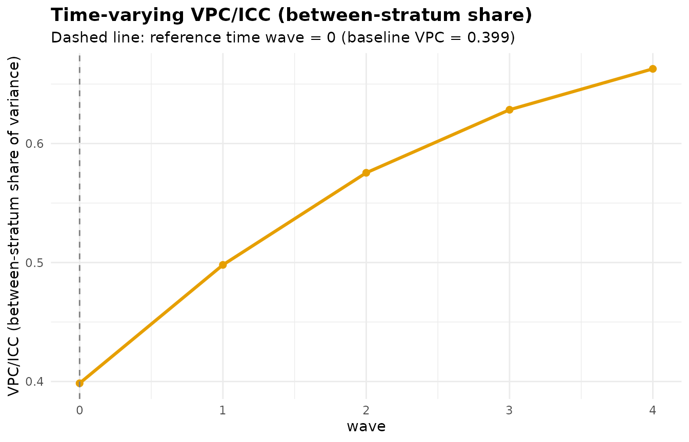
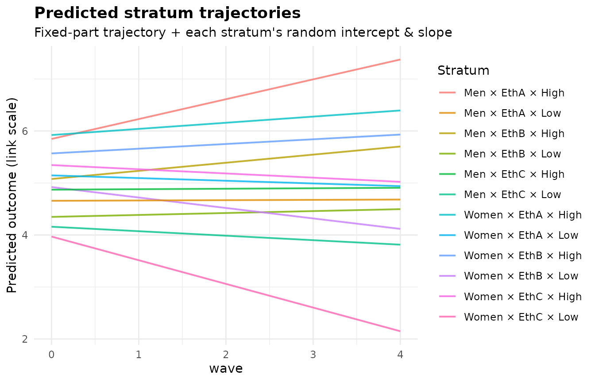
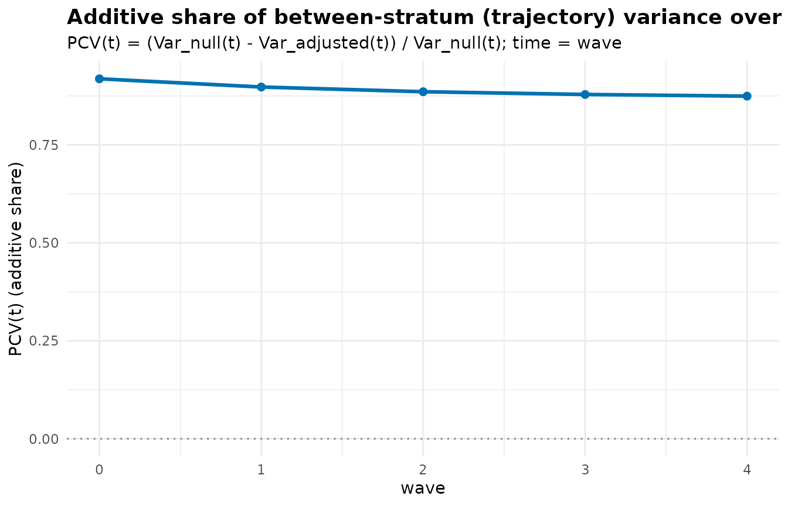

# Longitudinal MAIHDA: intersectional inequalities over time

## From a snapshot to a trajectory

Standard (cross-sectional) MAIHDA answers *“do intersectional strata
differ?”* at a single point in time, summarised by the between-stratum
VPC. With repeated measurements we can ask a richer question: *“do
strata differ in how they **change** over time?”* – and decompose those
trajectory differences into an **additive** part (the dimensions’ main
effects and their interactions with time) and a **multiplicative** part
(a genuinely intersectional trajectory beyond additive).

This is the longitudinal MAIHDA of Bell, Evans, Holman & Leckie (2024).
It is a **3-level growth-curve model**: measurement occasions (level 1)
within individuals (level 2) within intersectional strata (level 3),
with a random intercept **and** slope on time at both the individual and
stratum levels:

``` math
y_{tij} = \beta_0 + \beta_1 t + \underbrace{(u_{0j} + u_{1j}\,t)}_{\text{stratum}}
        + \underbrace{(v_{0ij} + v_{1ij}\,t)}_{\text{individual}} + e_{tij}.
```

Because the stratum random effect now has a slope, the between-stratum
variance – and hence the VPC – becomes a **function of time**:

``` math
\operatorname{Var}_S(t) = \sigma^2_{u0} + 2t\,\sigma_{u01} + t^2 \sigma^2_{u1},
\qquad
\operatorname{VPC}_S(t) = \frac{\operatorname{Var}_S(t)}
                               {\operatorname{Var}_S(t) + \operatorname{Var}_I(t) + \sigma^2_e}.
```

## The data

The bundled `maihda_long_data` is a simulated panel: 600 people, each
measured over five waves, within 12 strata of gender $`\times`$
ethnicity $`\times`$ education. The trajectory differences are
constructed to be *mostly additive* with one genuine interaction, so the
decomposition below is interpretable.

``` r

data(maihda_long_data)
head(maihda_long_data)
#>      id wave gender ethnicity education age wellbeing low_wellbeing
#> 1 P0001    0    Men      EthB       Low  50     3.732             1
#> 2 P0001    1    Men      EthB       Low  50     3.696             1
#> 3 P0001    2    Men      EthB       Low  50     1.638             1
#> 4 P0001    3    Men      EthB       Low  50     3.585             1
#> 5 P0001    4    Men      EthB       Low  50     3.594             1
#> 6 P0002    0  Women      EthB       Low  56     5.631             0
```

It is **long format** – one row per person-occasion – with a person id
(`id`) and a numeric time (`wave`).

## Fitting and the time-varying VPC

Supply `id` and `time` to
[`fit_maihda()`](https://hdbt.github.io/MAIHDA/reference/fit_maihda.md).
Write only the strata shorthand `(1 | var1:var2)`; the growth slopes on
time are added for you.

``` r

m <- fit_maihda(wellbeing ~ wave + (1 | gender:ethnicity:education),
                data = maihda_long_data, id = "id", time = "wave")
summary(m)
#> MAIHDA Model Summary
#> ====================
#> 
#> Variance Partition Coefficient (VPC/ICC) at baseline (wave = 0):
#>   Estimate: 0.3985
#> 
#> Variance Components:
#>                                            component variance     sd
#>                Between-stratum: intercept (baseline)  0.40774 0.6385
#>                        Between-stratum: slope (wave)  0.04284 0.2070
#>          Between-stratum: intercept-slope covariance  0.08848     NA
#>        Between-individual (id): intercept (baseline)  0.25558 0.5055
#>                Between-individual (id): slope (wave)  0.01936 0.1391
#>  Between-individual (id): intercept-slope covariance -0.00110     NA
#>                                    Within (residual)  0.35982 0.5999
#> 
#> Time-varying VPC/ICC (between-stratum share over wave):
#>   range 0.3985 to 0.6628 across wave in [0, 4].
#>   The between-stratum variance is a function of time (random intercept +
#>   slope), so the VPC varies; it depends on where time is zeroed. See
#>   plot(type = "vpc_trajectory") for the full curve.
#> 
#> Fixed Effects:
#>         term  estimate
#>  (Intercept)  4.986465
#>         wave -0.006306
#> 
#> Stratum Estimates (first 10):
#>  stratum stratum_id               label random_effect      se lower_95 upper_95
#>        1          1    Men × EthB × Low      -0.63793 0.08953 -0.81340  -0.4625
#>        2          2  Women × EthB × Low      -0.06461 0.08594 -0.23306   0.1038
#>        3          3   Men × EthA × High       0.86073 0.07782  0.70820   1.0133
#>        4          4   Men × EthB × High       0.09123 0.10259 -0.10985   0.2923
#>        5          5 Women × EthA × High       0.93600 0.08804  0.76344   1.1086
#>        6          6 Women × EthC × High       0.35847 0.13544  0.09300   0.6239
#>        7          7   Men × EthC × High      -0.11459 0.13286 -0.37500   0.1458
#>        8          8    Men × EthA × Low      -0.32848 0.07050 -0.46665  -0.1903
#>        9          9  Women × EthA × Low       0.15991 0.07326  0.01633   0.3035
#>       10         10    Men × EthC × Low      -0.82706 0.13286 -1.08747  -0.5667
#>   ... and 2 more strata
```

[`summary()`](https://rdrr.io/r/base/summary.html) reports the VPC at
the **baseline** (reference time, the earliest wave) and the **full
trajectory** of the VPC across the observed times. Plot it:

``` r

plot(m, type = "vpc_trajectory")   # VPC(t), with the reference time marked
```



``` r

plot(m, type = "trajectories")     # predicted per-stratum mean trajectories
```



A rising VPC trajectory means the strata **fan out** over time –
intersectional inequality grows. Note that the VPC depends on where time
is zeroed; the package reports the whole curve so that choice is
transparent.

## Decomposing the trajectory: additive vs. multiplicative

`maihda(decomposition = "longitudinal")` (selected automatically when
`id`/`time` are supplied) fits a **null** growth model and an
**adjusted** growth model. The adjusted model adds the dimensions’ main
effects *and their interactions with time* (`dim:time`), so the
stratum-level variance it leaves behind is the interaction beyond
additive.

``` r

a <- maihda(wellbeing ~ wave + (1 | gender:ethnicity:education),
            data = maihda_long_data, id = "id", time = "wave",
            decomposition = "longitudinal")
a$pcv
#> Longitudinal PCV (additive vs. multiplicative intersectionality)
#> ================================================================
#> 
#> Baseline (intercept) variance: 0.4077 (null) -> 0.0332 (adjusted)
#>   PCV_intercept: 91.9% of the baseline between-stratum inequality is additive.
#> Slope (wave) variance:          0.0428 (null) -> 0.0058 (adjusted)
#>   PCV_slope:     86.6% of the *trajectory* between-stratum inequality is additive
#>                  (the remainder is the multiplicative/interaction part).
#> 
#> The PCV is the share of the null model's between-stratum (trajectory) variance
#> explained by the dimensions' additive main effects and their time interactions;
#> a high PCV_slope means trajectory inequalities are 'mostly additive'.
```

The PCV is reported separately for the two pieces of the trajectory:

- **`PCV_intercept`** – the share of the *baseline* between-stratum
  inequality explained by the additive main effects.
- **`PCV_slope`** – the share of the *trajectory* (slope)
  between-stratum inequality explained additively. A high `PCV_slope` is
  the “trajectories are mostly additive” finding; the remainder is the
  multiplicative/interaction part.

``` r

plot(a, type = "pcv_trajectory")   # the additive share over time
```



## Scope and cautions

- **Engines / families.** lme4 (any polynomial degree) and brms (linear
  growth); all families with a defined level-1 variance (`gaussian`,
  `binomial`, `poisson`, `negbinomial`). For non-Gaussian outcomes the
  VPC is on the latent scale, as for the cross-sectional summaries.
- **Identifiability.** A stratum random slope needs enough occasions per
  stratum; sparse strata or few waves can give a singular lme4 fit
  (surfaced in the fit diagnostics) – the brms engine handles this
  better.
- **Not a single number.** The VPC is time-varying, so
  [`extract_between_variance()`](https://hdbt.github.io/MAIHDA/reference/extract_between_variance.md)
  and
  [`calculate_pvc()`](https://hdbt.github.io/MAIHDA/reference/calculate_pvc.md)
  deliberately refuse a longitudinal model; use the longitudinal
  decomposition above.
- **Out of scope (v1).** Design-weighted, contextual (stratum $`\times`$
  place $`\times`$ time), and `wemix`/`ordinal` longitudinal models are
  not yet supported.

## Reference

Bell, A., Evans, C., Holman, D., & Leckie, G. (2024). Extending
intersectional multilevel analysis of individual heterogeneity and
discriminatory accuracy (MAIHDA) to study individual longitudinal
trajectories, with application to mental health in the UK. *Social
Science & Medicine*, 351, 116955. <doi:10.1016/j.socscimed.2024.116955>
