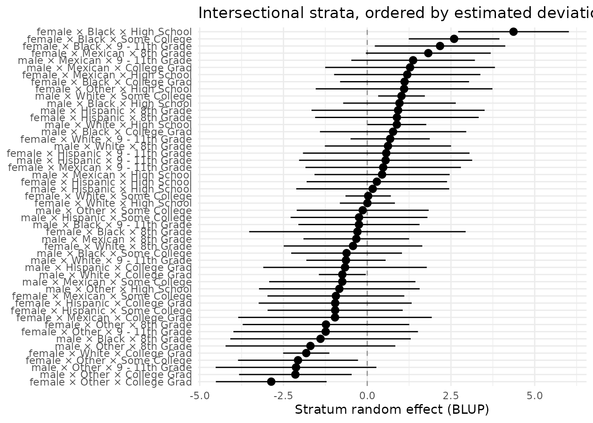

# Reporting MAIHDA results: tidy output and publication tables

## From a fitted model to a manuscript

This vignette covers the three reporting helpers that turn a
[`maihda()`](https://hdbt.github.io/MAIHDA/reference/maihda.md) analysis
into publication-ready output without you recomputing anything:
**[`glance()`](https://generics.r-lib.org/reference/glance.html)** (the
one-row headline),
**[`tidy()`](https://generics.r-lib.org/reference/tidy.html)**
(estimates as a tidy tibble), and
**[`maihda_table()`](https://hdbt.github.io/MAIHDA/reference/maihda_table.md)**
(the two canonical write-up tables). They read the quantities
[`summary()`](https://rdrr.io/r/base/summary.html) already computed, so
the tables always agree with
[`print()`](https://rdrr.io/r/base/print.html)/[`plot()`](https://rdrr.io/r/graphics/plot.default.html).

``` r

library(MAIHDA)
data("maihda_health_data")

a <- maihda(
  BMI ~ Age + Gender + Race + Education + (1 | Gender:Race:Education),
  data = maihda_health_data
)
```

## `glance()` – the one-row headline

[`glance()`](https://generics.r-lib.org/reference/glance.html) returns
the whole MAIHDA headline as a **one-row tibble**: the VPC/ICC (with its
interval when bootstrapped), the PCV, the additive/interaction shares,
the discriminatory accuracy (AUC/MOR) for a binary outcome, and the
bookkeeping (`n_strata`, `nobs`, `engine`, `family`, `mode`).

``` r

glance(a)
#> # A tibble: 1 × 16
#>      vpc vpc.conf.low vpc.conf.high   pcv pcv.conf.low pcv.conf.high
#>    <dbl>        <dbl>         <dbl> <dbl>        <dbl>         <dbl>
#> 1 0.0627           NA            NA 0.596           NA            NA
#> # ℹ 10 more variables: additive.share <dbl>, interaction.share <dbl>,
#> #   auc <dbl>, auc.adjusted <dbl>, mor <dbl>, n_strata <int>, nobs <int>,
#> #   engine <chr>, family <chr>, mode <chr>
```

This is the row no generic mixed-model tool emits, because the **PCV
needs the null + adjusted pair** that only a
[`maihda()`](https://hdbt.github.io/MAIHDA/reference/maihda.md) analysis
holds. It is ideal for
[`rbind()`](https://rdrr.io/r/base/cbind.html)-ing many analyses into a
comparison table, or for pulling a single number into inline text –
e.g. the VPC is 6.3% and the additive share (PCV) is 59.6%.

[`tidy()`](https://generics.r-lib.org/reference/tidy.html) and
[`glance()`](https://generics.r-lib.org/reference/glance.html) come from
the lightweight **`generics`** package – the same generics
`broom`/`broom.mixed` re-export – so they dispatch whether you have
`broom`, `generics`, or just `MAIHDA` loaded. There is no hard `broom`
dependency.

## `tidy()` – estimates as a tidy tibble

[`tidy()`](https://generics.r-lib.org/reference/tidy.html) returns
MAIHDA estimates in broom’s `estimate`/`std.error`/`conf.low`/
`conf.high` shape, ready for `dplyr`, `ggplot2`, or a table package.
Three `component`s are available.

The **stratum** estimates (the default) – one row per intersection, with
the human-readable label:

``` r

strata <- tidy(a, component = "strata")
head(strata)
#> # A tibble: 6 × 6
#>   stratum label                          estimate std.error conf.low conf.high
#>   <chr>   <chr>                             <dbl>     <dbl>    <dbl>     <dbl>
#> 1 1       male × Hispanic × Some College   -0.245     1.04   -2.29      1.80  
#> 2 2       male × Black × College Grad       0.772     1.11   -1.41      2.96  
#> 3 3       female × White × College Grad    -1.82      0.352  -2.51     -1.13  
#> 4 4       male × Hispanic × 8th Grade       0.921     1.32   -1.66      3.51  
#> 5 5       female × Mexican × 8th Grade      1.82      0.951  -0.0409    3.69  
#> 6 6       male × White × College Grad      -0.743     0.357  -1.44     -0.0431
```

The **variance components**:

``` r

tidy(a, component = "variance")
#> # A tibble: 3 × 4
#>   component                 variance    sd proportion
#>   <chr>                        <dbl> <dbl>      <dbl>
#> 1 Between-stratum (random)      2.90  1.70     0.0627
#> 2 Within-stratum (residual)    43.4   6.59     0.937 
#> 3 Total                        46.3   6.80     1
```

And the **fixed effects** (`component = "fixed"`). For a two-model
analysis, `which = "adjusted"` reads the adjusted model instead of the
default null:

``` r

tidy(a, component = "fixed", which = "adjusted")
#> # A tibble: 11 × 7
#>    term                estimate std.error statistic   p.value conf.low conf.high
#>    <chr>                  <dbl>     <dbl>     <dbl>     <dbl>    <dbl>     <dbl>
#>  1 (Intercept)          30.1      0.977      30.7   1.38e-207  2.81e+1   32.0   
#>  2 Age                   0.0148   0.00745     1.99  4.68e-  2  2.10e-4    0.0294
#>  3 Gendermale           -0.431    0.463      -0.933 3.51e-  1 -1.34e+0    0.475 
#>  4 RaceHispanic         -1.62     0.820      -1.98  4.82e-  2 -3.23e+0   -0.0130
#>  5 RaceMexican          -1.06     0.790      -1.34  1.79e-  1 -2.61e+0    0.487 
#>  6 RaceWhite            -1.67     0.658      -2.53  1.13e-  2 -2.96e+0   -0.377 
#>  7 RaceOther            -3.92     0.797      -4.92  8.62e-  7 -5.48e+0   -2.36  
#>  8 Education9 - 11th …   0.129    0.834       0.154 8.78e-  1 -1.51e+0    1.76  
#>  9 EducationHigh Scho…   1.08     0.813       1.32  1.85e-  1 -5.17e-1    2.67  
#> 10 EducationSome Coll…  -0.177    0.795      -0.222 8.24e-  1 -1.73e+0    1.38  
#> 11 EducationCollege G…  -0.960    0.825      -1.16  2.45e-  1 -2.58e+0    0.657
```

Because the output is a plain tibble, you can build your *own* figure
instead of using the built-in
[`plot()`](https://rdrr.io/r/graphics/plot.default.html) – here a
caterpillar of the stratum estimates, ordered by size. The default
(`which = "null"`) estimates plotted below are the null model’s *total*
between-stratum deviations (additive + interaction); for a caterpillar
of the pure interaction estimates, tidy the adjusted model instead:
`tidy(a, component = "strata", which = "adjusted")`.

``` r

library(ggplot2)

strata_ord <- strata[order(strata$estimate), ]
strata_ord$label <- factor(strata_ord$label, levels = strata_ord$label)

ggplot(strata_ord, aes(x = estimate, y = label)) +
  geom_vline(xintercept = 0, linetype = "dashed", colour = "grey60") +
  geom_pointrange(aes(xmin = conf.low, xmax = conf.high)) +
  labs(x = "Stratum random effect (BLUP)", y = NULL,
       title = "Intersectional strata, ordered by estimated deviation") +
  theme_minimal()
```



## `maihda_table()` – the two canonical write-up tables

[`maihda_table()`](https://hdbt.github.io/MAIHDA/reference/maihda_table.md)
assembles the two deliverables a MAIHDA paper reports (cf. Evans et
al. 2024): a **model-results table** contrasting the null (Model 1) and
adjusted (Model 2) fits, and a **ranked-strata table** ordering the
intersections by predicted outcome. The
[`print()`](https://rdrr.io/r/base/print.html) method shows both in the
familiar “estimate \[low, high\]” layout:

``` r

tab <- maihda_table(a)
tab
#> MAIHDA Results Table
#> ====================
#> 
#> Engine: lme4 | Family: gaussian | Mode: two-model
#> Observations: 3000 | Strata: 50
#> 
#> Model results:
#>                 Statistic          Null (Model 1)      Adjusted (Model 2)
#>                 Intercept 28.208 [27.320, 29.096] 30.050 [28.135, 31.966]
#>  Between-stratum variance                   2.900                   1.172
#>        Between-stratum SD                   1.703                   1.083
#>                   VPC/ICC                   0.063                   0.026
#>    PCV (null -> adjusted)                                           0.596
#> 
#> Strata ranked by predicted value (null model):
#>  Rank                          Stratum   N               Predicted
#>     1     female × Black × High School  46 33.274 [31.621, 34.927]
#>     2    female × Black × Some College  76 31.413 [30.060, 32.766]
#>     3  female × Black × 9 - 11th Grade  29 31.124 [29.177, 33.071]
#>     4     female × Mexican × 8th Grade  33 30.759 [28.895, 32.623]
#>     5  male × Mexican × 9 - 11th Grade  34 30.206 [28.361, 32.051]
#>     6     female × Other × High School   9 30.099 [27.462, 32.736]
#>     7    female × Black × College Grad  30 30.044 [28.119, 31.969]
#>     8    male × Mexican × College Grad  11 30.036 [27.503, 32.570]
#>     9   female × Mexican × High School  20 30.007 [27.824, 32.190]
#>    10      male × Hispanic × 8th Grade  10 29.929 [27.345, 32.513]
#>   ...                              ... ...                     ...
#>    41 female × Hispanic × Some College  26 27.762 [25.745, 29.779]
#>    42       female × Other × 8th Grade  12 27.741 [25.255, 30.227]
#>    43  female × Mexican × Some College  25 27.739 [25.697, 29.781]
#>    44  female × Other × 9 - 11th Grade   7 27.610 [24.855, 30.365]
#>    45         male × Other × 8th Grade  11 27.304 [24.771, 29.838]
#>    46    female × White × College Grad 335 27.073 [26.383, 27.763]
#>    47    female × Other × Some College  37 26.795 [25.004, 28.585]
#>    48    male × Other × 9 - 11th Grade  14 26.758 [24.359, 29.157]
#>    49      male × Other × College Grad  44 26.669 [24.988, 28.351]
#>    50    female × Other × College Grad  46 25.913 [24.259, 27.566]
#>               Stratum RE
#>     4.367 [2.714, 6.020]
#>     2.594 [1.241, 3.947]
#>     2.174 [0.227, 4.121]
#>    1.823 [-0.041, 3.687]
#>    1.370 [-0.475, 3.215]
#>    1.101 [-1.537, 3.738]
#>    1.115 [-0.810, 3.040]
#>    1.279 [-1.254, 3.813]
#>    1.195 [-0.989, 3.378]
#>    0.921 [-1.663, 3.505]
#>                      ...
#>   -0.957 [-2.974, 1.060]
#>   -1.231 [-3.717, 1.255]
#>   -0.935 [-2.977, 1.107]
#>   -1.240 [-3.995, 1.515]
#>   -1.695 [-4.229, 0.839]
#>  -1.820 [-2.510, -1.130]
#>  -2.066 [-3.857, -0.275]
#>   -2.125 [-4.524, 0.273]
#>  -2.145 [-3.826, -0.464]
#>  -2.865 [-4.518, -1.212]
#>   (30 strata between ranks 11 and 40 not shown; see $strata)
#>   Predicted intervals are conditional (random-effect) only; Stratum RE is the stratum BLUP.
#> 
#> Estimates are point values unless a [low, high] interval is shown. The
#> intercept interval is a Wald (normal-approximation) one -- with few strata
#> it is too narrow; the variance and SD rows carry no interval.
```

The `$models` element is a **numeric, export-ready** data frame
(statistics in rows, a column per model with `*_lower`/`*_upper`
interval columns), so it drops straight into
[`knitr::kable()`](https://rdrr.io/pkg/knitr/man/kable.html) or
[`write.csv()`](https://rdrr.io/r/utils/write.table.html):

``` r

knitr::kable(tab$models, digits = 3,
             caption = "MAIHDA model-results table (null vs. adjusted).")
```

| statistic | null | null_lower | null_upper | adjusted | adjusted_lower | adjusted_upper |
|:---|---:|---:|---:|---:|---:|---:|
| Intercept | 28.208 | 27.32 | 29.096 | 30.050 | 28.135 | 31.966 |
| Between-stratum variance | 2.900 | NA | NA | 1.172 | NA | NA |
| Between-stratum SD | 1.703 | NA | NA | 1.083 | NA | NA |
| VPC/ICC | 0.063 | NA | NA | 0.026 | NA | NA |
| PCV (null -\> adjusted) | NA | NA | NA | 0.596 | NA | NA |

MAIHDA model-results table (null vs. adjusted). {.table
style="width:100%;"}

``` r

write.csv(tab$models, "maihda_results.csv", row.names = FALSE)
```

The `$strata` element holds every stratum ranked by predicted BMI (the
data behind the printed top/bottom rows):

``` r

head(tab$strata)
#>   rank stratum                           label  n predicted predicted_lower
#> 1    1      26    female × Black × High School 46  33.27402        31.62075
#> 2    2      29   female × Black × Some College 76  31.41301        30.05958
#> 3    3      45 female × Black × 9 - 11th Grade 29  31.12401        29.17711
#> 4    4       5    female × Mexican × 8th Grade 33  30.75902        28.89508
#> 5    5      34 male × Mexican × 9 - 11th Grade 34  30.20626        28.36146
#> 6    6      32    female × Other × High School  9  30.09881        27.46154
#>   predicted_upper random_effect    re_lower re_upper
#> 1        34.92729      4.366992  2.71372474 6.020259
#> 2        32.76643      2.594013  1.24058985 3.947436
#> 3        33.07091      2.174211  0.22730689 4.121115
#> 4        32.62295      1.823058 -0.04088002 3.686996
#> 5        32.05106      1.369987 -0.47481559 3.214789
#> 6        32.73607      1.100737 -1.53652679 3.738002
```

If you use **`gt`** or **`flextable`** for formatted tables, the same
numeric frame feeds them directly (shown only if `gt` is installed):

``` r

gt::gt(tab$models)
```

## Choosing a model structure with `maihda_ic()`

The VPC and PCV do not tell you whether a different model specification
(another covariate set, strata definition, or family) fits better.
[`maihda_ic()`](https://hdbt.github.io/MAIHDA/reference/maihda_ic.md)
answers that with information criteria – `AIC`/`BIC` for the likelihood
engines, `WAIC`/`LOOIC` for brms – and a `delta` column (gap from the
best model):

``` r

maihda_ic(a)
#> MAIHDA Information Criteria
#> ===========================
#> 
#>              model    n            estimator df logLik   AIC   BIC delta
#>      Model1 (Null) 3000 ML (refit from REML)  4  -9940 19889 19913  15.5
#>  Model1 (Adjusted) 3000 ML (refit from REML) 13  -9924 19873 19951   0.0
#> 
#> delta = difference from the best model on AIC (lower is better).
#> REML lmer fit(s) were refitted with ML so AIC/BIC are comparable across different fixed effects.
#> Information criteria are only comparable across models fitted to the same analytic sample with the same weights (and, for AIC/BIC, the same family).
#> 
```

## See also

- [Introduction to
  MAIHDA](https://hdbt.github.io/MAIHDA/articles/introduction.md) – the
  end-to-end workflow.
- [Finding interaction
  patterns](https://hdbt.github.io/MAIHDA/articles/finding_interactions.md)
  – which strata show the clearest residual deviations from additive
  expectations.
- [Interpreting MAIHDA plots and
  diagnostics](https://hdbt.github.io/MAIHDA/articles/interpreting_plots.md)
  – and how to restyle the built-in plots.

## References

- Evans, C. R., Leckie, G., Subramanian, S. V., Bell, A., & Merlo, J.
  (2024). A tutorial for conducting intersectional multilevel analysis
  of individual heterogeneity and discriminatory accuracy (MAIHDA).
  *SSM - Population Health*, 26,
  101664. 
