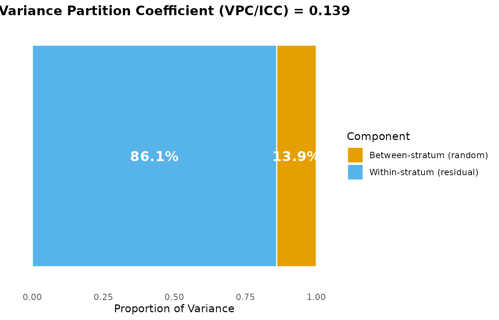
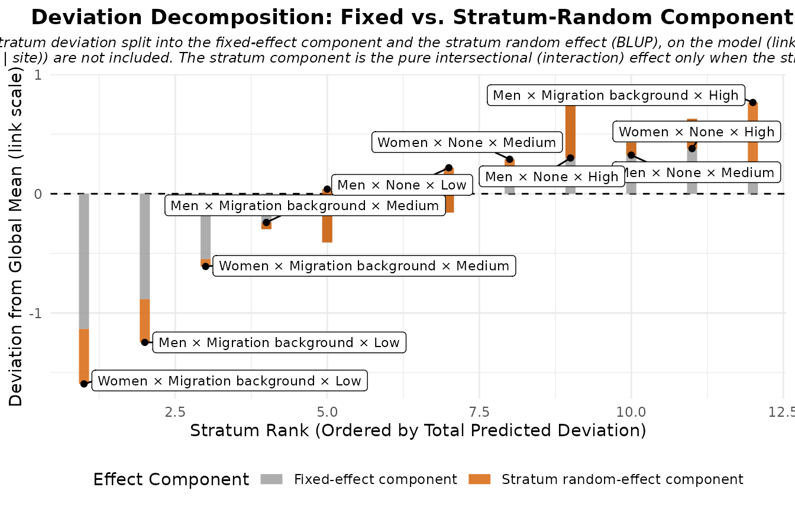
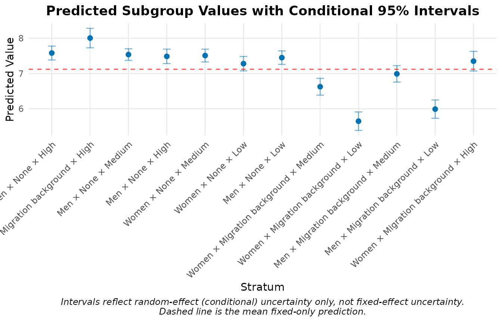
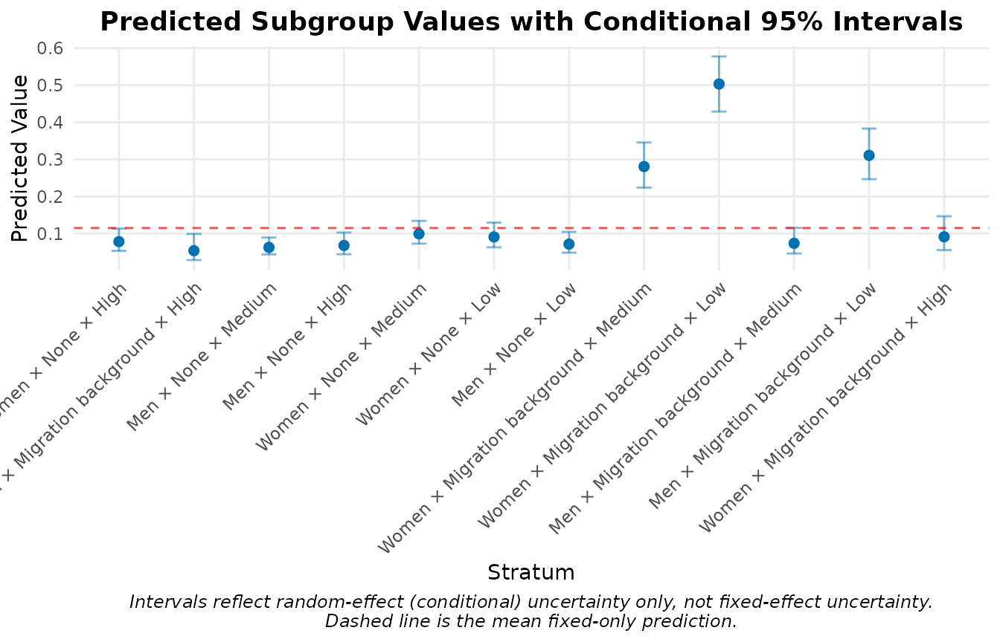
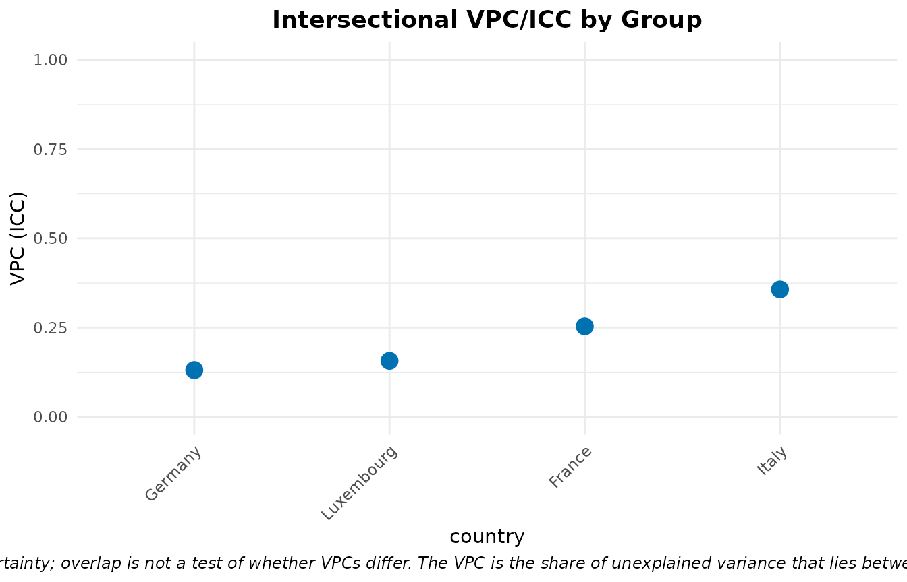
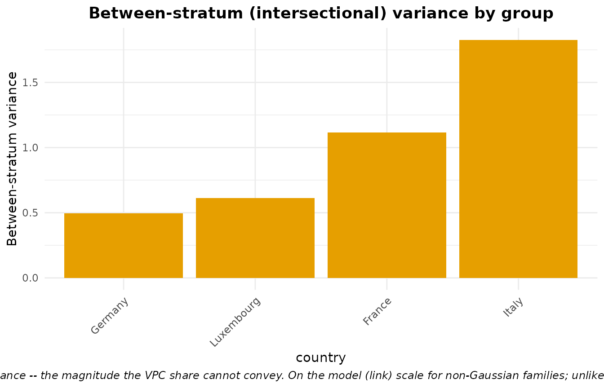

# Youth MAIHDA: NEET and well-being across Europe

## Why MAIHDA for youth research?

Youth-research institutes – the German Youth Institute (DJI), the *Youth
& Work* programme and the *Observatoire de la jeunesse* in Luxembourg –
ask, again and again, the same two questions about young people’s life
chances:

- the **school-to-work transition**: who ends up **NEET** (Not in
  Employment, Education or Training), the headline indicator of a
  stalled transition; and
- **subjective well-being**: how good young people feel their lives are.

And they ask these questions *intersectionally*. A young woman with a
migration background whose parents have little formal education is not
simply “a woman” plus “a migrant” plus “low social origin”: the
disadvantages can **compound** in ways that looking at one axis at a
time will miss. That is exactly what MAIHDA is built for – it places
every young person in an **intersectional stratum** (here
`gender x migration x parental education`) and asks how much of the
inequality in an outcome lies *between* those strata, and how much of
that is the simple additive sum of the parts versus a genuine
intersectional **interaction**.

This vignette walks through the full MAIHDA toolkit on a youth dataset:

1.  the two-model decomposition (**VPC/ICC** and **PCV**) for a
    continuous outcome (well-being),
2.  the **discriminatory-accuracy** workflow for a binary outcome
    (NEET),
3.  comparing intersectional inequality **across countries**, and
4.  pinpointing **which intersections** carry a genuine interaction.

## The data

`maihda_youth_data` is a simulated cross-section of 16–29-year-olds in
four countries. It is **synthetic** – the real surveys it is modelled on
(the Youth Survey Luxembourg, the DJI’s AID:A, and the youth sub-sample
of the European Social Survey) require data-use agreements and cannot be
shipped in a package – but its design and its NEET / life-satisfaction
levels are calibrated to Eurostat figures for young Europeans, so the
workflow below mirrors a real analysis.

> **Teaching data.** The values are constructed, not observed; read the
> patterns below as an illustration of the *method*, not as findings
> about these countries.

``` r

library(MAIHDA)
data("maihda_youth_data")

str(maihda_youth_data)
#> 'data.frame':    3000 obs. of  8 variables:
#>  $ id          : chr  "Y0001" "Y0002" "Y0003" "Y0004" ...
#>  $ country     : Factor w/ 4 levels "Luxembourg","Germany",..: 1 1 1 1 1 1 1 1 1 1 ...
#>  $ gender      : Factor w/ 2 levels "Women","Men": 1 1 2 2 1 2 2 1 2 1 ...
#>  $ migration   : Factor w/ 2 levels "None","Migration background": 1 1 2 1 1 1 1 1 2 1 ...
#>  $ parental_edu: Factor w/ 3 levels "Low","Medium",..: 3 3 3 2 3 2 3 2 3 3 ...
#>  $ age         : int  26 18 24 21 21 20 19 22 17 24 ...
#>  $ neet        : Factor w/ 2 levels "No","Yes": 1 1 1 1 1 1 1 1 1 2 ...
#>  $ wellbeing   : num  4.5 9.25 9.33 9.36 7.54 ...
#>  - attr(*, "truth")=List of 12
#>   ..$ target_interaction_share: num 0.33
#>   ..$ dimensions              : chr [1:3] "gender" "migration" "parental_edu"
#>   ..$ n_strata                : int 12
#>   ..$ additive_main_effects   :List of 3
#>   .. ..$ gender      : Named num [1:2] 0.3 -0.3
#>   .. .. ..- attr(*, "names")= chr [1:2] "Women" "Men"
#>   .. ..$ migration   : Named num [1:2] -0.5 0.5
#>   .. .. ..- attr(*, "names")= chr [1:2] "None" "Migration background"
#>   .. ..$ parental_edu: Named num [1:3] 0.8 0 -0.8
#>   .. .. ..- attr(*, "names")= chr [1:3] "Low" "Medium" "High"
#>   ..$ interaction_form        : chr "migration x social-origin + gender x migration (orthogonal to the main effects); compounding disadvantage conce"| __truncated__
#>   ..$ interaction_by_stratum  : Named num [1:12] -1.43 -0.77 1.43 0.77 -0.33 ...
#>   .. ..- attr(*, "names")= chr [1:12] "Women:None:Low" "Men:None:Low" "Women:Migration background:Low" "Men:Migration background:Low" ...
#>   ..$ gaussian                :List of 4
#>   .. ..$ between_var      : num 0.5
#>   .. ..$ residual_var     : num 3.24
#>   .. ..$ interaction_share: num 0.33
#>   .. ..$ vpc              : num 0.134
#>   ..$ binary_latent           :List of 4
#>   .. ..$ between_var      : num 1
#>   .. ..$ residual_var     : num 3.29
#>   .. ..$ interaction_share: num 0.33
#>   .. ..$ vpc              : num 0.233
#>   ..$ country_amplitude       : Named num [1:4] 0.8 0.9 1.1 1.4
#>   .. ..- attr(*, "names")= chr [1:4] "Luxembourg" "Germany" "France" "Italy"
#>   ..$ neet_prevalence_target  : Named num [1:4] 0.07 0.09 0.13 0.19
#>   .. ..- attr(*, "names")= chr [1:4] "Luxembourg" "Germany" "France" "Italy"
#>   ..$ wellbeing_mean_target   : Named num [1:4] 7.4 7.3 7 6.8
#>   .. ..- attr(*, "names")= chr [1:4] "Luxembourg" "Germany" "France" "Italy"
#>   ..$ note                    : chr "VPCs above are at amplitude 1; the per-country between-stratum variance is amp^2 x the value shown, so the VPC "| __truncated__
```

The three stratum dimensions form `2 x 2 x 3 = 12` intersectional
strata; `country` is a higher-level grouping variable. Every stratum is
well populated (this is not a sparse-cell problem – see
[`vignette("bayesian_sparse_maihda")`](https://hdbt.github.io/MAIHDA/articles/bayesian_sparse_maihda.md)
for that case):

``` r

# the 12 intersectional strata and their sizes (pooled across countries)
table(maihda_youth_data$gender,
      maihda_youth_data$migration,
      maihda_youth_data$parental_edu)
#> , ,  = Low
#> 
#>        
#>         None Migration background
#>   Women  279                  166
#>   Men    317                  169
#> 
#> , ,  = Medium
#> 
#>        
#>         None Migration background
#>   Women  355                  202
#>   Men    428                  212
#> 
#> , ,  = High
#> 
#>        
#>         None Migration background
#>   Women  301                  146
#>   Men    276                  149

# NEET prevalence differs across countries, as in the real Eurostat series
round(tapply(maihda_youth_data$neet == "Yes", maihda_youth_data$country, mean), 3)
#> Luxembourg    Germany     France      Italy 
#>      0.080      0.104      0.141      0.184
```

## Well-being: the two-model decomposition

[`maihda()`](https://hdbt.github.io/MAIHDA/reference/maihda.md) runs the
standard pipeline in one call. Writing the stratum dimensions’ main
effects in the formula tells
[`maihda()`](https://hdbt.github.io/MAIHDA/reference/maihda.md) they are
the **adjusted** model; it derives the **null** model (the
intersectional random intercept alone) by dropping them, fits both on
the same sample, and reports the VPC/ICC and the PCV.

``` r

wb <- maihda(
  wellbeing ~ gender + migration + parental_edu +
    (1 | gender:migration:parental_edu),
  data = maihda_youth_data
)
wb
#> MAIHDA Analysis
#> ===============
#> 
#> Null formula:    wellbeing ~ (1 | stratum)
#> Adjusted formula:wellbeing ~ gender + migration + parental_edu + (1 | stratum)
#> Engine: lme4 | Family: gaussian
#> VPC/ICC (null): 0.1394
#> PCV (null -> adjusted): 0.7192
#> Between-stratum variance: 0.4576 (null) -> 0.1285 (adjusted)
#>   ~71.9% of the between-stratum variance is additive (the dimensions' main
#>   effects); the remainder is the between-stratum variance remaining after the
#>   additive main effects -- a model-dependent quantity
#> Strata: 12
#> 
#> Use summary() for variance components and plot(type = ...) for figures.
```

The **VPC/ICC** is the share of well-being variation that lies *between*
the intersectional strata. The **PCV** (proportional change in variance)
is how much of that between-stratum variance the additive main effects
account for: a high PCV means inequality is largely the additive sum of
gender, migration, and social origin; the remainder is the part the
additive model cannot reach – the candidate **intersectional** signal.
(As always, the PCV is a model-dependent variance change, not a causal
decomposition.)

``` r

summary(wb)
#> MAIHDA Model Summary
#> ====================
#> 
#> Variance Partition Coefficient (VPC/ICC):
#>   Estimate: 0.1394
#> 
#> Variance Components:
#>                  component variance     sd proportion
#>   Between-stratum (random)    0.501 0.7078     0.1394
#>  Within-stratum (residual)    3.092 1.7585     0.8606
#>                      Total    3.593 1.8956     1.0000
#> 
#> Fixed Effects:
#>         term estimate
#>  (Intercept)    7.121
#> 
#> Stratum Estimates (first 10):
#>  stratum stratum_id                                 label random_effect      se
#>        1          1                   Women × None × High        0.4602 0.10033
#>        2          2     Men × Migration background × High        0.8858 0.14117
#>        3          3                   Men × None × Medium        0.4169 0.08439
#>        4          4                     Men × None × High        0.3660 0.10468
#>        5          5                 Women × None × Medium        0.3888 0.09253
#>        6          6                    Women × None × Low        0.1585 0.10413
#>        7          7                      Men × None × Low        0.3295 0.09782
#>        8          8 Women × Migration background × Medium       -0.4967 0.12188
#>        9          9    Women × Migration background × Low       -1.4751 0.13402
#>       10         10   Men × Migration background × Medium       -0.1311 0.11905
#>  lower_95 upper_95
#>   0.26356   0.6569
#>   0.60916   1.1625
#>   0.25149   0.5823
#>   0.16080   0.5712
#>   0.20749   0.5702
#>  -0.04564   0.3626
#>   0.13777   0.5212
#>  -0.73561  -0.2578
#>  -1.73773  -1.2124
#>  -0.36448   0.1022
#>   ... and 2 more strata
wb$pcv
#> Proportional Change in Variance (PCV)
#> =====================================
#> 
#> PCV: 0.7192
#> 
#> Between-stratum variance:
#>   Model 1: 0.457550
#>   Model 2: 0.128477
#>   Change:  0.329073 (71.92%)
#> 
#> Interpretation (PCV is the proportional change in between-stratum
#> variance between the models; it is variance 'explained' only when Model 2
#> nests Model 1 by adding predictors on the same outcome, sample and strata):
#>   Between-stratum variance is 71.9% lower in Model 2 than in Model 1.
```

[`plot()`](https://rdrr.io/r/graphics/plot.default.html) sends each view
to the model it belongs on automatically – the VPC and shrinkage views
to the null model, the additive-vs-intersectional views to the adjusted
model.

``` r

plot(wb, type = "vpc")              # variance partition (null model)
```



``` r

plot(wb, type = "effect_decomp")   # additive vs intersectional (adjusted model)
```



``` r

plot(wb, type = "predicted")       # predicted well-being per stratum, with 95% CIs
```



The predicted-value plot ranks the 12 strata: youth with a migration
background and low parental education sit at the bottom, those without
and with highly educated parents at the top – the additive gradient. The
effect-decomposition plot is where the *intersectional* part becomes
visible, separated from that additive gradient.

## NEET: discriminatory accuracy

NEET is binary, so MAIHDA fits a multilevel **logistic** model.
[`maihda()`](https://hdbt.github.io/MAIHDA/reference/maihda.md)
auto-detects the two-level outcome (it reports how it recoded the
factor); passing `family = "binomial"` makes it explicit. For a binary
outcome the **discriminatory accuracy** – the AUC / C-statistic and the
Median Odds Ratio (MOR) – rides along on the summary automatically.

``` r

neet <- maihda(
  neet ~ gender + migration + parental_edu +
    (1 | gender:migration:parental_edu),
  data = maihda_youth_data, family = "binomial"
)
#> Binary outcome 'neet' recoded to 0/1: 'No' = 0 (reference), 'Yes' = 1 (modeled event). Set the factor levels (or supply a 0/1 outcome) to control which level is the event.
neet
#> MAIHDA Analysis
#> ===============
#> 
#> Null formula:    neet ~ (1 | stratum)
#> Adjusted formula:neet ~ gender + migration + parental_edu + (1 | stratum)
#> Engine: lme4 | Family: binomial
#> VPC/ICC (null): 0.2033
#> PCV (null -> adjusted): 0.7464
#> Between-stratum variance: 0.8396 (null) -> 0.2129 (adjusted)
#>   ~74.6% of the between-stratum variance is additive (the dimensions' main
#>   effects); the remainder is the between-stratum variance remaining after the
#>   additive main effects -- a model-dependent quantity
#> 
#> Discriminatory accuracy (null model):
#>   AUC: 0.727 | MOR: 2.397 | cases/controls: 382/2618
#>   Adjusted-model AUC: 0.723
#> Strata: 12
#> 
#> Use summary() for variance components and plot(type = ...) for figures.
```

Two numbers tell complementary stories. The **VPC** says a substantial
share of the (latent) variation in NEET risk lies between intersectional
strata. The **AUC**, by contrast, asks a prediction question: *given
only which intersectional stratum a young person belongs to, how well
can we separate those who are NEET from those who are not?* Here the AUC
is moderate – and that is the central, cautionary message of the “DA” in
MAIHDA: a real between-stratum gradient still translates into only
limited accuracy at the **individual** level, so intersectional strata
describe *structure* far better than they *target individuals*. You can
pull the pieces out directly:

``` r

maihda_discriminatory_accuracy(neet$model)   # strata-only (null) model: Merlo's DA
#> Discriminatory accuracy (binomial MAIHDA)
#>   AUC (C-statistic): 0.727
#>   Median Odds Ratio: 2.397
#>   Cases / controls:  382 / 2618
```

The VPC for a logistic model is on the **latent** scale (the level-1
variance is fixed at `pi^2/3`); see
[`vignette("binary_outcomes")`](https://hdbt.github.io/MAIHDA/articles/binary_outcomes.md)
for the full treatment, including the probability-scale complement
[`maihda_vpc_response()`](https://hdbt.github.io/MAIHDA/reference/maihda_vpc_response.md).

``` r

plot(neet, type = "predicted")     # predicted NEET probability per stratum
```



## Comparing inequality across countries

Add `group = "country"` and
[`maihda()`](https://hdbt.github.io/MAIHDA/reference/maihda.md) runs the
whole decomposition *within each country* as well, so we can ask the
contextual question youth institutes care about: **is intersectional
inequality sharper in some countries than others?**

``` r

by_country <- maihda(
  neet ~ gender + migration + parental_edu +
    (1 | gender:migration:parental_edu),
  data = maihda_youth_data, group = "country", family = "binomial"
)

group_results <- as.data.frame(by_country$groups)
group_results[order(group_results$vpc, decreasing = TRUE),
              c("group", "n", "n_strata", "vpc", "var_between", "pcv", "status")]
#>        group   n n_strata       vpc var_between       pcv status
#> 3      Italy 750       12 0.3569970   1.8265435 0.8310519     ok
#> 1     France 750       12 0.2534557   1.1169275 0.9057089     ok
#> 4 Luxembourg 750       12 0.1568306   0.6119198 0.9337926     ok
#> 2    Germany 750       12 0.1309634   0.4957817 0.6343534     ok
```

``` r

plot(by_country, type = "group_vpc")
```



The VPC/ICC is a *share*, so a country can post a high VPC partly
because its residual variation is small. Read it alongside the
**absolute** between-stratum variance, which is the magnitude of
intersectional inequality rather than its share:

``` r

plot(by_country, type = "group_between_variance")
```



## Which intersections actually interact?

A high PCV says most inequality is additive – but *some* is not.
[`maihda_interactions()`](https://hdbt.github.io/MAIHDA/reference/maihda_interactions.md)
reads each stratum’s interaction effect (its departure from the additive
prediction, the random effect of the adjusted model) and flags those
credibly different from zero. With many strata, screen with an FDR
correction:

``` r

flagged <- maihda_interactions(wb, adjust = "BH")
flagged
#> Strata with credibly non-zero intersectional interaction
#> ========================================================
#> 
#> 7 of 12 strata flagged (95% interval; BH-adjusted p-values).
#> Model: adjusted (two-model); interaction on the link (latent) scale.
#> 
#>  stratum                              label   n interaction      se   lower
#>        2  Men × Migration background × High 149      0.6134 0.13803  0.3428
#>        4                  Men × None × High 276     -0.5787 0.10338 -0.7813
#>        9 Women × Migration background × Low 166     -0.4604 0.13132 -0.7178
#>        6                 Women × None × Low 279      0.4468 0.10285  0.2453
#>        7                   Men × None × Low 317      0.3761 0.09676  0.1864
#>       11   Men × Migration background × Low 169     -0.3625 0.13024 -0.6178
#>        1                Women × None × High 301     -0.2498 0.09919 -0.4442
#>     upper   p_value p_adjusted flagged direction
#>   0.88389 8.839e-06  5.303e-05    TRUE     above
#>  -0.37606 2.176e-08  2.611e-07    TRUE     below
#>  -0.20302 4.550e-04  1.092e-03    TRUE     below
#>   0.64843 1.396e-05  5.585e-05    TRUE     above
#>   0.56571 1.016e-04  3.047e-04    TRUE     above
#>  -0.10725 5.378e-03  1.076e-02    TRUE     below
#>  -0.05542 1.178e-02  2.019e-02    TRUE     below
#> 
#> Interaction BLUPs are shrunken (partially pooled) estimates; treat flags as
#>   exploratory. See ?maihda_interactions.
```

The flagged strata are not scattered at random: they are the
`migration x social origin` cells. This is what an intersectional
interaction *is* – the effect of one dimension **depends on** another.
Here the social-origin gradient in well-being is **steeper among youth
with a migration background**: low parental education carries an extra
penalty when combined with a migration background, beyond what either
factor predicts on its own. Equivalently, the additive model
*over-credits* high parental education for youth without a migration
background. That dependence – not a single “worst-off” cell – is the
intersectional finding, and it is exactly the kind of compounding
disadvantage the additive main effects cannot represent.

> **What an interaction can and cannot look like.** A genuine
> interaction (one that survives adjustment for the main effects) is
> *orthogonal* to them, so it always moves cells in a symmetric pattern
> – “the doubly-disadvantaged get worse *and* the doubly-advantaged get
> better” is the signature of an **additive** effect, which the main
> effects already absorb. Read the flagged strata as *where the additive
> model mis-predicts*, and in which direction.

## Reading this for youth policy

Put together, the workflow gives a youth-policy reader four distinct
things:

- **VPC/ICC** – how segregated outcomes are across intersectional groups
  (a structural-inequality summary);
- **PCV** – how much of that is the simple additive sum of the axes
  versus genuine intersectionality (whether single-axis policies would
  suffice);
- **discriminatory accuracy** – whether intersectional membership is
  sharp enough to *target* individuals, or only to *describe* groups (a
  caution against profiling);
- **the group comparison** – where intersectional inequality is most
  acute, to prioritise contexts.

For the modelling extensions most relevant to youth data – survey
weights (`sampling_weights=`), youth nested in schools or regions
(`context=`), panel / growth-curve designs
([`vignette("longitudinal")`](https://hdbt.github.io/MAIHDA/articles/longitudinal.md)),
and small intersectional cells
([`vignette("bayesian_sparse_maihda")`](https://hdbt.github.io/MAIHDA/articles/bayesian_sparse_maihda.md))
– see the linked workflows.

## References

- Merlo, J. (2018). Multilevel analysis of individual heterogeneity and
  discriminatory accuracy (MAIHDA) within an intersectional framework.
  *Social Science & Medicine*, 203, 74-80.

- Evans, C. R., Williams, D. R., Onnela, J. P., & Subramanian, S. V.
  (2018). A multilevel approach to modeling health inequalities at the
  intersection of multiple social identities. *Social Science &
  Medicine*, 203, 64-73.

- Merlo, J., Wagner, P., Ghith, N., & Leckie, G. (2016). An original
  stepwise multilevel logistic regression analysis of discriminatory
  accuracy: the case of neighbourhoods and health. *PLOS ONE*, 11(4),
  e0153778.

- Crenshaw, K. (1989). Demarginalizing the intersection of race and sex.
  *University of Chicago Legal Forum*, 1989(1), 139-167.
