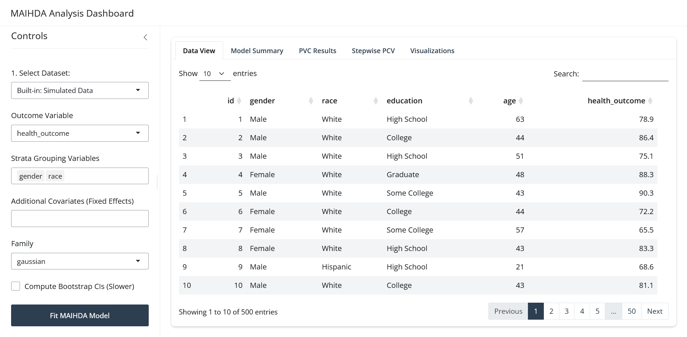

```{r, include = FALSE}
knitr::opts_chunk$set(
  collapse = TRUE,
  comment = "#>"
)
```

## Introduction

The **MAIHDA** package includes a fully-featured interactive Shiny Dashboard that provides a no-code alternative to exploring your data, building intersectional strata, fitting models, and analyzing inequality. This is particularly useful for rapid exploration.

## Launching the Application

### Online Version

You can access a live, cloud-hosted version of the MAIHDA interactive dashboard directly in your browser without installing R:
**[https://hdbt.shinyapps.io/shiny/](https://hdbt.shinyapps.io/shiny/)**

### Local Version

You can start the interactive dashboard locally by running a single command:

```{r eval=FALSE}
library(MAIHDA)
run_maihda_app()
```

This will automatically launch the dashboard in your default web browser or the RStudio viewer.

```{r, echo=FALSE, out.width="100%", fig.cap="Shiny Dashboard", eval=TRUE}
 
```


## App Features

### 1. Data Import

* **Upload Own Data:** Easily upload datasets in `.csv`, Stata (`.dta`), or SPSS (`.sav`) formats.
* **Use Included Data:** Try out the app instantly by selecting the pre-loaded `maihda_health_data` or `maihda_sim_data`.
* **View Data:** The app includes an interactive data table letting you sort, filter, and inspect variables before analyzing.


### 2. Variable Selection & Strata Creation

* Choose a categorical/continuous outcome metric from your dataset.
* Select two or more categorical demographic variables (e.g., gender, race, education) to automatically generate intersectional strata.

### 3. Model Fitting & Settings

* Choose the modeling engine: **lme4** (fast, frequentist) or **brms** (robust, Bayesian).
* Select covariates to control for within your models.
* Choose whether to calculate **bootstrap confidence intervals** to get robust uncertainty metrics for your Variance Partition Coefficient (VPC / ICC).

### 4. Interactive Visualizations

Once a model is fit, you can navigate across multiple tabs:

* **Caterpillar Plots:** Visually evaluate stratum-level random effects relative to the overall mean with dynamic prediction intervals.
* **VPC Decomposition:** Examine how much of your outcome's variance is attributed to between-stratum differences versus within-stratum individual heterogeneity.
* **Observed vs. Shrunken Estimates:** Compare raw unadjusted group means to your model's shrinkage estimates to see the protective mechanism of multilevel modeling.

### 5. Stepwise Variance Analysis (PCV)

The dashboard calculates stepwise Proportional Change in Variance (**PCV**) tables:

* See how much inequality is "explained away" by adding covariates sequentially.
* Uncover masking/suppression effects directly inside the app by comparing partial PCV values across models.

## Summary

The MAIHDA interactive dashboard is designed to make modeling health and social inequalities accessible without needing to write code. It provides a platform for exploring intersectional data, fitting multilevel models, and visualizing results in a user-friendly way.
