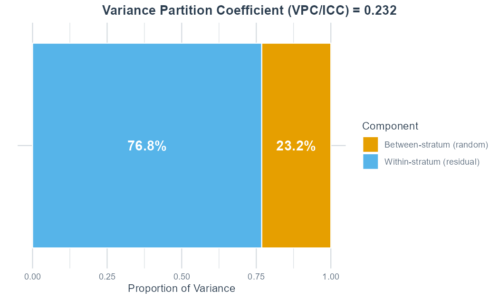
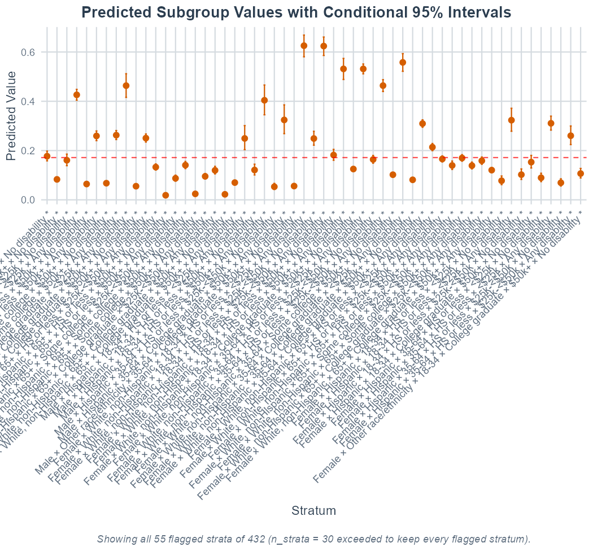
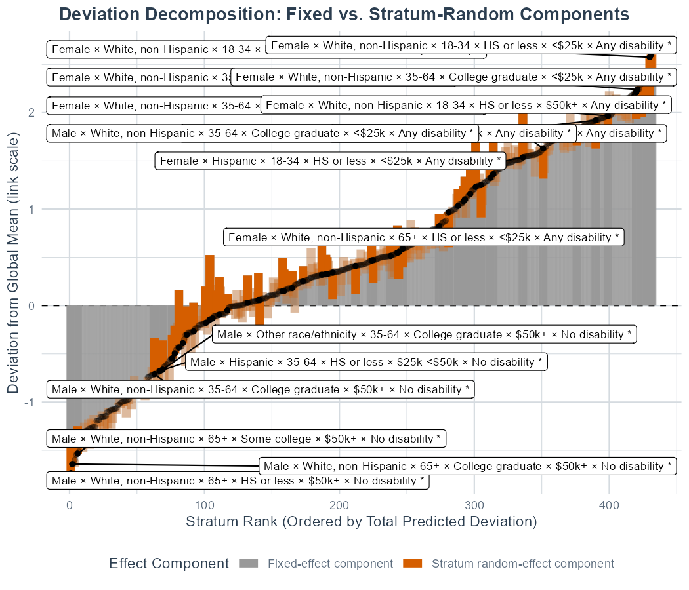

```{r setup, include = FALSE}
knitr::opts_chunk$set(
  collapse = TRUE,
  comment = "#>",
  fig.width = 7,
  fig.height = 4.5
)

# This is an UNWEIGHTED MAIHDA on the full ~352,714-record complete-case sample. An
# lme4 glmer on that many rows (with the 432-group random intercept, two models)
# takes minutes -- too slow for a package build -- so it is fitted once by
# data-raw/brfss_precompute.R and this article renders from a small cache plus
# pre-rendered figures.
pc <- readRDS("brfss_precomputed.rds")

fmt  <- function(x, d = 3) formatC(as.numeric(x), format = "f", digits = d)
fmt0 <- function(x, d = 3) ifelse(is.na(x), "", formatC(as.numeric(x), format = "f", digits = d))
pct  <- function(x, d = 1) paste0(formatC(100 * as.numeric(x), format = "f", digits = d), "%")
big  <- function(x) format(as.numeric(x), big.mark = ",", trim = TRUE)
```

This case uses the 2024 Behavioral Risk Factor Surveillance System (BRFSS), a U.S. health survey released by the Centers for Disease Control and Prevention. The outcome is frequent mental distress: 14 or more of the past 30 days when mental health was not good.

The intersectional strata combine respondent sex, race/ethnicity, age, education, income, and disability. The question is whether mental distress is concentrated in particular social strata, and whether any of these intersections remain once the additive main effects of the dimensions are included.

CDC's 2024 BRFSS page provides the data and codebook:

-   [2024 BRFSS survey data and documentation](https://www.cdc.gov/brfss/annual_data/annual_2024.html)
-   [2024 SAS transport data file](https://www.cdc.gov/brfss/annual_data/2024/files/LLCP2024XPT.zip)
-   [2024 codebook](https://www.cdc.gov/brfss/annual_data/2024/zip/codebook24_llcp-v2-508.zip)


## Data preparation

BRFSS distributes the public-use file as a zipped SAS transport (`.XPT`) file (\~1 GB unzipped).

```{r download, eval = FALSE}
library(MAIHDA)
library(dplyr)

raw_cols <- c(
  "_MENT14D", "SEXVAR", "_IMPRACE", "_AGEG5YR", "EDUCA", "_INCOMG1",
  "DEAF", "BLIND", "DECIDE", "DIFFWALK", "DIFFDRES", "DIFFALON"
)

brfss_raw <- haven::read_xpt(xpt_file, col_select = dplyr::all_of(raw_cols))
dim(brfss_raw)
```

## Recode and collapse strata

The outcome uses `_MENT14D`, CDC's three-level calculated mental-health status: zero days, 1-13 days, and 14+ days when mental health was not good. The binary outcome below codes 14+ days as 1 and the two lower categories as 0.

The core BRFSS file contains respondent sex (`SEXVAR`), not a general gender identity measure. Optional SOGI modules can support a different analysis, but they are not available for all states in the national core file.

The full six-dimension crossing can create many sparse cells. For the case-study version, we collapse the highest-cardinality dimensions before fitting:

-   Race/ethnicity: White non-Hispanic, Black non-Hispanic, Hispanic, and other.
-   Age: 18-34, 35-64, and 65+.
-   Education: high school or less, some college, and college graduate.
-   Income: less than \$25k, \$25k to less than \$50k, and \$50k+.
-   Disability: any vs. none, from the six core disability items.

```{r recode, eval = FALSE}
disability_vars <- c("DEAF", "BLIND", "DECIDE", "DIFFWALK", "DIFFDRES", "DIFFALON")
disability_items <- brfss_raw[disability_vars]

any_disability <- rowSums(disability_items == 1, na.rm = TRUE) > 0
all_answered_no <- rowSums(disability_items == 2, na.rm = TRUE) == length(disability_vars)

brfss_reduced <- brfss_raw |>
  transmute(
    frequent_distress = case_when(
      .data[["_MENT14D"]] == 3 ~ 1L,
      .data[["_MENT14D"]] %in% c(1, 2) ~ 0L,
      TRUE ~ NA_integer_
    ),
    sex = factor(
      case_when(SEXVAR == 1 ~ "Male", SEXVAR == 2 ~ "Female", TRUE ~ NA_character_),
      levels = c("Male", "Female")
    ),
    race_ethnicity = factor(
      case_when(
        .data[["_IMPRACE"]] == 1 ~ "White, non-Hispanic",
        .data[["_IMPRACE"]] == 2 ~ "Black, non-Hispanic",
        .data[["_IMPRACE"]] == 5 ~ "Hispanic",
        .data[["_IMPRACE"]] %in% c(3, 4, 6) ~ "Other race/ethnicity",
        TRUE ~ NA_character_
      ),
      levels = c("White, non-Hispanic", "Black, non-Hispanic",
                 "Hispanic", "Other race/ethnicity")
    ),
    age_group = factor(
      case_when(
        .data[["_AGEG5YR"]] %in% 1:3 ~ "18-34",
        .data[["_AGEG5YR"]] %in% 4:9 ~ "35-64",
        .data[["_AGEG5YR"]] %in% 10:13 ~ "65+",
        TRUE ~ NA_character_
      ),
      levels = c("18-34", "35-64", "65+")
    ),
    education = factor(
      case_when(
        EDUCA %in% 1:4 ~ "HS or less", EDUCA == 5 ~ "Some college",
        EDUCA == 6 ~ "College graduate", TRUE ~ NA_character_
      ),
      levels = c("HS or less", "Some college", "College graduate")
    ),
    income = factor(
      case_when(
        .data[["_INCOMG1"]] %in% 1:2 ~ "<$25k",
        .data[["_INCOMG1"]] %in% 3:4 ~ "$25k-<$50k",
        .data[["_INCOMG1"]] %in% 5:7 ~ "$50k+",
        TRUE ~ NA_character_
      ),
      levels = c("<$25k", "$25k-<$50k", "$50k+")
    ),
    disability = factor(
      case_when(
        any_disability ~ "Any disability", all_answered_no ~ "No disability",
        TRUE ~ NA_character_
      ),
      levels = c("No disability", "Any disability")
    )
  ) |>
  filter(
    !is.na(frequent_distress), !is.na(sex), !is.na(race_ethnicity),
    !is.na(age_group), !is.na(education), !is.na(income), !is.na(disability)
  )
```

The complete-case recode yields **`r big(pc$analytic_n)` adults** in **`r pc$n_strata` intersectional strata** (only `r pc$n_sparse_lt20` stratum has fewer than 20 adults, `r pc$n_sparse_lt50` fewer than 50).

## Fit the MAIHDA

The analysis is a single call, a binomial MAIHDA fitting a null model (strata only) and an adjusted model (the six dimensions additive main effects), on the full individual data:

```{r fit-code, eval = FALSE}
brfss_fit <- maihda(
  frequent_distress ~ sex + race_ethnicity + age_group + education + income + disability +
    (1 | sex:race_ethnicity:age_group:education:income:disability),
  data = brfss_reduced, family = "binomial", interactions = "BH"
)

brfss_fit
generics::glance(brfss_fit)
```

```{r model-table, echo = FALSE}
mt <- pc$model_table
knitr::kable(
  data.frame(
    Statistic            = mt$statistic,
    `Null (Model 1)`     = fmt0(mt$null),
    `Adjusted (Model 2)` = fmt0(mt$adjusted),
    check.names = FALSE
  ),
  caption = "Model-results table (unweighted, full data, cached)."
)
```

The null model gives a **VPC of `r fmt(pc$vpc)`** (about `r pct(pc$vpc)` of the latent-scale variation lies between strata), with **AUC `r fmt(pc$auc, 2)`** and **MOR `r fmt(pc$mor, 2)`**. Adding the six dimensions' additive main effects collapses the between-stratum variance from `r fmt(pc$between_var_null, 2)` to `r fmt(pc$between_var_adjusted, 2)`, a **PCV of `r pct(pc$pcv)`**. Almost all of the between-stratum inequality is additive  and the residual intersectional component is small (residual VPC `r pct(pc$vpc_adjusted)`, residual MOR `r fmt(pc$mor_adjusted, 2)`).

## Which strata drive the pattern?

`maihda_table()` ranks strata by their null-model predicted risk (the simple-intersectional stratum predictions; pass `which = "adjusted"` to rank by the adjusted model).

```{r ranked-strata-cached, echo = FALSE}
ts <- pc$top_strata
disp <- data.frame(Rank = ts$rank, Stratum = ts$label, Predicted = fmt(ts$predicted),
                   check.names = FALSE)
if ("observed" %in% names(ts)) disp[["Observed"]] <- fmt(ts$observed)
if ("raw_n" %in% names(ts)) disp[["N"]] <- big(ts$raw_n)
knitr::kable(disp, caption = "Highest predicted-risk strata (cached).")
```

The highest-risk strata combine younger age, female sex, low income, and disability (top predicted prevalence around `r pct(pc$top_strata$predicted[1])`) and race/ethnicity varies across the top group. These strata are high-risk because they stack several high-risk main-effect categories, not necessarily because of a large residual interaction.

The interaction table instead asks which strata *depart* from the additive main-effect prediction:

```{r interaction-table-cached, echo = FALSE}
it <- pc$top_interactions
disp <- data.frame(Stratum = it$label, Interaction = fmt(it$interaction),
                   Lower = fmt(it$lower), Upper = fmt(it$upper), check.names = FALSE)
if ("direction" %in% names(it)) disp[["Direction"]] <- it$direction
if ("decision" %in% names(it)) disp[["ROPE (±0.4)"]] <- it$decision
knitr::kable(head(disp, 15), digits = 3,
             caption = "Strongest interactions by absolute size, with ROPE classification (cached).")
```

### How many interactions actually matter? A ROPE

Flagging asks only whether an interaction differs statisticaly significantly from zero. On the full data the FDR screen flags `r pc$n_flagged` of `r pc$n_interactions` strata. The more interesting question is whether a departure is *large enough to matter*. A **region of practical equivalence** (ROPE) sets a smallest intersectional effect of interest on the log-odds scale and classifies each stratum's interval as practically **relevant** (outside the ROPE), **negligible** (inside it), or **inconclusive** (Schuirmann 1987; Kruschke 2018). The `rope` argument of `maihda_interactions()` adds this `decision` column:

```{r rope-code, eval = FALSE}
maihda_interactions(brfss_fit, rope = 0.4)   # ROPE = +/- 0.4 log-odds (OR ~ 1.5)
```

At a ROPE of ±0.4 log-odds (an odds ratio within roughly 0.67--1.49 of the additive expectation), **`r pc$rope_primary$relevant` of `r pc$rope_primary$n`** strata are practically relevant, `r pc$rope_primary$negligible` negligible, and `r pc$rope_primary$inconclusive` inconclusive; at a stricter ±0.2 (OR ≈ 1.22) the relevant count rises to `r pc$rope_strict$relevant`. The full data is precise enough that the ROPE can actually resolve a handful of strata as practically relevant, where the per-stratum interactions are genuinely largest (up to about `r fmt(pc$max_abs_int, 2)` on the log-odds scale). Even so, the great majority are negligible or inconclusive: consistent with the high PCV (`r pct(pc$pcv)`), the structure is overwhelmingly additive, and only a small number of intersections carry a practically meaningful departure from additivity.

## Plot the case study

```{r plot-vpc-cached, echo = FALSE, out.width = "100%", fig.cap = "Variance partition (VPC): share of latent-scale variation between intersectional strata."}

```

```{r plot-predicted-cached, echo = FALSE, out.width = "100%", fig.cap = "Top 30 strata by predicted risk; BH-flagged interactions highlighted."}

```

```{r plot-effect-cached, echo = FALSE, out.width = "100%", fig.cap = "Effect decomposition: additive disadvantage vs. residual intersectional deviation."}

```

The predicted-strata plot shows the inequality pattern; the effect-decomposition plot separates additive disadvantage from the (mostly small) residual intersectional deviation.


## Results

We fitted two logistic MAIHDA models on `r big(pc$analytic_n)` adults from the 2024 BRFSS, nested within `r pc$n_strata` intersectional strata defined by the cross-classification of sex, race/ethnicity, age, education, household income, and disability. In the simple intersectional model, the variance partition coefficient indicated that `r pct(pc$vpc)` of the variance in the latent propensity for frequent mental distress lay between intersectional strata. The strata had moderate discriminatory accuracy (area under the ROC curve, AUC = `r fmt(pc$auc, 2)`) and a median odds ratio of `r fmt(pc$mor, 2)`.

After adding the additive main effects of the six dimensions, the between-stratum variance fell from `r fmt(pc$between_var_null, 2)` to `r fmt(pc$between_var_adjusted, 2)`, a proportional change in variance (PCV) of `r pct(pc$pcv)` (residual VPC `r pct(pc$vpc_adjusted)`). Almost all of the between-stratum inequality was additive. The highest-risk strata combined younger age, female sex, low income, and disability (top predicted prevalence `r pct(pc$top_strata$predicted[1])`).

Per-stratum interaction effects were small (largest ≈ `r fmt(pc$max_abs_int, 2)` on the log-odds scale). The FDR screen flagged `r pc$n_flagged` of `r pc$n_interactions` strata; a region of practical equivalence (±0.4 log-odds) classified `r pc$rope_primary$relevant` strata as practically relevant, `r pc$rope_primary$negligible` as negligible, and `r pc$rope_primary$inconclusive` as inconclusive. The defensible conclusion is a predominantly additive structure, with a small number of intersections showing a practically meaningful departure from additivity.

## References

-   Centers for Disease Control and Prevention. Behavioral Risk Factor Surveillance System: 2024 Survey Data and Documentation.
-   Evans, C. R., Leckie, G., Subramanian, S. V., Bell, A., & Merlo, J. (2024). A tutorial for conducting intersectional multilevel analysis of individual heterogeneity and discriminatory accuracy (MAIHDA). *SSM - Population Health*, 26, 101664.
-   Evans, C. R., Williams, D. R., Onnela, J. P., & Subramanian, S. V. (2018). A multilevel approach to modeling health inequalities at the intersection of multiple social identities. *Social Science & Medicine*, 203, 64-73.
-   Merlo, J. (2018). Multilevel analysis of individual heterogeneity and discriminatory accuracy (MAIHDA) within an intersectional framework. *Social Science & Medicine*, 203, 74-80.
```
